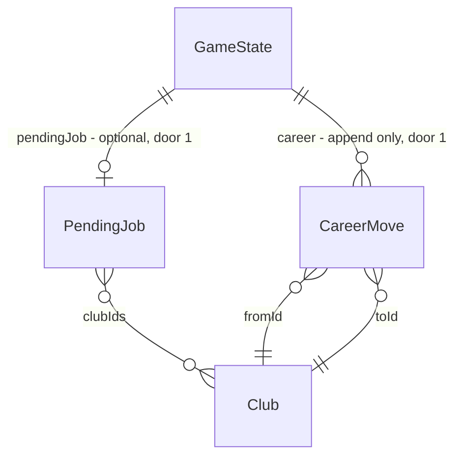

# Carreira dinâmica

## Problem

A carreira do técnico só se move na virada de temporada: `verdictFor` (`src/engine/board.ts`) julga a posição final, e só um «Demitido» leva às 3 propostas de `jobOffers`, sempre de clubes **mais fracos**. No meio do ano a diretoria não reage a nada: um time na zona de rebaixamento da rodada 10 à 37 não recebe aviso nem demissão. E quem cumpre a meta nunca é procurado por um clube melhor, então o único jeito de treinar um grande é começar nele. O técnico não tem reputação: dez temporadas de títulos e uma de fracasso valem o mesmo para o mercado de técnicos.

O código não traz nenhuma evidência numérica. O pedido é do autor, escolhido na lista de candidatas pós-lançamento em 30/09/2026.

Com esta feature, a diretoria avisa quando a campanha vai mal e demite no meio da temporada. O técnico tem uma reputação que sobe com metas e títulos e cai com fracassos. Clubes mais fortes, dentro do que a reputação alcança, fazem propostas na metade e no fim da temporada. O usuário aceita ou recusa, e a História mostra a carreira.

## Flow

Reusa `verdictFor` como régua da demissão, `jobOffers` para as propostas depois de uma demissão, `strengthRanking` para as ofertas por reputação, o `finishRound` da liga como ponto de checagem e o caminho de troca de clube de `nextSeason`. Nada disso é duplicado.

1. `finishRound` (exists, `season.ts`) -> `boardAfterRound` (new, `src/engine/career.ts`): só em rodada de liga, conta a sequência de rodadas na zona de demissão em `boardWarnings` (door 1). No limite, grava `pendingJob` fired com `jobOffers`. Na rodada do meio, com a meta em dia, grava `pendingJob` offer pelo fluxo de propostas (door 2)
2. `finishRound` / `finishCupDate` (exists): a próxima data que fecha apaga um `pendingJob` offer, ou seja, a proposta é recusada ao jogar
3. `store` (exists): um `pendingJob` fired abre a nova fase `"job"` e trava `playRound`; `takeJob` (new, `career.ts`) troca o clube no meio da temporada e anota em `career` (door 1)
4. `seasonReview` (exists): `jobOffers` passa a trazer também as propostas por reputação quando a meta foi cumprida; `nextSeason` (exists, `rollover.ts`) aceita qualquer id dessa lista e anota a troca em `career`
5. `managerReputation` (new, `career.ts`): derivada de `history` e de `career`, nunca gravada (door 1)
6. out: telas «Demitido» (nova), Rodada, Elenco, Fim da temporada e História mostram aviso, propostas, reputação e carreira

## Impact

| Front | What changes |
| --- | --- |
| domain | new term: `boardWarnings`: rodadas seguidas de liga na zona de demissão, contadas a partir da rodada 10; lives in `GameState`, rules in `engine/career.ts` |
| domain | new term: `pendingJob`: propostas à espera de resposta, `fired` (obrigatória) ou `offer` (opcional); lives in `GameState` |
| domain | new term: `CareerMove`: uma troca de clube do técnico, com temporada, rodada e motivo; lives in `GameState.career` |
| domain | new term: reputação: 0..100, derivada de `history` + `career`; lives in `engine/career.ts` |
| domain | existing term: `SeasonReview.jobOffers` era «só quando demitido». Passa a ser «propostas da virada, demitido ou meta cumprida». Quem usa: `End.tsx` (branch em `fired`) e o guard de `nextSeason` |
| domain | existing term: `boardGoal` era fixado na chegada ou na virada. Agora também na troca do meio da temporada. Quem usa: `seasonReview`, `End.tsx`, `Squad.tsx` |
| stored data | nothing to migrate: os 3 campos são opcionais, e ausentes valem 0 avisos, nenhuma proposta e carreira vazia. O save continua v8, como na AD-021 |

## Relations

One-way constraints: `career` só cresce e nunca é reescrito (door 1). `pendingJob.clubIds` nunca contém o clube do usuário (door 1). A reputação não é gravada (door 1).

## Surface

None - nothing consumed outside; a SPA não expõe rotas.

## Landing

| One-way door | Literal shape | Alternative rejected |
| --- | --- | --- |
| 1. carreira no save | `GameState.boardWarnings?: number` (ausente = 0); `GameState.pendingJob?: { reason: "fired" \| "offer"; clubIds: string[] }`; `GameState.career?: { season: number; round: number; fromId: string; toId: string; reason: "fired" \| "offer" }[]`, com `round` = rodada da liga que acabou de fechar (na virada, o número de rodadas da liga); `schemaVersion` continua 8; reputação não gravada | save v9 com migração: três campos opcionais não pedem migração (AD-021). `GameState.reputation` gravado: podia divergir de `history` e não seria recalibrável sem backfill |
| 2. fluxo de sorteio das propostas | `createRng(mix32(mix32(rngState, 0xca), season * 64 + round))`, com o `rngState` de antes do sorteio; `round` = rodada do meio, ou o número de rodadas da liga na virada; o `rngState` do save não avança | sortear do `rngState` do save: mudaria mercado, partidas e todas as seeds dos testes de balanço, como na door 3 de treino-evolucao |

- Nothing else in this change is hard to reverse

## Criteria

### S1: reputação do técnico (P1)

Um número de 0 a 100 que resume a carreira e decide quem faz proposta.

**Acceptance Criteria**

1. The system SHALL calcular a reputação como 50 somado, sobre as últimas 5 entradas de `history` com `userClubId`, a +6 por «met», −3 por «missed», −8 por «fired», +8 por título da liga do usuário quando ela tem `tier` 0, +4 quando tem `tier` maior, +6 pela copa nacional e +10 pela continental. Soma ainda −8 por `CareerMove` `fired` da temporada atual. O resultado é inteiro e fica entre 0 e 100
2. The system SHALL mostrar «Reputação: N/100» na História e na tela «Demitido»

**Independent test:** um save com 3 temporadas «met» e um título da Série A mostra «Reputação: 76/100» na História.

### S2: a diretoria avisa e demite no meio da temporada (P1)

Uma campanha na zona de demissão por 4 rodadas seguidas derruba o técnico antes do fim.

**Acceptance Criteria**

3. WHEN uma rodada de liga de número `n` fecha, com `10 ≤ n ≤ R − 4` (`R` = rodadas da liga), THEN the system SHALL somar 1 a `boardWarnings` se `verdictFor(divisão, boardGoal, posição atual)` é «fired», e zerar se não é
4. WHEN uma rodada de liga fora de `10..R−4` fecha THEN the system SHALL zerar `boardWarnings`
5. WHEN `boardWarnings` chega a 4 THEN the system SHALL gravar `pendingJob = { reason: "fired", clubIds: jobOffers(state) }` e zerar `boardWarnings`
6. WHILE `boardWarnings` está entre 1 e 3 the system SHALL mostrar nas telas Rodada e Elenco «Aviso da diretoria (N/3): a campanha está abaixo do aceitável.»
7. WHEN uma rodada fecha com `pendingJob` fired THEN the system SHALL abrir a tela «Demitido» com «Você foi demitido do <clube> na rodada <n>.» e as 3 propostas (nome · divisão · força)
8. WHILE há `pendingJob` fired the system SHALL não jogar data nenhuma, e «Continuar» SHALL abrir a tela «Demitido»
9. WHEN uma data de copa fecha THEN the system SHALL não mudar `boardWarnings`

**Independent test:** um save com o usuário na zona de demissão nas rodadas 10, 11 e 12 mostra «Aviso da diretoria (3/3)»; jogar a rodada 13 ainda na zona abre a tela «Demitido» com 3 propostas.

### S3: trocar de clube no meio da temporada (P1)

Aceitar uma proposta muda o clube do usuário sem esperar a virada.

**Acceptance Criteria**

10. WHEN o usuário assume um clube de `pendingJob.clubIds` THEN the system SHALL mudar `userClubId` para ele, apagar `pendingJob`, zerar `boardWarnings` e anotar `{ season, round: rodada da liga que fechou por último, fromId, toId, reason }` no fim de `career`
11. WHEN o usuário assume um clube no meio da temporada THEN the system SHALL deixar o clube antigo com `lineup` null, sem `training` e sem `forSale`, e apagar `market.offers`
12. WHEN o usuário assume um clube no meio da temporada THEN the system SHALL escalar o clube novo com `autoLineup` na formação da IA para a competição da próxima data
13. WHEN o usuário assume um clube no meio da temporada THEN the system SHALL fixar `boardGoal` no maior entre a meta pela força (`boardGoalFor`) e a posição atual do clube novo, e `cupGoal` em −1
14. IF o id escolhido não está em `pendingJob.clubIds` THEN the system SHALL recusar a troca e manter o estado
15. WHEN a troca é gravada THEN the system SHALL abrir o Elenco do clube novo

**Independent test:** na tela «Demitido», assumir o segundo clube abre o Elenco dele, com a meta nova, e a próxima rodada é jogada pelo clube novo.

### S4: propostas de clubes melhores (P1)

A reputação atrai clubes mais fortes, na metade e no fim da temporada.

**Acceptance Criteria**

16. The system SHALL escolher as propostas por reputação entre os clubes de posição `r` no `strengthRanking` de todos os clubes, com `teto ≤ r < posição do clube do usuário` e `teto = max(1, N − floor(reputação × N / 100))` (`N` = total de clubes). Entre os 8 primeiros candidatos, sorteia até 2 pelo fluxo da door 2
17. WHEN a rodada de liga `floor(R/2)` fecha com a posição do usuário ≤ `boardGoal`, sem `pendingJob`, e há candidatos THEN the system SHALL gravar `pendingJob = { reason: "offer", clubIds }`
18. WHILE há `pendingJob` offer the system SHALL mostrar nas telas Rodada e Elenco o painel «Proposta de emprego», com «Aceitar» por clube e «Recusar»
19. WHEN o usuário escolhe «Recusar», ou a próxima data (liga ou copa) fecha, THEN the system SHALL apagar o `pendingJob` offer sem trocar de clube
20. WHEN a temporada termina com veredito «met» THEN the system SHALL listar no Fim da temporada até 2 propostas por reputação (fluxo com `round = R`), cada uma selecionável e opcional, e «Próxima temporada» sem seleção SHALL manter o clube
21. WHEN o usuário vira a temporada com uma proposta selecionada THEN the system SHALL assumir o clube depois da virada, como a troca por demissão já faz, e anotar em `career` com `reason: "offer"`
22. WHEN o usuário vira a temporada demitido THEN the system SHALL anotar a troca em `career` com `reason: "fired"`

**Independent test:** um save com reputação 90 no 30º clube em força, na meta, jogado até a rodada 19, mostra 2 propostas de clubes mais fortes; aceitar uma troca o clube na hora.

### S5: a carreira na História (P2)

**Acceptance Criteria**

23. WHEN `career` não está vazio THEN the system SHALL mostrar na História a seção «Carreira», uma linha por troca, mais antiga primeiro: «Temporada S, rodada N: demitido do X, assumiu o Y» ou «Temporada S, rodada N: trocou o X pelo Y»
24. IF `career` está vazio ou ausente THEN the system SHALL mostrar na seção «Carreira» «Nenhuma troca de clube ainda.»

**Independent test:** depois de uma demissão no meio e de uma troca na virada, a História lista as duas linhas na ordem.

### S6: saves de antes (P1)

**Acceptance Criteria**

25. The system SHALL abrir e importar um save v8 sem `boardWarnings`, `pendingJob` e `career`, jogar uma temporada inteira e virá-la, tratando os ausentes como 0, nenhuma proposta e carreira vazia
26. IF um save importado tem `pendingJob.clubIds` com um id que não existe ou é o clube do usuário, THEN the system SHALL recusar o arquivo como «malformed»

**Independent test:** importar o fixture v8 atual e jogar até a virada sem erro.

## Out of scope

| Excluded | Why |
| --- | --- |
| técnicos da IA e demissões em outros clubes | a IA não tem técnico modelado; as propostas vêm do ranking de força |
| ficar desempregado e esperar proposta | a demissão sempre vem com 3 propostas, como hoje na virada |
| proposta aceita no meio da temporada levar jogadores junto | só o técnico muda de clube |
| confiança da diretoria em barra contínua | a sequência de avisos é mais legível e testável; YAGNI |
| meta de copa depois de trocar no meio | a copa do clube novo pode já estar pela metade; `cupGoal` −1 |

## Assumptions

| Assumption | Chosen default | Rationale | Confirmed? |
| --- | --- | --- | --- |
| paciência da diretoria | 4 rodadas seguidas na zona de demissão, contadas de 10 a R−4 | não demite por uma semana ruim nem tão tarde que o novo clube não tenha tempo | y |
| pesos da reputação | base 50; met +6, missed −3, fired −8; liga +8/+4; copa nacional +6, continental +10; janela de 5 temporadas | três metas seguidas já abrem clubes do meio da tabela; a janela deixa recuperar de um fracasso | y |
| propostas depois de demissão no meio | `jobOffers` atual (3 logo abaixo em força) | mesmo castigo que a demissão da virada já dá | y |
| número de propostas por reputação | até 2, sorteadas entre os 8 mais fortes que a reputação alcança | variedade sem ofertar sempre os mesmos 2 | y |
| meta depois da troca no meio | maior entre a meta pela força e a posição atual | não cobrar do técnico novo uma posição que o clube já perdeu | y |

**Open questions:** none - o autor delegou as escolhas («siga toda a sua recomendação»); os defaults estão acima.

## Observable

| Surface | Decision | Landing |
| --- | --- | --- |
| screen Demitido | conteúdo e ação obrigatória | AC 7, AC 8, AC 15 |
| screen Demitido | empty state | n/a - `jobOffers` sempre devolve 3 clubes |
| screen Demitido | loading / error state | existing - `persist` mostra falha de gravação como nas outras ações |
| screen Rodada / Elenco | aviso da diretoria | AC 6 |
| screen Rodada / Elenco | painel de proposta, aceitar e recusar | AC 18, AC 19 |
| screen Fim da temporada | propostas opcionais | AC 20 |
| screen História | reputação e carreira, com e sem trocas | AC 2, AC 23, AC 24 |
| all screens | cabe sem rolagem (AD-010) | existing - `npm run check:layout` roda sobre as fases |
| save | documento antigo e importado | AC 25, AC 26 |
| engine | determinismo e sementes | door 2 |

## Sources

- Chat de 30/09/2026 - o autor escolheu «carreira dinâmica» (demissão no meio, propostas por reputação) e pediu seguir com as recomendações
