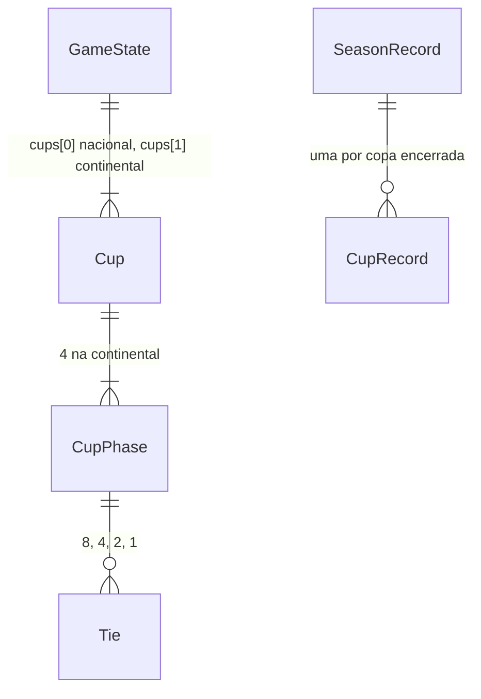

# Copa Continental

## Problem

Os clubes da Argentina e de Portugal só jogam a própria liga. Um técnico que termina entre os primeiros da Série A, da Liga Argentina ou da Liga Portuguesa não ganha nada além do prêmio da tabela, e nenhum clube brasileiro enfrenta um clube de fora. O sub-projeto 4b criou os três países justamente para a copa continental (plano de paises: «A copa continental (sub-projeto 4c) precisa de clubes de outro país para existir»).

Hoje também há dois defeitos que só aparecem com mais de uma copa ou com usuário fora do Brasil:
- a tela Copa mostra só `cups[0]`, e para um usuário de clube argentino ou português diz «Na disputa» numa copa que ele não joga (`isAlive` é verdadeiro para quem nunca perdeu, e quem nunca jogou nunca perdeu);
- a campanha do usuário (`reachedText`) sempre usa os nomes das seis fases da Copa Nacional e trata 6 como «Campeão».

Evidência: roteiro aprovado em 26/09/2026 (4a copa nacional → 4b países → 4c copa continental); 4a e 4b entregues em 27/09/2026. Em 28/09/2026 o autor disse «siga» para o 4c e mantém a preferência de 26/09/2026: «siga toda a sua recomendação, não me pergunte mais». Não há métrica de uso.

Quando isto for entregue:
- toda temporada tem a Copa Continental: 16 clubes dos três países, mata-mata em jogo único, quatro datas no calendário;
- o técnico classificado joga os confrontos ao vivo, com cartões e prêmios próprios da copa;
- a tela Copa mostra as duas copas, e o Fim, o Histórico e a Nova temporada mostram a continental.

## Flow

Reutiliza tudo da Copa Nacional (`engine/cup`: sorteio, `Tie` com pênaltis, `cupLive`, `finishCupDate`, `catchUpPhase`), o calendário (`calendar.nextDate`, que já percorre `state.cups`), a disciplina por copa (`Player.cupDiscipline[cupId]`, AD-013), o fluxo do store para datas de copa (abre a tela ao vivo só se o usuário joga) e as telas Ao vivo e Rodada, que já titulam pela `cup.name`. O que era fixo da Copa Nacional (nomes das fases, datas, prêmios, fase preliminar, sais das sementes) passa a vir do formato de cada copa, pelo id.

1. jogo novo → `engine/generate` (exists) - cria `cups[1]` (door 1) com os 16 classificados pelo ranking de força de cada liga de nível 0 e sorteia as oitavas com a semente própria (door 2)
2. virada → `engine/rollover.nextSeason` (exists) - cria `cups[1]` com os classificados da temporada fechada: campeão da Copa Nacional e melhores da Série A até 6 brasileiros, 5 primeiros da Liga Argentina, 5 primeiros da Liga Portuguesa; sorteia as oitavas sem confronto entre clubes do mesmo país
3. «Jogar rodada» → `calendar.nextDate` (exists) - depois das rodadas 7, 13, 25 e 31 a próxima data é uma fase da continental
4. store (exists) → `cup.startCupDate` / tela `Live` (exists) - o usuário classificado joga ao vivo; sem confronto, a data fecha sem a tela ao vivo
5. `cup.finishCupDate` (exists) - resultados, pênaltis, disciplina em `cupDiscipline["cup-cont"]`, renda para o mandante, prêmio da fase da continental para o vencedor, sorteio da próxima fase
6. rodada 38 → `season.seasonReview` (exists) - a continental entra em `cups` da revisão e do `SeasonRecord` (door 1 de copa-nacional já é lista); o veredito continua lendo só `cups[0]`
7. telas Copa, Fim, Histórico e Nova temporada (exist) - duas abas na Copa; campanha com os nomes das fases de cada copa; coluna da continental no Histórico; classificação na Nova temporada
8. `persistence` (exists) grava o save v8; `engine/migrate` (exists) leva um save v7 ao v8 (door 3)

## Impact

| Front | What changes |
| --- | --- |
| domain | new term: `Copa Continental` - `cups[1]`, id `"cup-cont"`, fases «Oitavas», «Quartas», «Semifinal», «Final», vive em `engine/cup` |
| domain | existing term: `userReached` / `cupReached` - «campeão» era sempre 6 (`CHAMPION_REACHED`); passa a ser o número de fases da copa (6 na nacional, 4 na continental). Quem ramifica hoje: `ui/Cup.reachedText` (Fim, Histórico), `board.cupGoalMet` (só lê `cups[0]`, valor 6 não muda) |
| domain | existing term: situação do usuário na tela Copa - «Na disputa» para quem nunca jogou passa a «Fora da competição». Quem ramifica: `ui/Cup.situation` |
| domain | existing term: calendário da temporada - 44 datas (38 rodadas + 6 fases) passam a 48 (+4 fases da continental). Testes que contam 44 datas ou `cups.length === 1` mudam (Superseded em `checks.md`) |
| domain | existing criterion: copa-nacional door 3 (sementes do sorteio) - a nacional mantém sal e fórmula; a continental tem sal próprio (door 2) |
| domain | existing criterion: AD-013 - `cups[0]` continua sendo a nacional; a continental é `cups[1]` |
| finance | 16 clubes ganham renda e prêmio a mais; os clubes da IA gastam o excedente pelo gastos-da-ia, sem mudança de regra |
| stored data | save v7 → v8: migrate on read (door 3) |

## Relations

One-way constraints: `cups[1].id` é `"cup-cont"` (door 1); `cups[1].seeding` tem 16 ids de clubes de nível 0 ou do campeão da Copa Nacional (door 1). No columns and no types here.

## Surface

None - nothing consumed outside. É um SPA estático sem API (AD-001).

## Landing

| One-way door | Literal shape | Alternative rejected |
| --- | --- | --- |
| 1. a continental no save | `cups[1] = { id: "cup-cont", name: "Copa Continental", seeding: [16 ids], phases: [«Oitavas», «Quartas», «Semifinal», «Final»], currentPhase }`, com `afterLeagueRound` 7, 13, 25, 31; `CupRecord` com `cupId: "cup-cont"` e `userReached` 0..4 (4 = campeão). `SCHEMA_VERSION = 8` | um campo `continentalCup` no `GameState`: contraria AD-013 e fura cada laço genérico que já percorre `cups` (`nextDate`, disciplina, revisão, histórico) |
| 2. sementes da continental | sorteio `mix32(mix32(rngState, 0xd1), fase)`, partidas `mix32(mix32(rngState, 0xc1), fase * 32 + confronto)`; a nacional segue com `0xd0` e `0xc0` | usar os sais da nacional: as duas preliminares/oitavas são sorteadas no mesmo `rngState` da virada, e os dois embaralhamentos sairiam do mesmo fluxo; pôr o índice da copa na fórmula da nacional: muda todo sorteio nacional de uma mesma seed e quebra a door 3 de copa-nacional |
| 3. migração v7 → v8 | `cups[1]` criada pelo ranking de força de cada liga de nível 0, com sorteio em `mix32(seed, 8)` e partidas em `mix32(seed, 9)`; as fases cuja rodada-âncora já passou são sorteadas e jogadas só com placar, sem dinheiro nem condição (o mesmo `catchUpPhase` da door 5 de copa-nacional); `history` intacto | só criar a continental na próxima virada: um save v7 no meio da temporada ficaria com `cups.length === 1`, e toda tela precisaria de um ramo para a copa ausente |

- Nothing else in this change is hard to reverse. Vagas por país, datas, prêmios, a regra do sorteio das oitavas e as abas da tela mudam com uma constante ou com CSS.

## Criteria

### S1: A Copa Continental existe com os classificados certos (P1)

Um jogo novo e cada temporada seguinte começam com os 16 classificados e as oitavas sorteadas.

**Acceptance Criteria**

1. WHEN um jogo novo é criado THEN o sistema SHALL criar `cups[1]` com id `"cup-cont"`, nome «Copa Continental» e as fases «Oitavas», «Quartas», «Semifinal» e «Final», nessa ordem
2. WHEN um jogo novo é criado THEN os 16 classificados SHALL ser os 6 primeiros do ranking de força da Série A, os 5 primeiros da Liga Argentina e os 5 primeiros da Liga Portuguesa
3. WHEN a temporada vira THEN os classificados brasileiros SHALL ser o campeão da Copa Nacional encerrada e, em seguida, os melhores colocados da tabela final da Série A que ainda não estão classificados, até 6 clubes brasileiros
4. WHEN a temporada vira THEN os classificados argentinos e portugueses SHALL ser os 5 primeiros da tabela final da Liga Argentina e os 5 primeiros da tabela final da Liga Portuguesa
5. The `seeding` da continental SHALL intercalar os países pela colocação: 1º BR, 1º AR, 1º PT, 2º BR, 2º AR, 2º PT, … , 5º PT, 6º BR
6. WHEN a continental é criada THEN as oitavas SHALL já estar sorteadas, com 8 confrontos e nenhum confronto entre dois clubes do mesmo país
7. WHEN uma fase da continental termina THEN a próxima fase SHALL ser sorteada entre os vencedores, sem restrição de país, com o clube mais abaixo no `seeding` como mandante
8. The mesmo `seed` e o mesmo `rngState` SHALL produzir o mesmo sorteio da continental, e o sorteio das oitavas SHALL usar a semente da door 2, não a da nacional

**Independent test:** criar um jogo novo com uma seed fixa: a continental tem os 16 clubes esperados, intercalados, e as oitavas não têm confronto de mesmo país.

### S2: A Copa Continental se joga no calendário (P1)

**Acceptance Criteria**

9. The fases da continental SHALL ser jogadas logo depois das rodadas 7, 13, 25 e 31 da liga, e uma temporada SHALL ter 48 datas
10. WHILE o clube do usuário tem confronto na fase da data, WHEN o usuário aperta «Jogar rodada» THEN o sistema SHALL abrir a tela ao vivo com o título «Ao vivo · Copa Continental · <fase>»
11. IF o clube do usuário não tem confronto na fase da data THEN a data SHALL fechar sem a tela ao vivo, como na Copa Nacional
12. WHEN uma fase da continental fecha THEN o vencedor de cada confronto SHALL receber o prêmio da fase: 800.000 nas Oitavas, 1.500.000 nas Quartas, 2.500.000 na Semifinal e 5.000.000 na Final, e o mandante SHALL receber a renda do jogo
13. WHEN um jogador recebe cartão numa partida da continental THEN o cartão SHALL contar só em `cupDiscipline["cup-cont"]`, sem mudar a disciplina da liga nem a da Copa Nacional
14. WHILE um jogador está suspenso na Copa Nacional, ele SHALL poder ser escalado numa partida da continental
15. The veredito da diretoria SHALL ser o mesmo qualquer que seja a campanha do usuário na continental

**Independent test:** jogar uma temporada com um clube classificado: as quatro fases aparecem depois das rodadas 7, 13, 25 e 31, e o prêmio da fase entra no caixa.

### S3: As telas mostram as duas copas (P2)

**Acceptance Criteria**

16. The tela Copa SHALL ter duas abas, «Copa Nacional» e «Copa Continental», e cada aba SHALL mostrar as fases e os confrontos da sua copa
17. WHEN a tela Copa abre THEN ela SHALL mostrar a aba «Copa Continental» se o clube do usuário está no `seeding` da continental, e a aba «Copa Nacional» nos outros casos
18. The confrontos da aba «Copa Continental» SHALL mostrar ao lado de cada clube a sigla do país: «BRA», «ARG» ou «POR»
19. IF o clube do usuário não está no `seeding` da copa da aba THEN a situação SHALL ser «Fora da competição»
20. WHEN a temporada termina THEN a tela Fim SHALL mostrar a campanha do usuário em cada copa com os nomes das fases dessa copa, e «Campeão» só para quem venceu a final dela
21. The tela Histórico SHALL ter a coluna «Copa Continental» com o campeão de cada temporada fechada, e «-» numa temporada sem continental
22. WHEN a tela Nova temporada abre com o clube do usuário classificado THEN ela SHALL mostrar «Copa Continental» na linha da temporada
23. WHILE a janela tem 400 × 700 px, a tela Copa com a aba «Copa Continental» SHALL caber sem rolagem de página (AD-010)

**Independent test:** abrir a tela Copa com um clube argentino classificado: a aba continental abre, com siglas de país, e a aba nacional diz «Fora da competição».

### S4: Um save antigo ganha a continental (P1)

**Acceptance Criteria**

24. WHEN um save v7 é carregado THEN o sistema SHALL gravar `schemaVersion` 8 com `cups[1]` criada pelo ranking de força das três ligas de nível 0, como no AC 2
25. WHEN um save v7 é carregado no meio da temporada THEN as fases da continental cuja rodada-âncora já passou SHALL estar sorteadas e jogadas, sem mudar caixa, condição nem disciplina de nenhum jogador
26. WHEN um save v7 é carregado THEN o `history` e a `cups[0]` SHALL ficar iguais aos do save v7

**Independent test:** carregar um save v7 parado depois da rodada 14: a continental já tem Oitavas e Quartas jogadas, e o caixa de todos os clubes é o mesmo do save.

## Out of scope

| Excluded | Why |
| --- | --- |
| fase de grupos | cria um padrão novo (tabela de copa, 6 datas a mais); o mata-mata reaproveita todo o motor da Copa Nacional |
| confrontos de ida e volta | muda o formato do `Tie` (door 1 de copa-nacional); jogo único é o formato da nacional |
| meta da diretoria na continental | o veredito já combina liga e Copa Nacional; uma terceira meta pede novo desenho de veredito |
| Série B, 2ª divisão de outros países ou mais vagas | a continental é da elite; vagas mudam por constante depois |
| supercopa, mundial de clubes ou outra copa | não pedido |
| taxa de participação ou cota de TV | o prêmio por fase já dá o dinheiro da copa |

## Assumptions

| Assumption | Chosen default | Rationale | Confirmed? |
| --- | --- | --- | --- |
| quem decide | o autor disse «siga» (28/09/2026) e prefere as recomendações sem rodada de perguntas (26/09/2026) | user delegated | y |
| nome | «Copa Continental», mesmo com Portugal fora do continente | nome do roteiro; é um mundo fictício e o nome é uma constante | y |
| formato | 16 clubes, mata-mata em jogo único, pênaltis no empate | reaproveita `Tie`, sorteio e pênaltis da nacional sem padrão novo | y |
| vagas | 6 BR, 5 AR, 5 PT | o Brasil tem duas divisões e a maior liga; 16 fecha a chave sem preliminar | y |
| vaga do campeão da Copa Nacional | entra em primeiro entre os brasileiros, mesmo vindo da Série B | dá peso à nacional, como a vaga de campeão de copa no futebol real | y |
| datas | depois das rodadas 7, 13, 25 e 31 | não coincidem com a nacional (4, 10, 16, 22, 28, 34) e terminam antes da última rodada | y |
| prêmios | 800 mil, 1,5 mi, 2,5 mi e 5 mi | acima da nacional (150 mil a 2,5 mi); o título vale o mesmo que o da Série A (5 mi) | y |
| sorteio das oitavas | sem confronto de mesmo país; fases seguintes livres | regra das copas continentais reais; com 6/5/5 sempre há solução | y |
| aba inicial | a continental se o usuário está nela | é a copa que ele mais quer acompanhar quando classificado | y |

O autor aprovou o plano com estes defaults em 28/09/2026 («aprovado, siga»).

**Open questions:** none - all resolved or logged above.

## Observable

| Surface | Decision | Landing |
| --- | --- | --- |
| tela Copa | empty state | existing - fase ainda não sorteada mostra «a sortear» |
| tela Copa | usuário fora da copa | AC 19 |
| tela Copa | densidade e ordem | AC 16, AC 17, AC 18 |
| tela Copa | loading, error, unauthorised | n/a - lê o estado já carregado; jogo local sem conta |
| tela Copa no celular | rolagem | AC 23 |
| tela Ao vivo | título | AC 10 |
| tela Rodada de uma data da continental | título e confrontos | existing - `cupPhaseTitle` e a lista de confrontos da nacional já leem a copa da data |
| tela Fim | campanha por copa | AC 20 |
| tela Histórico | coluna nova e temporada sem continental | AC 21 |
| tela Nova temporada | classificação | AC 22 |
| tela Nova temporada | usuário não classificado | AC 22 - a linha não menciona a continental |
| destructive action | confirmação | n/a - nenhuma ação destrutiva nova |

## Sources

- `.specs/features/copa-nacional/plan.md` - doors 1 a 6 da copa, que esta reutiliza
- `.specs/features/paises/plan.md` - países, níveis e AD-016
- `.specs/STATE.md` - AD-013, AD-014, AD-016
