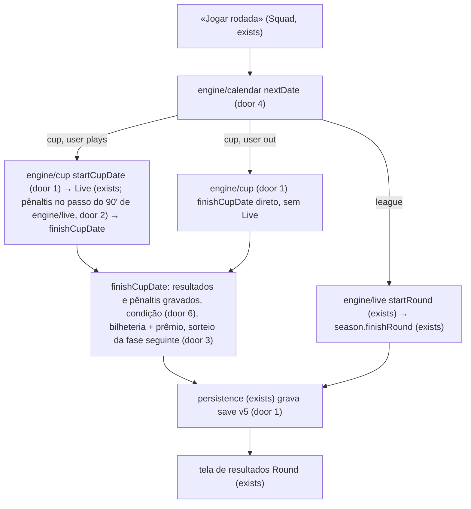
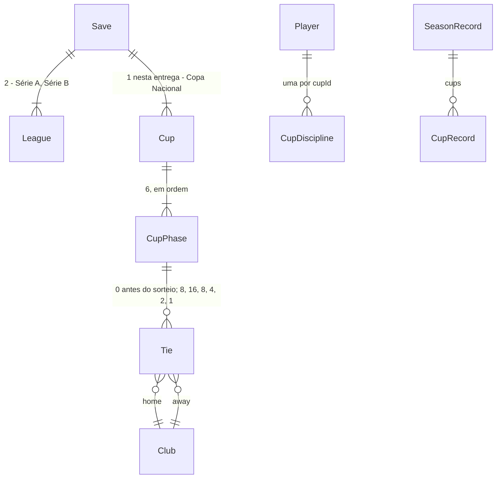

# Copa nacional

## Problem

A temporada hoje é só pontos corridos: 38 rodadas de liga, uma partida por clube por rodada, e nenhum jogo que vale eliminação. O técnico de um clube do meio da tabela da Série A não tem nada a disputar depois da metade do campeonato, e o de um clube da Série B nunca enfrenta um grande. Não existe pênalti, nem jogo em que o empate não basta, nem sorteio. O elenco nunca é disputado por duas competições ao mesmo tempo, então rodízio e cartão por competição não pesam em nenhuma escolha.

No Brasfoot original, e no calendário real que o jogo imita, a copa nacional é metade do interesse de uma temporada.

Evidência: roteiro aprovado em 26/09/2026. O sub-projeto 4 («copas e países») foi quebrado nesse dia em 4a copa nacional → 4b países → 4c copa continental, e esta é a 4a. Em 26/09/2026 o autor escolheu:
- os 40 clubes entram: preliminar com os 16 últimos do chaveamento e depois mata-mata de 32 em jogo único, com pênaltis;
- um calendário único de 44 datas, e a copa gasta o elenco;
- cartões e suspensões separados por competição;
- bilheteria do mandante e prêmio crescente por fase;
- sorteio a cada fase, com o mando para o clube de pior ranking;
- uma meta de copa que ajusta em um degrau o veredito da liga, sem nunca demitir sozinha.

Depois disso, o autor delegou o resto: «siga toda a sua recomendação, não me pergunte mais».

Não há métrica de uso.

Quando isto for entregue, cada temporada terá a «Copa Nacional», com 6 datas intercaladas com a liga. O técnico vê o sorteio e joga o mata-mata ao vivo, com disputa de pênaltis narrada. Ele administra suspensões de copa e de liga separadamente e recebe bilheteria e prêmio pelas fases que vencer. No fim da temporada, vê se cumpriu a meta de copa e como isso mexeu no veredito da diretoria. O campeão da copa entra no histórico.

## Flow

Reutiliza o motor minuto a minuto (`engine/live`: `makeSide`, `makeMatch`, `stepMatch`, `runToEnd`), a condição por rodada (`engine/condition.playerAfterRound`), a bilheteria (`finance.attendanceFor`), o ranking de força (`board.strengthRanking`), a virada (`rollover.nextSeason`) e a cadeia de migração (`migrate.migrateSave`). Nenhum deles ganha uma cópia para a copa: recebem um parâmetro de competição.

1. jogo novo -> `engine/generate` (exists) - além das duas divisões, cria a `Cup` com o chaveamento por força e a preliminar sorteada (door 1, door 3). Ao escolher o clube, fixa `cupGoal`
2. «Jogar rodada» -> `engine/calendar` (new, door 4) `nextDate` - decide se a próxima data é de liga ou de copa. Sem decisões, `engine/season.playDate` joga uma data e `playRound` joga as datas de copa pendentes e uma rodada
3. data de liga -> `engine/live` + `engine/season.finishRound` (exist) - como hoje. A suspensão da liga só é consultada e cumprida aqui (door 6)
4. data de copa -> `engine/cup` (new, door 1) `startCupDate` - monta um `LiveRound` só com os confrontos da fase. A disponibilidade usa a suspensão de copa (door 6), e a semente de cada partida segue a door 2
5. tela «Ao vivo» (exists) - mostra os confrontos da copa. No 90', empate vai a pênaltis dentro do mesmo passo: a disputa vive em `engine/live` (`stepMatch`, `shootout`, `penaltyTakers`, `penaltyChance`), que já é dono do `Rng` da partida (door 2). Se o clube do usuário não joga a data, esta etapa é pulada
6. `engine/cup.finishCupDate` - grava placar, pênaltis e vencedor, aplica a condição (door 6), paga bilheteria e prêmio, sorteia a fase seguinte (door 3) e avança `rngState` uma vez
7. `persistence` (exists) grava o save v5 (door 1). Depois vêm a tela de resultados (exists) e a nova tela «Copa» (new, no door - placement per conventions)
8. rodada 38 -> tela Fim (exists) -> `engine/season.seasonReview` (exists) - combina o veredito da liga com a meta de copa. `rollover.nextSeason` (exists) grava a copa no histórico, zera a disciplina de copa e cria a copa nova (door 1, door 3)

## Impact

| Front | What changes |
| --- | --- |
| domain | new term: data (`GameDate`) - uma rodada de liga ou uma fase de copa. A temporada passa de 38 para 44 datas. Vive em `engine/calendar` |
| domain | new term: `Cup`, `CupPhase`, `Tie` - a copa, suas 6 fases e os confrontos de jogo único com pênaltis. Vivem em `engine/types` e `engine/cup` |
| domain | new term: chaveamento (`Cup.seeding`) - os 40 clubes do melhor para o pior, congelados no início da temporada. Decide quem joga a preliminar e quem tem o mando |
| domain | new term: disciplina de copa (`Player.cupDiscipline[cupId]`) - amarelos e suspensão que só valem na copa. Os campos `yellowCards` e `suspendedRounds` que já existem passam a significar **só liga**. Quem os lê hoje: `lineup.isAvailable`, `lineup.aiLineup`, `lineup.validateLineup`, `live.startRound` (bancos), `condition.playerAfterRound`, a tela Squad/Condition (marca «Suspenso») e `rollover` |
| domain | existing term: `isAvailable(player)` respondia «disponível para a próxima partida». Agora depende da competição da data: fora da copa, é o de hoje. Quem usa: `aiLineup`, `validateLineup`, `startRound`, as telas Squad e Condition |
| domain | existing term: `injuryRounds` («rodadas fora») passa a contar datas, de liga ou copa. Uma lesão de 4 cura em menos rodadas de liga quando há copa no meio. Quem usa: `playerAfterRound`, a tela Condition |
| domain | existing term: `MatchEventType` ganha `penalty_scored` e `penalty_missed`. Quem faz `switch` nele: `narration.narrate`, a tela «Ao vivo» e a tela de resultados |
| domain | existing term: `Ledger` ganha `cupPrize?`. Um ledger de data de copa tem salário, patrocínio e juros zerados. Quem lê: a tela Finanças, `ledgerNet` |
| domain | existing term: o veredito da diretoria (`seasonReview.user.verdict`) deixa de ser só `verdictFor(liga)` e passa pelo ajuste da copa. Quem usa: tela Fim, `rollover.nextSeason` (demissão e propostas), `SeasonRecord.verdict` |
| domain | existing term: `RoundOutcome` e a tela de resultados (`Round`) passam a mostrar uma data de copa: título da fase no lugar de «Rodada N», e «Próxima fase» no lugar de «Classificação» |
| domain | existing term: a linha «Rodada N de 38» (Squad, Round) vira «Copa Nacional · <fase>» quando a próxima data é de copa |
| domain | existing criterion C43 de partida-ao-vivo, C52 do sub-projeto 2 e o de versão incompatível de multiplas-temporadas: agora só uma versão acima de 5 é incompatível |
| stored data | migrate on read: v4 (e, pela cadeia, v3, v2 e v1) vira v5. Entram `cups` com o chaveamento por força e as fases já vencidas no calendário sorteadas e simuladas só com placar; `cupDiscipline: {}` em todo jogador (clubes, livres, juniores); `cupGoal`; e `cups: []` em cada `SeasonRecord` antigo (door 1, door 5) |

## Relations

Restrições de mão única:
- `cups` é um array desde a v5; a copa nacional é `cups[0]` com id `"cup-nat"` (door 1). A continental (4c) entra como mais um elemento.
- `Cup.seeding` tem os 40 ids de clube uma vez cada e não muda durante a temporada (door 1).
- Uma fase só tem confrontos depois de sorteada, e o sorteio de uma fase nunca é refeito (door 3).
- `Player.cupDiscipline` sempre existe, mesmo vazio `{}`; a chave é o id da copa (door 6).

## Surface

None - nothing consumed outside. É um SPA estático sem API (AD-001).

## Landing

| One-way door | Literal shape | Alternative rejected |
| --- | --- | --- |
| 1. save v5 | `schemaVersion: 5`; `GameState.cups: Cup[]`, `GameState.cupGoal: number` (índice da fase a alcançar; `-1` sem clube); `Cup { id, name, seeding: string[], phases: CupPhase[], currentPhase: number }`; `CupPhase { name, afterLeagueRound, ties: Tie[] }`; `Tie { id, homeId, awayId, result: MatchResult \| null, penalties: { home, away } \| null, winnerId: string \| null }`; `Player.cupDiscipline: Record<string, { yellowCards, suspendedRounds }>`; `SeasonRecord.cups: { cupId, championId, runnerUpId, userReached: number \| null }[]`. Ids: copa `"cup-nat"`, confronto `"<cupId>-p<fase>-m<i>"` | copa dentro de `leagues[]` - quebraria a door 4 de multiplas-temporadas (`leagues[0]` = A, `leagues[1]` = B) e obrigaria tabela, rebaixamento e finanças a pular a copa em todo lugar; campos fixos `cupYellowCards`/`cupSuspended` no jogador - a copa continental (4c) exigiria um save v6 |
| 2. `Rng` das partidas de copa e dos pênaltis | o confronto `i` da fase `k` usa `createRng(mix32(mix32(rngState, 0xC0), k*32 + i))`, com o `rngState` do início da data. A disputa de pênaltis continua o **mesmo** fluxo da partida depois do minuto 90 | reusar `matchSeed(rngState, round, i, 0)` - a fase `k` e a rodada `k` teriam a mesma semente se o `rngState` coincidisse; um `Rng` separado para os pênaltis - seria mais uma semente a manter estável sem ganho |
| 3. `Rng` do sorteio | o sorteio da fase `k` usa `createRng(mix32(mix32(rngState, 0xD0), k))`. Na preliminar (`k = 0`), o `rngState` é o do jogo novo, o da temporada nova (depois do avanço da virada) ou o da migração; nas outras fases, o da data que fechou a fase `k-1`, antes do avanço. O sorteio embaralha os classificados (Fisher-Yates com `randInt`) e junta em pares consecutivos | sortear com o `Rng` da virada (door 3 de multiplas-temporadas) - mudaria a sequência de sorteios que C-checks de multiplas-temporadas já fixam; `mix32(rngState, 0xD0 + k)` direto - colide com `mix32(rngState, 13*16 + i)` das partidas da rodada 13 |
| 4. calendário | `CUP_AFTER_ROUNDS = [4, 10, 16, 22, 28, 34]` gravado em cada `CupPhase.afterLeagueRound`. `nextDate(state)` devolve `{ kind: "cup", cupIndex, phase }` quando existe copa com `currentPhase < phases.length` e `phases[currentPhase].afterLeagueRound <= leagues[0].currentRound`; senão, `{ kind: "league", roundIndex }` enquanto houver rodada; senão, `{ kind: "over" }`. Não há ponteiro de data no save | um array `calendar` com ponteiro próprio - duplicaria `League.currentRound` e `Cup.currentPhase`, e os dois poderiam divergir num save |
| 5. migração v4 → v5 | chaveamento por força em cada divisão (A antes de B); sorteio da preliminar com a door 3 sobre `mix32(seed, 6)`; cada fase com `afterLeagueRound <= leagues[0].currentRound` é simulada só com placar (`runToEnd`, pênaltis inclusos) usando a door 2 sobre `mix32(seed, 7)`, e depois é sorteada a fase seguinte. Sem dinheiro e sem condição | pular as fases passadas e começar a copa na próxima - um save no meio da temporada ficaria com uma copa que não termina até a final |
| 6. disciplina por competição | `isAvailableFor(p, competition)`, onde `competition` é `{ kind: "league" }` ou `{ kind: "cup", cupId }`: lesão zerada **e** a suspensão daquela competição zerada. Os campos de topo `yellowCards` e `suspendedRounds` são a disciplina da liga | renomear para `leagueDiscipline` - reescreveria saves e todos os leitores sem mudar comportamento |

- Nada mais nesta entrega é difícil de reverter.

## Criteria

### S1: Calendário de 44 datas (P1)

As fases da copa entram entre as rodadas da liga, e «Jogar rodada» joga a próxima data.

**Acceptance Criteria**

1. The sistema SHALL ordenar a temporada em 44 datas: as fases «Preliminar», «16 avos», «Oitavas», «Quartas», «Semifinal» e «Final» vêm logo depois das rodadas 4, 10, 16, 22, 28 e 34 da liga, nessa ordem, cada uma antes da rodada seguinte
2. WHEN «Jogar rodada» é pressionado e a próxima data é uma fase de copa THEN o sistema SHALL jogar só os confrontos dessa fase e SHALL manter o `currentRound` das duas divisões
3. WHEN uma data de copa fecha THEN o sistema SHALL avançar `Cup.currentPhase` em 1 e `rngState` exatamente uma vez
4. WHILE a próxima data é uma fase de copa a tela do elenco SHALL mostrar «Copa Nacional · <fase>» no lugar de «Rodada N de 38»
5. WHEN a rodada 38 da liga fecha THEN o sistema SHALL mostrar a tela Fim com a copa já decidida

**Independent test:** um jogo novo jogado data a data: a data 5 é a «Preliminar», a liga continua na rodada 4 depois dela, e a data 44 é a rodada 38.

### S2: Chaveamento e sorteio (P1)

Quem entra onde, contra quem e com mando de quem.

**Acceptance Criteria**

6. WHEN uma temporada começa (jogo novo, virada, migração) THEN o sistema SHALL congelar `Cup.seeding` com os 40 clubes: Série A antes da Série B; dentro da A, quem ficou pela posição na Série A da temporada anterior, depois os que subiram pela posição na Série B; dentro da B, os que caíram pela posição na Série A, depois o resto pela posição na Série B
7. IF não existe temporada anterior (jogo novo ou migração) THEN o sistema SHALL ordenar cada divisão por `strengthRanking`
8. The sistema SHALL pôr os 16 últimos do chaveamento na «Preliminar» (8 confrontos), e os 24 primeiros SHALL entrar na «16 avos»
9. WHEN uma fase fecha THEN o sistema SHALL sortear a fase seguinte com todos os classificados: 32 clubes em 16 confrontos na «16 avos», depois 8, 4, 2 e 1
10. The sistema SHALL dar o mando de cada confronto ao clube mais abaixo em `Cup.seeding`
11. The sistema SHALL sortear a «Preliminar» no momento em que a temporada começa, de modo que a tela da copa a mostre antes da data 1

**Independent test:** uma virada a partir de uma temporada com tabelas conhecidas: os 16 clubes que ficaram na Série B jogam a preliminar, os 4 rebaixados entram direto, e em todo confronto o mandante é o de pior chaveamento.

### S3: Mata-mata e pênaltis (P1)

Um jogo único que sempre tem vencedor.

**Acceptance Criteria**

12. IF um confronto de copa está empatado no 90' THEN o sistema SHALL decidir nos pênaltis: 5 cobranças por lado, alternadas, encerrando antes quando um lado não pode mais alcançar o outro, e depois pares de cobranças até um par ter exatamente um gol
13. The sistema SHALL converter um pênalti com probabilidade `0,75 + (força efetiva do batedor − força efetiva do goleiro) / 200`, limitada a [0,55; 0,92]
14. The sistema SHALL escolher os batedores entre os jogadores em campo no 90', na ordem FW, MF, DF, GK e por força efetiva dentro da posição, repetindo a ordem depois do último
15. WHEN um pênalti é cobrado THEN o sistema SHALL emitir um evento `penalty_scored` ou `penalty_missed` com o batedor, narrado na tela «Ao vivo» e na tela de resultados
16. WHEN um confronto foi aos pênaltis THEN a tela «Ao vivo», a tela de resultados e a tela da copa SHALL mostrar o placar como «1 x 1 (pên. 4 x 3)»
17. The sistema SHALL gravar `winnerId` em todo confronto encerrado, e o perdedor SHALL não aparecer em nenhuma fase seguinte daquela copa
18. The sistema SHALL NOT mudar nenhuma tabela da liga, `seasonGames` ou `seasonGoals` por causa de um jogo de copa

**Independent test:** um confronto entre lados iguais forçado a 0 x 0 vai aos pênaltis, tem vencedor, e o placar diz «0 x 0 (pên. X x Y)».

### S4: O elenco nas duas competições (P1)

Suspensão por competição; cansaço e lesão compartilhados.

**Acceptance Criteria**

19. WHEN uma data de copa fecha THEN um jogador com amarelo nela SHALL somar 1 em `cupDiscipline[cupId].yellowCards` e, ao chegar a 3, SHALL ficar com `suspendedRounds` 1 ali e os amarelos de volta a 0
20. WHEN uma data de copa fecha THEN um jogador expulso nela SHALL somar 1 em `cupDiscipline[cupId].suspendedRounds`
21. WHEN uma data de copa fecha THEN `yellowCards` e `suspendedRounds` da liga de todo jogador SHALL ficar iguais
22. WHEN uma rodada da liga fecha THEN o `cupDiscipline` de todo jogador SHALL ficar igual
23. WHILE a próxima data é uma fase de copa o sistema SHALL tratar um jogador com suspensão de copa como indisponível e um jogador só com suspensão de liga como disponível, na validação da escalação do usuário, na escalação da IA e no banco ao vivo
24. WHILE a próxima data é uma rodada da liga o sistema SHALL tratar um jogador só com suspensão de copa como disponível
25. WHEN uma data de copa fecha THEN o sistema SHALL baixar em 1 o `suspendedRounds` de copa de cada jogador de clube que jogou a data
26. WHEN qualquer data fecha THEN o sistema SHALL baixar em 1 o `injuryRounds` de todo jogador em clube, e SHALL aplicar aos jogadores dos clubes que jogaram a data as mesmas regras de cansaço e lesão de uma rodada da liga
27. WHEN uma data de copa fecha THEN quem jogou SHALL ganhar 1 de moral se o clube avançou e perder 1 se foi eliminado, dentro de [-2, 2]
28. WHEN uma data de copa fecha THEN os jogadores de clubes que não jogaram SHALL recuperar 30 de cansaço e SHALL manter `idleRounds` e moral
29. WHILE a próxima data é uma fase de copa a tela do elenco SHALL marcar os indisponíveis para aquela data e SHALL dizer «Suspenso (copa)» para uma suspensão de copa

**Independent test:** um jogador com 2 amarelos na liga e um vermelho na copa não pode jogar a próxima data de copa, pode jogar a próxima rodada, e a contagem da liga continua 2 depois da data de copa.

### S5: Dinheiro da copa (P2)

Bilheteria para o mandante e prêmio para quem avança.

**Acceptance Criteria**

30. WHEN uma data de copa fecha THEN o mandante SHALL receber `attendanceFor(finance, ticketPrice, 1) × ticketPrice` de bilheteria, e o visitante SHALL não receber bilheteria
31. WHEN um confronto de copa fecha THEN o vencedor SHALL receber o prêmio da fase: Preliminar R$ 150.000, 16 avos R$ 300.000, Oitavas R$ 500.000, Quartas R$ 800.000, Semifinal R$ 1.200.000, Final R$ 2.500.000
32. WHEN uma data de copa fecha THEN o sistema SHALL NOT cobrar salários nem juros, SHALL NOT pagar patrocínio e SHALL NOT avançar `expansionRoundsLeft`
33. WHEN uma data de copa fecha THEN o mercado SHALL ficar como estava: as mesmas propostas, juniores e livres
34. WHEN uma data de copa fecha THEN cada clube que jogou SHALL ter um registro com salários 0, patrocínio 0, juros 0, sua bilheteria, suas transferências desde o fechamento anterior e `cupPrize`, e a tela Finanças SHALL mostrar a linha «Prêmio da copa» quando `cupPrize` for maior que 0

**Independent test:** o usuário vence as Oitavas em casa: o caixa sobe exatamente a bilheteria mais R$ 500.000, e a folha não é cobrada.

### S6: Meta de copa e veredito (P2)

A diretoria cobra a copa, e a copa mexe um degrau no veredito.

**Acceptance Criteria**

35. WHEN a temporada do usuário começa (escolha de clube, virada, migração) THEN o sistema SHALL fixar `cupGoal`: a «16 avos» para um clube na «Preliminar»; senão, pelo `strengthRanking` dos 40 clubes, a «Semifinal» para as posições 1-4, as «Quartas» para 5-8 e as «Oitavas» para o resto
36. The sistema SHALL considerar a meta de copa cumprida quando o clube jogou a fase da meta ou uma posterior, ou foi campeão
37. WHEN a temporada termina e a meta de copa foi cumprida THEN o sistema SHALL melhorar o veredito da liga em um degrau: «Demitido» vira «Meta não cumprida» e «Meta não cumprida» vira «Meta cumprida»
38. WHEN a temporada termina e a meta de copa não foi cumprida THEN o sistema SHALL transformar «Meta cumprida» em «Meta não cumprida» e SHALL manter qualquer outro veredito
39. The sistema SHALL usar o veredito combinado na tela Fim, nas propostas de emprego depois de uma demissão e em `SeasonRecord.verdict`
40. The tela «Nova temporada» e a tela da copa SHALL mostrar «Meta na copa: chegar à <fase>» (por exemplo «chegar às oitavas»)

**Independent test:** um usuário na Série A que não cumpriu a meta da liga («Meta não cumprida») e chegou à fase da meta na copa termina com «Meta cumprida».

### S7: Telas da copa, do fim e do histórico (P2)

O técnico enxerga a copa inteira.

**Acceptance Criteria**

41. The tela do elenco SHALL ter um botão «Copa» que abre a tela da copa
42. The tela da copa SHALL listar as 6 fases em ordem, com os clubes e o placar de cada confronto, e «a sortear» para uma fase ainda não sorteada
43. The tela da copa SHALL mostrar a situação do usuário: «Na disputa», «Eliminado na <fase>» ou «Campeão»
44. IF o clube do usuário não joga a próxima data de copa THEN «Jogar rodada» SHALL fechar a data sem abrir a tela «Ao vivo» e SHALL mostrar a tela de resultados dela
45. WHILE uma data de copa está ao vivo a tela «Ao vivo» SHALL ter o título «Ao vivo · Copa Nacional · <fase>» e SHALL listar só os confrontos da fase
46. WHEN uma data de copa fecha THEN a tela de resultados SHALL ter o título «Copa Nacional · <fase>», SHALL mostrar todos os confrontos da data e SHALL mostrar o sorteio da fase seguinte, ou o campeão depois da «Final»
47. The tela Fim SHALL mostrar o campeão da copa, o vice e a fase que o usuário alcançou
48. WHEN a temporada vira THEN o sistema SHALL gravar no `SeasonRecord` da temporada uma entrada `cups` com o campeão, o vice e a fase que o usuário alcançou, e a tela Histórico SHALL mostrar o campeão da «Copa Nacional» de cada temporada
49. WHEN a temporada vira THEN todo jogador SHALL ter `cupDiscipline` `{}`, e SHALL existir uma copa nova com o chaveamento da nova temporada e a «Preliminar» sorteada

**Independent test:** abrir «Copa» na data 1 (preliminar sorteada, o resto «a sortear»), jogar até o fim e ver o campeão na tela Fim e, depois da virada, no Histórico.

### S8: Save v5 (P1)

A copa sobrevive a recarregar a página, e os saves antigos continuam abrindo.

**Acceptance Criteria**

50. The sistema SHALL gravar o save com `schemaVersion` 5
51. WHEN um save v4 é lido THEN o sistema SHALL migrá-lo para v5 com uma copa cujas fases com `afterLeagueRound` até o `currentRound` da Série A estão sorteadas e encerradas com vencedor, sem mudança de dinheiro nem de condição
52. WHEN um save v4 é lido THEN todo jogador em clube, entre os livres e entre os juniores SHALL ter `cupDiscipline` `{}`, todo `SeasonRecord` existente SHALL ter `cups` `[]`, e `cupGoal` SHALL seguir o AC 35
53. WHEN um save v1, v2 ou v3 é lido THEN o sistema SHALL migrá-lo para v5 passando pela v4
54. IF o `schemaVersion` do save é maior que 5 ou não é número THEN a tela inicial SHALL mostrar «Jogo salvo incompatível (versão N)»
55. The sistema SHALL produzir a mesma copa (sorteios, placares, pênaltis) a partir da mesma seed e das mesmas decisões do usuário

**Independent test:** um save v4 fixado na rodada 12 abre com a preliminar e a 16 avos encerradas, as oitavas sorteadas e não jogadas, e a próxima data é a rodada 13.

## Out of scope

| Excluded | Why |
| --- | --- |
| prorrogação | a Copa do Brasil real vai direto aos pênaltis; o autor aceitou a recomendação |
| ida e volta, gol fora de casa | o autor escolheu jogo único |
| artilharia e estatísticas da copa | as estatísticas atuais são da liga; uma artilharia por competição é outro sistema |
| jogador «inscrito» por um clube na copa que não pode jogar por outro | regra de inscrição não foi pedida |
| escolha manual de batedores de pênalti | a ordem sai da regra do AC 14 |
| copa continental e outros países | sub-projetos 4c e 4b |
| cotas de TV da copa | o dinheiro da copa é bilheteria e prêmio, como escolhido |
| copa estadual | não foi pedida |

## Assumptions

| Assumption | Chosen default | Rationale | Confirmed? |
| --- | --- | --- | --- |
| nome da copa | «Copa Nacional», sem logo e sem marca real | AD-008 | y - user delegated |
| valores dos prêmios | os do AC 31: o campeão que entra na 16 avos soma R$ 5,3 mi, perto dos R$ 5 mi do campeão da Série A | calibrado contra `prizeFor` | y - user delegated |
| público da copa | fator de forma 1,0 (neutro), preço de ingresso do mandante | a copa é neutra à tabela da liga | y - user delegated |
| amarelos para suspensão na copa | 3, igual à liga (`YELLOWS_FOR_SUSPENSION`) | a Copa do Brasil real também suspende no 3º amarelo | y - user delegated |
| moral em disputa de pênaltis | quem avança conta como vitória e quem cai como derrota (AC 27) | o que importa ao elenco é passar ou cair | y - user delegated |
| fases simuladas na migração | sem prêmio, bilheteria nem condição | mesmo padrão da Série B na migração v4 (door 5 de multiplas-temporadas) | y - user delegated |
| data de copa com o usuário fora | fecha direto, sem a tela «Ao vivo» (AC 44) | a tela «Ao vivo» assume um jogo do usuário; assistir jogos alheios não foi pedido | y - user delegated |
| rótulo do botão | continua «Jogar rodada», e a linha de próxima data diz qual é | não quebra o fluxo aprendido | y - user delegated |
| título da seção de Finanças | continua «Última rodada»; a data de copa aparece ali com a linha «Prêmio da copa» | mudança mínima de texto | y - user delegated |
| clube demitido no meio da copa | não existe demissão no meio da temporada (multiplas-temporadas) | nada muda | y - user delegated |

**Open questions:** none - all resolved or logged above.

## Observable

| Surface | Decision | Landing |
| --- | --- | --- |
| screen «Copa» | empty state | AC 42 - fases não sorteadas mostram «a sortear»; a preliminar sempre existe desde o início da temporada (AC 11) |
| screen «Copa» | loading state | n/a - o estado já está em memória quando o hub abre |
| screen «Copa» | error state | n/a - só leitura do estado; nenhuma ação que possa falhar |
| screen «Copa» | unauthorised | n/a - jogo local de um jogador só |
| screen «Copa» | density and ordering | AC 42 - fases na ordem do calendário, confrontos na ordem do sorteio |
| screen «Copa» | destructive action confirms | n/a - não há ação na tela |
| screen «Copa» | usuário sem clube | n/a - a tela só é alcançada pelo hub, que exige clube |
| screen «Ao vivo» (copa) | ordering and content | AC 45, AC 16 |
| screen «Ao vivo» (copa) | usuário fora da data | AC 44 - a tela não abre |
| screen resultados (copa) | content | AC 46 |
| screen resultados (copa) | depois da final | AC 46 - mostra o campeão |
| screen Squad | próxima data | AC 4, AC 29 |
| screen Squad | lineup inválido para a data de copa | AC 23 - o check de lineup existente desabilita «Jogar rodada», como hoje |
| screen Fim | content | AC 47, AC 39 |
| screen «Nova temporada» | content | AC 40 |
| screen Histórico | content | AC 48; temporadas migradas sem copa mostram «-» |
| screen Finanças | content | AC 34 |
| screen Home | save incompatível | AC 54 |
| all screens | responsivo ≤ 900 px sem rolagem de página | existing - AD-010, abas por painel via `ScreenTabs` |

## Sources

- Roteiro de sub-projetos aprovado em 26/09/2026 e o brainstorm da mesma data (formato, calendário, cartões, dinheiro, sorteio, meta de copa) - escolhas do autor
- `.specs/STATE.md` AD-001 a AD-012 - restrições do projeto
