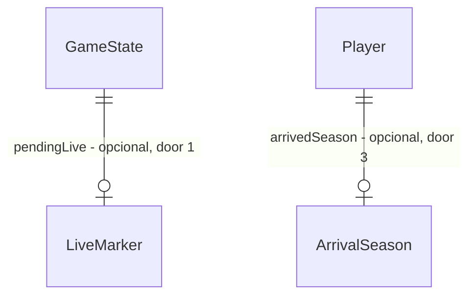

# Correções da validação ampla

## Problem

Uma validação ampla de 29/09/2026 levantou 43 achados. Oito agentes varreram o código, um verificador cético revisou cada dimensão e um crítico procurou lacunas. Dois achados foram refutados; os outros 41 estão abertos, e a maioria foi reproduzida com teste temporário (lista e evidência em `findings.json`, nesta pasta). A suíte está verde (472/472), o lint e o build passam, e mesmo assim:

1. **O jogador perde a carreira.** Se a leitura do IndexedDB falha uma vez, a tela inicial trata o jogo como «sem save», e «Novo jogo» grava por cima de um save íntegro sem pedir confirmação. Duas abas abertas fazem a mais antiga sobrescrever o progresso da outra. Um arquivo importado com um campo faltando é gravado no slot e depois não abre. Escalação, formação e postura só vão para o disco na próxima rodada. Com o salvamento falhando, não há caminho até «Exportar jogo» sem recarregar e perder o jogo.
2. **O jogo trava para sempre.** Na virada, a base não repõe o elenco do usuário. Com menos de 11 aptos e o mercado fechado, «Jogar rodada» fica desligado, e lesão e suspensão só diminuem jogando. O save fica inutilizável (seed 11, temporada 3, rodada 24).
3. **A economia quebra.** Contratar livre custa 4 salários, e o jogador vale de 50 a 75 salários: contratar e revender dá de 4,2 a 5,4 milhões por janela, sem risco. Em 20 temporadas a força média sobe sem parar e os 80 clubes terminam no vermelho a partir da 16ª.
4. **Regras de jogo erradas.**
   - A escalação de copa usa a suspensão da liga.
   - Time sem goleiro converte 100% dos chutes no alvo.
   - A formação quase não muda o placar (diferença abaixo de 2%).
   - Rebaixado com meta 13–15 não é demitido, mas com meta 16 é.
   - A artilharia soma gols marcados em outra divisão.
   - Recarregar no meio da partida ao vivo permite jogar a rodada de novo até ganhar.
5. **Telas e som.**
   - A tela Rodada fica vazia no celular em data de copa sem o usuário.
   - O botão «Jogar rodada» desliga sem dizer por quê.
   - Há textos sem concordância («Eliminado na Oitavas», «Faltam 1 titulares»).
   - Ids internos aparecem na narração.
   - Erros fora do render travam a tela.
   - Faltam padrões de acessibilidade.
   - Os efeitos se acumulam com a aba escondida e tocam todos juntos ao voltar.
   - A torcida fica em loop depois de um erro.
   - Uma falha de download silencia a música pelo resto da sessão.
6. **As guardas não guardam.**
   - O `deps.test` não barra `Math.random` fora do motor.
   - Os testes de narração passam com id cru.
   - 15 provas dos `checks.md` apontam para testes que não existem mais.
   - As pendências L-023, L-024 e L-025 do `STATE.md` continuam abertas.
   - O CI não roda o `dist-check`.
   - O vitest e o `layout-check` falham sob carga (timeout fixo de 5 s), e o selftest do layout ignora a saída da execução normal.

Quem paga é o jogador do site público, que perde a carreira ou fica preso num save sem saída. Não há métrica de uso; a evidência é a da validação.

Quando isto for entregue:
- o save sobrevive a falha de leitura, a duas abas, a um arquivo ruim e a um reload;
- nenhum save fica sem saída;
- dinheiro não nasce do nada, e uma carreira de 20 temporadas continua equilibrada;
- a formação, o goleiro e a diretoria seguem regras coerentes;
- as telas e o som se comportam nas bordas;
- as guardas de convenção e de CI pegam o que dizem pegar.

## Flow

Reutiliza `persist`/`init` da store, `saveGame`/`loadGame`, `decodeSaveFile`, `refillFromAcademy` (hoje só IA), `validateLineup`/`isAvailableFor`/`nextCompetition`, `sideStrength`/`changeFormation`, `marketValue`, `boardGoalFor`/`verdictFor`, a `ErrorScreen` já existente e os scripts de `scripts/`. Nenhum módulo novo de domínio.

1. abertura -> `src/store.init` (exists) pede o lock de aba (door 2) e chama `persistence/save.loadGame` (exists). Uma leitura que falha vira o estado `loadFailed`, diferente de «sem save». Um marcador de ao vivo pendente (door 1) fecha a rodada antes de abrir o jogo
2. importar -> `engine/saveFile.decodeSaveFile` (exists) valida o documento em profundidade -> `store.openImported` (exists) abre o jogo **antes** de gravar
3. Elenco -> `store.setFormation/setPosture/assignStarter` (exist) -> `engine/lineup` (exists) com a competição do próximo jogo e o mínimo `min(11, aptos)` -> `persist`
4. Jogar rodada -> `store.playRound` (exists) grava o marcador de ao vivo (door 1) -> `engine/live` (exists): goleiro efetivo, força do setor pela contagem, vaga no setor certo -> `finishLive` limpa o marcador
5. fechamento da rodada -> `engine/market` (exists): luvas pelo valor, trava de revenda (door 3), propostas dentro do caixa do comprador, preço de titular pela força
6. virada -> `engine/rollover` (exists) repõe pela base também o usuário, poda os livres e calibra a evolução; `engine/board` (exists) aplica as regras novas de demissão; `engine/season` (exists) conta a artilharia pelas partidas da liga
7. telas em `src/ui` (exists) e som em `src/audio` (exists): estados de borda, textos, ARIA e visibilidade da aba. A narração lê `engine/narration` (exists) com todos os clubes e os livres; a oferta inválida volta de `engine/market` como `invalid`; um erro fora do render passa por `store.crash` até a `ErrorBoundary`
8. `scripts` (exists), `src/deps.test.ts` (exists), `vite.config.ts` (exists), `deploy.yml` (exists), `index.html` (exists): guardas e metadados. O `check:layout --seed=<n>` abre a página com `?seed=<n>`, que `ui/NewGameButton` (exists) passa ao `store.newGame`

## Impact

| Front | What changes |
| --- | --- |
| domain | existing term: «escalação válida» (`validateLineup`, núcleo AC 17) exigia 11. Agora exige `min(11, aptos para a competição)`. Quem lê: `Squad`, `Round` (`canPlay`), `store.playRound` e os testes do núcleo C17 e da partida-ao-vivo C35 |
| domain | existing term: `refillFromAcademy` (multiplas-temporadas AC 19) era só da IA. Agora vale também para o usuário, até 18 jogadores. Consome o `Rng` da virada, então as fixtures de `rollover.test`/`balance.test` que fixam valores sorteados depois da reposição são reescritas com os valores novos, sem afrouxar nenhuma afirmação |
| domain | existing term: «luvas» do livre (`releaseCost`, elenco-mercado-financas AC 36) eram 4 salários. Passam a `max(4 × salário, 50% do valor de mercado)`, para o usuário e para a IA. A rescisão de quem é dispensado continua 4 salários. Os gastos-da-ia C19–C21/C34 são remedidos |
| domain | existing term: «titular» no preço pedido pela IA (AC 20) era «um dos 11 que a IA escalaria agora». Passa a ser «um dos 11 mais fortes, ignorando lesão, suspensão e cansaço» |
| domain | existing criteria: multiplas-temporadas AC 33 e paises AC 13/14 (meta e demissão) são substituídos pelos AC 32–34 deste plano. O copa-nacional C49 («Eliminado na Oitavas») e o núcleo AC 17 («Faltam N titulares») mudam de texto (AC 36) |
| domain | existing decision: a door 4 de partida-ao-vivo («recarregar recomeça do minuto 0 com as mesmas seeds») é substituída pela door 1 deste plano, com nova entrada AD-019 no `STATE.md` |
| domain | existing term: força do setor em `sideStrength` era a média do setor. Passa a depender também da contagem. `balance.test` (gols por jogo, vantagem do mandante) é remedido |
| domain | existing criterion: gastos-da-ia C19 (mediana do caixa entre 2× e 4× em 5 temporadas) passa a mediana entre 2× e 6,5×, com o máximo de 15× mantido. Com a força estável (AC 30), a folha deixa de inflar e o caixa da IA cresce mais; o AC 68 limita o crescimento em carreira longa. Pela mesma razão, paises C24 (mediana de AR e PT entre 1,2× e 4×) passa a mediana entre 1,2× e 6,5×. Decisões do usuário em 29/09/2026, depois da medição do lote A |
| stored data | nothing to migrate: os dois campos novos são opcionais, e a ausência tem significado definido (door 1, door 3). `schemaVersion` continua 8 |

## Relations

One-way constraints: `pendingLive` ausente = nenhuma rodada em andamento (door 1). `arrivedSeason` ausente = chegou antes desta regra e pode ser vendido (door 3).

## Surface

None - nada é consumido fora. É um SPA estático sem API (AD-001). O arquivo exportado (AD-018) muda só por carregar os campos opcionais das doors 1 e 3.

- Parâmetro de endereço `?seed=<n>` (inteiro positivo), achado no build (AC 60): «Novo jogo» começa o jogo com essa semente; sem ele, ou com valor inválido, a semente continua sorteada. Quem usa: o `check:layout`. Reversível - nada é gravado por ele além da semente que o jogo já grava

## Landing

| One-way door | Literal shape | Alternative rejected |
| --- | --- | --- |
| 1. marcador de ao vivo no save | `GameState.pendingLive?: true`. É gravado junto do estado de antes da rodada quando ela vai para o ao vivo e apagado pelo persist de `finishLive`. Ao abrir com o marcador, a data é jogada inteira sem decisões (`runToEnd`, mesmas seeds, escalação gravada) e o jogo abre na tela Rodada | gravar cada decisão ao vivo e reexecutar: uma escrita por clique e um log que o save carregaria para sempre. Aceitar o re-roll (door 4 antiga): deixa a copa e a liga serem jogadas até ganhar |
| 2. uma aba ativa por vez | Web Locks: `navigator.locks.request("forzion-futmanager-save", { ifAvailable: true })` na abertura. Sem o lock, a tela «O jogo está aberto em outra aba» aparece com «Usar nesta aba» (`steal: true`). A aba que perde o lock bloqueia as escritas e mostra a mesma tela. Sem `navigator.locks`, o jogo abre sem a guarda | revisão gravada no documento e comparada no `put`: exige transação de leitura e escrita, e a aba velha só descobre o conflito ao gravar, depois de o usuário já ter jogado nela. BroadcastChannel: não impede a escrita de uma aba que já está aberta |
| 3. data de chegada do jogador | `Player.arrivedSeason?: number`, gravado com a temporada atual quando o usuário contrata um livre, promove um júnior ou compra de outro clube | ler o boletim `market.transfers`: não registra livre nem júnior, e o boletim é limpo na virada |

- Nothing else in this change is hard to reverse

## Criteria

### S1: O save sobrevive (P1)

Nenhuma sequência de uso normal faz o jogador perder o progresso gravado.

**Acceptance Criteria**

1. IF `loadGame` rejeita na abertura THEN a tela inicial SHALL mostrar «Não foi possível ler o jogo salvo» e um botão «Tentar de novo» que repete a leitura
2. WHILE a última leitura falhou, WHEN o usuário toca «Novo jogo» ou importa um arquivo THEN o sistema SHALL pedir a mesma confirmação de quando existe save, antes de gravar
3. WHEN «Tentar de novo» lê o save com sucesso THEN a tela inicial SHALL mostrar «Continuar» e o slot SHALL permanecer com o documento original
4. IF o arquivo importado não tem `rounds`/`currentRound` em cada liga, `players`/`finance`/`forSale` em cada clube, ou o clube do usuário sem `lineup` THEN a importação SHALL recusar com «Arquivo corrompido: não foi possível ler o jogo» e o slot SHALL continuar com o documento anterior
5. IF abrir o jogo importado lança erro THEN o sistema SHALL mostrar a mesma mensagem de arquivo corrompido e SHALL NOT gravar o documento importado no slot
6. IF «Continuar» encontra um save que lança erro ao abrir THEN a tela inicial SHALL mostrar «Não foi possível abrir o jogo salvo» em vez de ignorar o clique
7. WHEN uma segunda aba abre o jogo enquanto outra tem o lock THEN a segunda SHALL mostrar «O jogo está aberto em outra aba» com o botão «Usar nesta aba», e SHALL NOT gravar
8. WHEN o usuário toca «Usar nesta aba» THEN esta aba SHALL recarregar o save e abrir o jogo, e a outra aba SHALL passar a mostrar «O jogo está aberto em outra aba», sem gravar mais
9. IF `navigator.locks` não existe THEN o jogo SHALL abrir sem a guarda de aba, como hoje
10. WHILE `saveStatus` é `failed` ou `unavailable` a faixa de aviso SHALL mostrar o botão «Exportar jogo», que baixa o jogo em memória no envelope do AD-018
11. WHEN o usuário muda a formação, a postura ou um titular THEN o sistema SHALL gravar o jogo, e depois de recarregar «Continuar» SHALL restaurar a mesma formação, postura e titulares
12. IF uma mudança de escalação acontece enquanto uma ação de mercado grava THEN o estado final SHALL conter as duas mudanças
13. WHEN a rodada vai para o ao vivo THEN o save SHALL ter `pendingLive: true` e o estado de antes da rodada, com a escalação do início
14. WHEN o jogo abre com `pendingLive` THEN o sistema SHALL jogar a data inteira sem decisões, gravar o resultado sem o marcador e abrir a tela Rodada. O placar do usuário SHALL ser o mesmo de `runToEnd` com as mesmas seeds e a escalação gravada

**Independent test:** com o IDB falhando na primeira abertura, «Novo jogo» pede confirmação. Com F5 aos 85' de uma derrota, a rodada volta fechada com o placar que a escalação gravada produz.

### S2: Nenhum save fica sem saída (P1)

**Acceptance Criteria**

15. WHEN a temporada vira e o elenco do usuário tem menos de 18 jogadores THEN a base SHALL completar o elenco até 18 com juniores, pela mesma regra de força da IA (média do elenco − 8 ± 4)
16. WHILE o clube do usuário tem menos de 11 jogadores aptos para a competição do próximo jogo a escalação SHALL ser válida com todos os aptos escalados e as vagas restantes vazias, e «Jogar rodada» SHALL estar ligado
17. WHEN a partida começa com vaga vazia no time do usuário THEN o motor SHALL jogar com o slot vazio, como já faz com a IA
18. WHILE a escalação é inválida a tela Rodada SHALL mostrar «Falta 1 titular» ou «Faltam N titulares» junto do «Jogar rodada» desligado

**Independent test:** a seed 11, clube 10, sem renovações, passa da temporada 3, rodada 24, sem travar.

### S3: Escalação de copa pela disciplina certa (P1)

**Acceptance Criteria**

19. WHEN o próximo jogo do usuário é de copa e ele escolhe para um slot um jogador suspenso só na liga THEN o sistema SHALL aceitar a escolha
20. WHEN o próximo jogo do usuário é de copa e ele escolhe para um slot um jogador suspenso nessa copa THEN o sistema SHALL recusar a escolha
21. WHEN o usuário troca a formação THEN o auto-preenchimento SHALL usar a competição do próximo jogo e a postura atual, e SHALL NOT escalar quem está indisponível nela

**Independent test:** antes das Oitavas, um suspenso de liga entra no slot de ATA. Trocar para 4-3-3 deixa a escalação válida.

### S4: Economia sem dinheiro do nada (P1)

**Acceptance Criteria**

22. The sistema SHALL cobrar de luvas, para contratar um livre (usuário e IA), `max(4 × salário, arredondar(0,5 × valor de mercado))`
23. WHEN o usuário contrata um livre, promove um júnior ou compra um jogador THEN o jogador SHALL receber `arrivedSeason` = temporada atual
24. IF o usuário tenta pôr «À venda» um jogador com `arrivedSeason` igual à temporada atual THEN o sistema SHALL recusar com «Chegou nesta temporada: só pode ser vendido na próxima»
25. The geração de propostas SHALL NOT criar proposta por jogador do usuário com `arrivedSeason` igual à temporada atual
26. WHEN as propostas de uma rodada são geradas THEN a soma das propostas de cada comprador SHALL ser menor ou igual ao caixa dele, e o elenco dele mais as propostas SHALL ter no máximo 30 jogadores
27. IF o usuário aceita uma proposta e o comprador já não tem caixa ou tem 30 jogadores THEN o sistema SHALL recusar com «O comprador desistiu da proposta» e remover a proposta
28. The preço pedido pela IA SHALL aplicar o acréscimo de titular (1,5×) aos 11 jogadores mais fortes do clube, ignorando lesão, suspensão e condição física
29. WHEN a temporada vira THEN a lista de livres SHALL ficar com no máximo 80 jogadores, mantendo os de maior força
30. The simulação de 20 temporadas sem usuário (seed 5) SHALL manter a média dos 18 melhores de cada clube da Série A a no máximo 5 pontos da média da temporada 1, em todas as temporadas
31. The mesma simulação SHALL terminar cada temporada com no máximo 10 dos 80 clubes com caixa negativo
68. The mesma simulação SHALL manter a mediana do caixa dos 80 clubes em no máximo 20 × o caixa inicial, em todas as temporadas

**Independent test:** o ciclo «contratar livre, marcar à venda, aceitar» deixa o caixa menor que o de quem só jogou. 20 temporadas simuladas ficam dentro das faixas.

### S5: Regras de temporada e diretoria coerentes (P2)

**Acceptance Criteria**

32. WHEN um clube do usuário termina na zona de rebaixamento THEN o veredito SHALL ser «Demitido», qualquer que seja a meta
33. The meta de uma divisão sem rebaixamento SHALL ser no máximo o 17º lugar
34. WHEN o usuário termina em 20º numa divisão sem rebaixamento THEN o veredito SHALL ser «Demitido»
35. The artilharia de cada liga SHALL contar só os gols marcados em partidas dessa liga, atribuídos ao clube em que o gol saiu
36. The textos de tela SHALL concordar em número e preposição:
    - «Eliminado na Preliminar», «nos 16 avos», «nas Oitavas», «nas Quartas», «na Semifinal» e «na Final»;
    - «Falta 1 titular» e «Faltam N titulares»;
    - «Obras: 1 rodada» e «Obras: N rodadas»
37. WHEN a base repõe um clube da Liga Argentina ou da Liga Portuguesa THEN os juniores SHALL receber nomes do país da liga

**Independent test:** um clube da Série A de posto 10 rebaixado em 17º é demitido. Na Série B, o 20º é demitido.

### S6: Partida coerente (P2)

**Acceptance Criteria**

38. WHILE o slot de goleiro está vazio a força de goleiro SHALL ser a do melhor jogador de linha em campo × 0,75 (fator fora de posição)
39. The taxa de conversão dos chutes no alvo contra um time sem goleiro SHALL ficar abaixo de 0,8 em 2000 partidas simuladas
40. WHEN o goleiro de um time da IA é expulso e ainda há substituição THEN a IA SHALL trocar um jogador de linha pelo goleiro reserva disponível
41. The força de ataque, meio e defesa SHALL crescer com o número de jogadores do setor: com os 11 de força 70, o ataque de um 4-3-3 SHALL ser pelo menos 1,2 × o de um 4-5-1
42. The média de gols marcados pelo mandante em 4-3-3 contra 4-4-2 SHALL ser pelo menos 5% maior que em 4-5-1 contra 4-4-2, em 2000 partidas com os mesmos clubes
43. WHEN a formação é trocada com uma vaga THEN a vaga SHALL ficar no setor do jogador perdido, se a nova formação tiver esse setor

**Independent test:** a medição de formações mostra diferença de pelo menos 5%. Sem goleiro, a conversão fica abaixo de 0,8.

### S7: Telas nas bordas (P2)

**Acceptance Criteria**

44. WHEN a tela Rodada abre numa data em que o usuário não joga THEN a aba ativa inicial SHALL ser «Resultados»
45. IF a oferta digitada no mercado é vazia, zero, negativa ou decimal THEN o botão SHALL ficar desligado ou a recusa SHALL dizer «Valor inválido», nunca «Jogador não encontrado»
46. The narração das telas Rodada e Ao vivo SHALL mostrar nome de jogador e de clube, nunca um id interno, mesmo quando o jogador mudou de clube no fechamento da rodada
47. IF um erro não tratado ou uma promise rejeitada escapa de uma ação da store ou do relógio do ao vivo THEN o sistema SHALL mostrar a tela «Algo deu errado» com «Exportar jogo»
48. The abas SHALL ter `aria-controls`, os painéis `role="tabpanel"`, e as setas esquerda e direita SHALL mudar de aba. No Elenco em desktop, uma aba visível SHALL começar selecionada
49. The ícones com rótulo (cartão amarelo, seta de moral) SHALL ter `role="img"` e `aria-label`
50. WHEN uma confirmação (Novo jogo, Dispensar, Renovar, Ampliar) aparece THEN o foco SHALL ir para o botão principal dela
51. The menor tamanho de fonte das telas SHALL ser 0,65rem

**Independent test:** no celular, uma data de copa sem o usuário abre em «Resultados». Uma exceção forçada no `tick` mostra «Algo deu errado».

### S8: Som que respeita a aba (P2)

**Acceptance Criteria**

52. WHILE a aba está escondida os efeitos da partida SHALL NOT ser agendados, e ao voltar SHALL NOT tocar os efeitos do período escondido
53. WHEN a tela Ao vivo desmonta THEN o som da torcida SHALL parar
54. IF o download de uma faixa falha THEN a próxima vez que o contexto tocar SHALL tentar baixar de novo

**Independent test:** esconder a aba do minuto 5 ao 70 e voltar não dispara nenhum efeito acumulado.

### S9: Guardas que guardam (P3)

**Acceptance Criteria**

55. The `deps.test` SHALL falhar em qualquer `Math.random` em `src/` fora de `engine/rng.ts` e dos testes, e em qualquer import estático ou dinâmico de `react`, `react-dom`, `zustand` ou `idb` em `src/engine/`
56. The ESLint SHALL barrar em `src/engine/` o `globalThis.Math.random` e o `import()` dinâmico desses pacotes
57. The `narration.test` SHALL ter a linha esperada de cada tipo de evento, com nome de jogador e de clube. Os testes que percorrem todos os tipos de evento SHALL afirmar que o texto não contém o id cru
58. The `checks.md` de cada feature SHALL marcar como «Superseded» cada check cuja prova aponta para um teste que não existe mais. Um script SHALL varrer os seletores `Proof:` e terminar com 0 órfãos
59. The migração v7→v8 SHALL ter teste que reproduz o sorteio com `mix32(seed, 8)` e as partidas com `mix32(seed, 9)` (L-024)
60. The `check:layout` SHALL aceitar `--seed=<n>` e usar a seed 1 por padrão (L-023)
61. The C13 da copa continental SHALL ligar o amarelo contado ao `playerId` do evento (L-025)
62. The `revokeObjectURL` adiado da exportação SHALL ter teste
63. The vitest SHALL limitar os workers a 4
64. The `layout-check` SHALL esperar até 20 s pelo fim das animações e SHALL apagar o perfil temporário do Chrome em toda saída
65. The `layout-check-selftest` SHALL falhar quando a execução normal sair com código diferente de 0
66. The deploy SHALL rodar `npm run check:dist` depois do build, e o `package.json` SHALL ter esse script apontando para `scripts/dist-check.mjs`
67. The `index.html` SHALL ter `og:image` (PNG 1200×630, URL absoluta do Pages), `og:url`, um `apple-touch-icon` PNG 180×180 e um `manifest.webmanifest` com caminhos relativos

**Independent test:** injetar `Math.random` em `src/store.ts` faz o `deps.test` falhar. O selftest do layout falha se a execução normal falhar.

## Out of scope

| Excluded | Why |
| --- | --- |
| rodar `check:layout` e `check:audio` no CI | dependem do Chrome no runner e só se validam com push, que pede autorização à parte. Ficam como gate local |
| instalar o jogo como app offline (service worker) | o manifest do AC 67 é só metadado de ícone; PWA offline é capacidade nova |

## Assumptions

| Assumption | Chosen default | Rationale | Confirmed? |
| --- | --- | --- | --- |
| re-roll do ao vivo (achado de severidade baixa, antes aceito pela door 4) | corrigir pela door 1 | pedido «corrija todos»; mata-mata de copa jogado até ganhar tira o sentido da copa; plano aprovado pelo usuário | y |
| como destravar o elenco curto | reposição até 18 na virada **e** jogar com vagas quando há menos de 11 aptos | escolha do usuário | y |
| exploit de revenda | luvas de 50% do valor **e** trava de revenda na temporada de chegada | escolha do usuário | y |
| meta máxima em divisão sem rebaixamento | 17º, com demissão no 20º | 17 + 5 − 2 cai dentro da tabela; hoje os postos 17–20 nunca são demitidos; plano aprovado pelo usuário | y |
| tamanho da lista de livres | 80 na virada, pelos de maior força | 2× o alvo de 40, e o mercado continua com escolha; plano aprovado pelo usuário | y |
| faixa de inflação aceitável | ±5 pontos da temporada 1 em 20 temporadas, no máximo 10 clubes no vermelho | a mesma tolerância do AC 22 revisado (gastos-da-ia C21), estendida a uma carreira longa; plano aprovado pelo usuário | y |
| efeito mínimo da formação | ataque 1,2× entre 3 e 1 atacantes; +5% de gols em 2000 partidas | uma diferença que o jogador sente, sem desmontar a calibração de gols por jogo; plano aprovado pelo usuário | y |
| multi-aba | Web Locks com «Usar nesta aba» | suportado em Chrome, Firefox e Safari 15.4+; sem o recurso, o jogo abre como hoje; plano aprovado pelo usuário | y |

**Open questions:** none - all resolved or logged above.

## Observable

| Surface | Decision | Landing |
| --- | --- | --- |
| tela inicial | erro de leitura | AC 1, AC 3 |
| tela inicial | ação destrutiva confirma | AC 2 (reusa o confirm de «Novo jogo») |
| tela inicial | erro ao abrir o save | AC 6 |
| tela «aberto em outra aba» | estado e ação | AC 7, AC 8 |
| faixa de aviso | ação de recuperação | AC 10 |
| tela Rodada | vazio (data sem o usuário) | AC 44 |
| tela Rodada | botão desligado explica | AC 18 |
| tela Mercado | entrada inválida | AC 45 |
| tela Mercado | ação recusada explica | AC 24, AC 27 |
| todas as telas | erro fora do render | AC 47 |
| todas as telas | carregando | existing - `phase: "loading"` da store |
| todas as telas | não autorizado | n/a - jogo local, sem conta |
| arquivo exportado | estrutura | existing - AD-018; só ganha os campos opcionais das doors 1 e 3 |
| comando `check:layout` | flags e padrão | AC 60 |
| comando `check:layout` | falha no meio | AC 64 (perfil apagado), AC 65 |
| comando `check:dist` | saída e código | existing - `dist-check.mjs` já imprime e sai com 1 |
| cartão de compartilhamento | estrutura | AC 67 |

## Sources

- `findings.json` (nesta pasta) - a validação ampla de 29/09/2026, com a evidência de cada achado
- `.specs/STATE.md` - pendências L-023, L-024, L-025 e revokeObjectURL no Handoff
