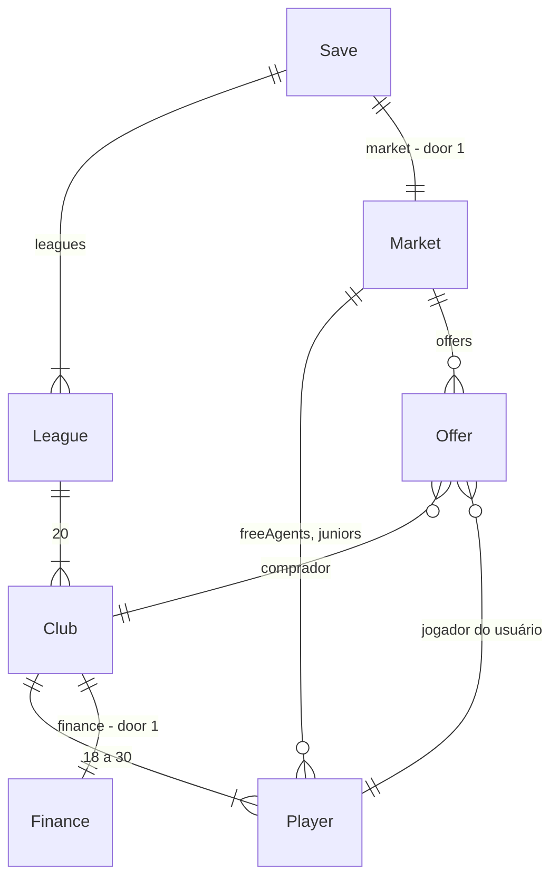

# Elenco, mercado e finanças

## Problem

Hoje o elenco de cada clube é o mesmo da primeira à última rodada: 22 jogadores gerados no jogo novo, sem entrada nem saída. Não existe dinheiro no jogo. Nenhum jogador tem salário ou preço, nenhum clube tem caixa, e jogar em casa vale o mesmo que jogar fora. Se um titular se machuca, se cansa ou é expulso, o técnico só pode trocá-lo por quem já está no banco. Não há como reforçar o time, vender quem sobra ou trocar força por dinheiro. Por isso metade do Brasfoot original, a gestão fora de campo, não existe.

Evidência: roteiro aprovado em 26/09/2026. O sub-projeto 2 é «elenco, mercado e finanças». Em 26/09/2026 o autor escolheu o escopo:
- compra e venda, caixa e salários, ingresso e estádio, e jogadores livres e base;
- mercado em janelas;
- empréstimo bancário quando falta caixa;
- proposta livre na compra.

Não há métrica de uso.

Quando isto for entregue, cada clube terá caixa, folha salarial, patrocínio, torcida e estádio. Toda rodada paga salários e rende bilheteria ao mandante. Nas janelas, o técnico:
- compra jogadores de outros clubes com propostas;
- recebe propostas da IA pelos seus jogadores;
- contrata livres e promove juniores da base;
- dispensa quem sobra.

Fora das janelas ele ainda mexe no preço do ingresso, amplia o estádio e pega ou paga empréstimo.

## Flow

Reutiliza o fechamento de rodada que já existe (`finishRound`, door 3 de partida-ao-vivo): as finanças e as propostas da IA entram no mesmo passo que já aplica condição e avança o `Rng`. Reutiliza também o documento único de save (AD-003), agora na versão 3.

1. jogo novo -> `engine/generate` (exists) - além de ligas e elencos, gera salário de cada jogador, finanças de cada clube, 40 jogadores livres e os 3 juniores da primeira janela (door 1, door 4)
2. telas «Mercado» e «Finanças» (new, no door - placement per conventions) -> `engine/market` e `engine/finance` (new, no door - placement per conventions) - cada ação é uma função pura `GameState -> GameState | recusa`: comprar, aceitar ou recusar proposta, marcar à venda, dispensar, contratar livre, promover júnior, preço do ingresso, ampliar estádio, pegar e pagar empréstimo
3. `store` (exists) -> `persistence` (exists) - grava o save v3 (door 1) depois de cada ação aceita, antes de mostrar o resultado
4. «Jogar rodada» -> `engine/live` (exists) - a partida em si não muda
5. `engine/season.finishRound` (exists) -> `engine/finance` - salários, patrocínio, bilheteria do mandante, juros e obras do estádio de todos os clubes, com o registro da rodada (`lastRound`)
6. `engine/season.finishRound` (exists) -> `engine/market` - expira propostas e gera as novas da IA; a IA com menos de 18 contrata livres; quando a janela abre ou fecha, cria ou apaga os juniores. Tudo usa o `Rng` de mercado da rodada (door 3)
7. `persistence` (exists) grava o save v3 (door 1); a tela Rodada (exists) mostra público e bilheteria do jogo em casa do usuário

## Impact

| Front | What changes |
| --- | --- |
| domain | new term: `salary` (UI «Salário») - reais por rodada, fixado quando o jogador é gerado ou entra no clube, guardado no jogador (door 2) |
| domain | new term: `value` (UI «Valor») - preço de mercado calculado de salário e idade, nunca guardado; lives in `src/engine/market` |
| domain | new term: `Finance` - caixa, patrocínio, torcida, estádio, empréstimo e registro da última rodada de um clube; lives in `src/engine/finance` |
| domain | new term: `Offer` (UI «Proposta») - proposta de um clube da IA por um jogador do usuário, válida até a próxima rodada |
| domain | new term: janela de mercado - aberta enquanto a próxima rodada está entre 1 e 5 ou entre 18 e 22 |
| domain | new term: `freeAgents` (UI «Livres») e `juniors` (UI «Base») - jogadores sem clube, guardados no save fora das ligas |
| domain | existing term: elenco era sempre 22 jogadores, e o id do jogador tinha o prefixo do clube. Agora tem de 18 a 30 e os jogadores mudam de clube mantendo o id. Quem conta com 22 hoje: `PLAYERS_PER_CLUB`, o teste «22 jogadores ordenados» da tela Elenco e `test-utils` |
| domain | existing term: `finishRound` só aplicava resultados e condição, agora também fecha finanças e mercado. Quem chama: `store.finishLive` e `playRound`, usado por testes e `seededGame` |
| domain | existing criterion C43 de partida-ao-vivo (só > 2 é incompatível) passa a «só > 3 é incompatível» (AC 52 deste plano) |
| domain | a escalação do usuário pode ficar com vaga vazia quando um titular é vendido ou dispensado. Isso já é tratado: «Faltam N titulares» desabilita «Jogar rodada» |
| stored data | migrate on read: save v2 e save v1 viram v3. Os jogadores ganham salário, os clubes ganham finanças e o save ganha o mercado com 40 livres, gerados a partir da seed (door 1). O save v3 é gravado na próxima vez que o jogo salva |

## Relations

Restrições de mão única:
- Um id de jogador é único em todo o save (elencos, livres e juniores) e nunca muda nem é reusado (door 4).
- Dinheiro é sempre inteiro em reais (AD-006).
- `salary` é guardado no jogador e não é recalculado a partir da força (door 2).

Colunas e tipos ficam fora daqui.

## Surface

None - nothing consumed outside. É um SPA estático sem API (AD-001).

## Landing

| One-way door | Literal shape | Alternative rejected |
| --- | --- | --- |
| 1. save v3 | `schemaVersion: 3`. `Club.finance: { cash, sponsorship, fans, capacity, ticketPrice, expansionRoundsLeft, loan, lastRound: Ledger \| null }` e `Club.forSale: string[]`. `Player.salary`. `GameState.market: { freeAgents: Player[], juniors: Player[], offers: Offer[] }` com `Offer { id, buyerId, playerId, amount }`. `Ledger { attendance, tickets, sponsorship, salaries, interest, transfersIn, transfersOut }`. Migração v2 -> v3 e v1 -> v3 na leitura | store separado no IndexedDB só para finanças - duas gravações podem divergir, e o documento único é a AD-003; mercado dentro de `League` - na sub-projeto 4 livres e transferências cruzam países, e o mercado dentro de uma liga teria de ser movido |
| 2. salário guardado | `Player.salary` gravado na geração, na compra, na contratação e na promoção, com a fórmula do AC 2; nunca recalculado na leitura | salário derivado da força a cada leitura - quando a força evoluir (sub-projeto 3), a folha de todo clube mudaria em silêncio sem contrato novo |
| 3. `Rng` de mercado | propostas da IA e contratações da IA usam `createRng(mix32(rngState, roundNumber*16 + 14))`, juniores usam `+ 15`, no mesmo `finishRound` que já avança `rngState` uma vez; o jogo novo gera livres e juniores com o `Rng` do próprio jogo novo; a migração usa `createRng(mix32(seed, 3))` | avançar o `Rng` do save a cada ação de mercado - comprar um jogador antes da rodada mudaria o sorteio de todas as partidas, e recarregar a página depois de uma compra daria outra rodada |
| 4. ids de jogador | livres `fa-<n>`, juniores `jr-<season>-<window>-<n>` e jogadores de clube mantêm `c<k>-p<n>` ao mudar de clube; `n` só cresce | renomear o id na transferência - `Goal.playerId` dos resultados já gravados e a escalação apontariam para quem não existe mais |
| 5. campos de apoio em `Finance` (achado no build) | `Finance.loanLimit` (2 × caixa inicial, gravado no jogo novo e na migração), `Finance.pendingIn` e `Finance.pendingOut` (dinheiro de transferências desde o último fechamento; o fechamento copia para `lastRound.transfersIn` e `lastRound.transfersOut` e zera). `transfersOut` soma compras, luvas e rescisões | recalcular o limite do caixa inicial - o caixa inicial não é guardado e não sai do patrocínio arredondado; gravar compras direto em `lastRound` - misturaria a rodada já fechada com a próxima |
| 6. `Rng` do mercado no jogo novo (achado no build, detalha a door 3) | livres e juniores do jogo novo usam `createRng(mix32(seed, 2))`, fora do fluxo que gera ligas e tabela | tirar do mesmo `Rng` das ligas - mudaria `rngState` depois da geração e, com isso, os resultados de toda seed já jogada |

- Nothing else in this change is hard to reverse. As fórmulas de salário, valor, público e os limites são números em constantes e só valem para jogadores gerados depois, porque o salário é guardado (door 2).

## Criteria

### S1: Caixa, salários e bilheteria (P1)

Toda rodada custa salários e rende patrocínio, e o mandante ainda fatura bilheteria.

**Acceptance Criteria**

1. The sistema SHALL guardar e calcular todo valor em dinheiro (caixa, salário, patrocínio, bilheteria, preço, proposta, empréstimo) como inteiro em reais
2. WHEN um jogador é gerado THEN o salário dele por rodada SHALL ser 2.000 × 1,09^(força − 40), arredondado para a centena: força 40 → R$ 2.000, 60 → R$ 11.200, 75 → R$ 40.800, 95 → R$ 228.800
3. WHEN um jogo novo é criado THEN cada clube SHALL começar com caixa igual a 10 vezes a sua folha salarial por rodada, arredondado para R$ 100.000
4. WHEN um jogo novo é criado THEN a torcida de cada clube SHALL ser 15.000 + 45.000 × (força média do elenco − 58) / 22, limitada entre 15.000 e 60.000 e arredondada para 1.000, e a capacidade do estádio SHALL ser 80% da torcida, arredondada para 1.000
5. WHEN uma rodada termina THEN cada clube SHALL pagar a soma dos salários do seu elenco e receber o seu patrocínio fixo por rodada
6. WHEN uma rodada termina THEN o mandante de cada partida SHALL receber bilheteria igual a público × preço do ingresso, e o visitante SHALL não receber bilheteria
7. WHEN o público de uma partida é calculado THEN ele SHALL ser o menor valor entre a capacidade do estádio do mandante e torcida × mín(1,3; (40 / preço)^1,5) × fase, arredondado para baixo. A fase vale 1,2 para o líder e 0,8 para o 20º, linear entre eles pela posição antes da rodada, e vale 1,0 antes da primeira rodada
8. The tela «Finanças» SHALL mostrar caixa, folha salarial por rodada, patrocínio por rodada, torcida, capacidade e preço do ingresso
9. WHEN ao menos uma rodada foi jogada THEN a tela Finanças SHALL mostrar as linhas da última rodada: público e bilheteria, patrocínio, salários, juros, compras e vendas, e o saldo da rodada
10. WHEN nenhuma rodada foi jogada THEN a tela Finanças SHALL mostrar «Nenhuma rodada jogada» no lugar das linhas da última rodada
11. The tela Elenco SHALL mostrar o salário por rodada de cada jogador
12. WHEN a partida do usuário na rodada foi em casa THEN a tela Rodada SHALL mostrar o público e a bilheteria dela
13. WHEN 38 rodadas são jogadas em 5 seeds sem nenhuma ação de mercado THEN o caixa final de cada clube SHALL ficar entre 50% e 250% do inicial, e a mediana dos 100 clubes SHALL ficar entre 90% e 160%
14. The sistema SHALL mostrar dinheiro no formato «R$ 1.234.567», sem centavos
15. WHEN uma ação de mercado ou de finanças é aceita THEN o save SHALL ser gravado antes de a tela mostrar o resultado

**Independent test:** começar um jogo, ver caixa e folha em «Finanças», jogar uma rodada em casa e ver público, bilheteria, salários e o saldo da rodada.

### S2: Janelas e compra (P1)

Nas janelas o técnico reforça o time comprando de outros clubes.

**Acceptance Criteria**

16. WHILE a próxima rodada está entre 1 e 5 ou entre 18 e 22, o mercado SHALL estar aberto
17. WHILE o mercado está fechado, a tela «Mercado» SHALL mostrar «Mercado fechado - reabre antes da rodada 18» (depois da rodada 22: «Mercado fechado - reabre na próxima temporada») e SHALL não oferecer compra, venda, dispensa, contratação ou promoção
18. The tela Mercado SHALL listar os jogadores de todos os outros clubes e os livres, cada um com nome, posição, idade, força, clube («Livre» para os livres), valor e salário, por força decrescente, e com filtro por posição
19. The valor de mercado de um jogador SHALL ser salário × 50 × fator de idade, arredondado para R$ 10.000. O fator vale 1,5 até 21 anos, 1,2 de 22 a 27, 1,0 de 28 a 30, 0,6 de 31 a 33 e 0,3 a partir de 34. Por exemplo, força 75 aos 25 anos vale R$ 2.450.000 e aos 32 vale R$ 1.220.000
20. The preço pedido por um clube da IA SHALL ser 1,5 × valor para um jogador entre os 11 que a IA escalaria, e 1,0 × valor para os demais
21. WHEN o usuário oferece por um jogador de outro clube um valor igual ou maior que o preço pedido THEN o jogador SHALL passar na hora para o elenco do usuário, o caixa do usuário SHALL cair o valor oferecido e o do vendedor SHALL subir o mesmo valor
22. IF a oferta é menor que o preço pedido THEN o sistema SHALL recusar com «Recusado: pedem R$ X», com X igual ao preço pedido
23. IF um gasto (compra, luvas, rescisão, ampliação do estádio ou amortização) passa do caixa do usuário THEN o sistema SHALL recusar com «Caixa insuficiente»
24. IF o elenco do usuário já tem 30 jogadores THEN o sistema SHALL recusar compra, contratação e promoção com «Elenco cheio (30)»
25. IF o clube vendedor ficaria com menos de 18 jogadores THEN o sistema SHALL recusar com «O clube não vende: elenco no mínimo»
26. WHEN um jogador troca de clube THEN ele SHALL manter id, salário, condição, moral, cartões, lesão e suspensão, e SHALL entrar fora da escalação do novo clube

**Independent test:** na rodada 1, filtrar atacantes, oferecer abaixo do pedido e ver a recusa com o preço, oferecer o preço e ver o jogador no elenco e o caixa menor.

### S3: Venda, propostas e dispensa (P2)

Nas janelas a IA faz propostas pelos jogadores do usuário, e ele pode vender ou dispensar.

**Acceptance Criteria**

27. WHILE o mercado está aberto, a tela Elenco SHALL permitir marcar e desmarcar um jogador como «À venda»
28. WHEN uma rodada termina e o mercado segue aberto THEN cada jogador do usuário marcado «À venda» SHALL receber, com 50% de chance, uma proposta de 80% a 110% do valor, arredondada para R$ 10.000. A proposta SHALL vir de um clube da IA com caixa maior ou igual ao valor da proposta e menos de 30 jogadores
29. WHEN uma rodada termina e o mercado segue aberto THEN, com 25% de chance, um clube da IA SHALL fazer uma proposta de 110% a 150% do valor, arredondada para R$ 10.000, por um dos 5 jogadores mais valiosos do usuário que não estão à venda
30. The aba «Propostas» da tela Mercado SHALL listar cada proposta com clube, jogador e valor, e os botões «Aceitar» e «Recusar»; sem propostas SHALL mostrar «Nenhuma proposta»
31. WHEN o usuário aceita uma proposta e confirma «Vender X por R$ Y?» THEN o jogador SHALL ir para o clube comprador, o caixa do usuário SHALL subir o valor e o do comprador SHALL cair o mesmo valor. O jogador SHALL sair da escalação do usuário, e as outras propostas por ele SHALL sumir
32. IF aceitar uma proposta ou dispensar um jogador deixaria o usuário com menos de 18 jogadores THEN o sistema SHALL recusar com «Elenco no mínimo (18)»
33. WHEN a próxima rodada termina THEN as propostas não respondidas SHALL expirar
34. WHEN o usuário dispensa um jogador e confirma «Dispensar X custa R$ Y. Confirmar?» THEN o caixa SHALL cair 4 vezes o salário dele e o jogador SHALL ir para os livres

**Independent test:** marcar um reserva à venda, jogar rodadas na janela até chegar proposta, aceitar e ver o caixa subir e o jogador no elenco do comprador.

### S4: Livres e base (P2)

Sem pagar transferência, o técnico completa o elenco com jogadores livres e juniores da base.

**Acceptance Criteria**

35. WHEN um jogo novo é criado THEN o sistema SHALL gerar 40 jogadores livres, 10 por posição, com força entre 45 e 70
36. WHEN o usuário contrata um livre THEN o caixa SHALL cair 4 vezes o salário dele (luvas) e o jogador SHALL entrar no elenco e sair dos livres
37. WHEN a janela abre (no jogo novo e ao fim da rodada 17) THEN o usuário SHALL receber 3 juniores de 17 anos, com força entre 45 e 62 e posições sorteadas, na aba «Base» da tela Mercado
38. WHEN o usuário promove um júnior THEN ele SHALL entrar no elenco sem custo e com salário pela fórmula do AC 2
39. WHEN a janela fecha THEN os juniores não promovidos SHALL deixar de existir; a aba «Base» sem juniores SHALL mostrar «Nenhum júnior na base»
40. WHEN um clube da IA termina uma rodada com menos de 18 jogadores THEN ele SHALL contratar livres até chegar a 18, a cada vez o de maior força na posição em que tem menos jogadores, pagando as luvas

**Independent test:** contratar um livre e ver o caixa cair as luvas; promover um júnior; jogar até a rodada 6 e ver a base vazia.

### S5: Ingresso e estádio (P2)

O técnico define o preço do ingresso e pode ampliar o estádio.

**Acceptance Criteria**

41. The tela Finanças SHALL permitir escolher o preço do ingresso de R$ 10 a R$ 200, em passos de R$ 5; o preço inicial e o dos clubes da IA SHALL ser R$ 40
42. WHEN o preço do ingresso muda THEN a tela Finanças SHALL mostrar o público estimado de um jogo em casa com a fase atual, pela fórmula do AC 7
43. WHEN o usuário amplia o estádio e confirma «Ampliar custa R$ 4.000.000. Confirmar?» THEN o caixa SHALL cair R$ 4.000.000 e a capacidade SHALL subir 5.000 ao fim da 6ª rodada seguinte
44. WHILE há obra no estádio, a tela Finanças SHALL mostrar «Obras: N rodadas» e SHALL recusar outra ampliação com «Já há uma obra em andamento»
45. IF a ampliação levaria a capacidade acima de 80.000 THEN o sistema SHALL recusar com «Capacidade máxima: 80.000»

**Independent test:** subir o preço e ver o público estimado cair; ampliar o estádio e ver a capacidade mudar 6 rodadas depois.

### S6: Empréstimo (P2)

Quando falta caixa, o técnico pega dinheiro emprestado e paga juros toda rodada.

**Acceptance Criteria**

46. The tela Finanças SHALL permitir pegar empréstimo em múltiplos de R$ 500.000, com o saldo devedor limitado a 2 vezes o caixa inicial do clube
47. IF o pedido levaria o saldo devedor acima do limite THEN o sistema SHALL recusar com «Limite de empréstimo: R$ X», com X o valor que ainda pode ser pego
48. WHEN uma rodada termina com saldo devedor THEN o clube SHALL pagar juros de 1,5% do saldo, arredondados para a centena
49. The tela Finanças SHALL permitir pagar o empréstimo em múltiplos de R$ 500.000 ou o saldo inteiro, até o saldo devedor
50. WHILE o caixa está negativo, compras, luvas, rescisões e ampliações SHALL ser recusadas por «Caixa insuficiente» (AC 23), e os salários SHALL continuar sendo pagos

**Independent test:** pegar R$ 1.000.000, jogar uma rodada e ver R$ 15.000 de juros; pagar e ver o saldo zerar.

### S7: Save compatível (P1)

Quem já tem um jogo salvo continua de onde parou.

**Acceptance Criteria**

51. WHEN o jogo lê um save v2 ou v1 THEN o sistema SHALL migrá-lo para v3 com as regras do jogo novo:
    - salário pela fórmula do AC 2;
    - finanças pelas fórmulas dos AC 3 e 4, sem empréstimo, sem obra e ingresso a R$ 40;
    - 40 livres gerados da seed;
    - nenhuma proposta e nenhum júnior.
52. IF o save lido tem `schemaVersion` maior que 3 THEN a tela Início SHALL mostrar «Jogo salvo incompatível (versão X)» e oferecer apenas «Novo jogo»
53. WHEN o mesmo save é recarregado antes de jogar a rodada THEN a rodada seguinte SHALL gerar os mesmos resultados, as mesmas propostas e as mesmas contratações da IA

**Independent test:** abrir um save v2 gravado antes deste sub-projeto e ver as finanças preenchidas e o elenco intacto.

## Out of scope

| Excluded | Why |
| --- | --- |
| contratos com duração, renovação e fim de contrato | só fazem sentido com várias temporadas (sub-projeto 3) |
| evolução de força e idade dos jogadores | sub-projeto 3; juniores hoje são só baratos e jovens |
| premiação por posição na tabela | fim de temporada é o sub-projeto 3 |
| demissão pela diretoria | sub-projeto 3; o autor escolheu empréstimo em vez de demissão por dívida |
| transferências entre clubes da IA | a IA só compra do usuário e contrata livres nesta entrega |
| contraproposta da IA | a recusa já diz o preço pedido; o técnico oferece de novo |
| negociação de salário | o salário sai da fórmula |
| empréstimo de jogador entre clubes | não foi pedido |
| direitos de TV e outras receitas | patrocínio e bilheteria bastam para o equilíbrio desta entrega |
| juniores para clubes da IA | a IA só completa elenco com livres |
| empréstimo bancário para a IA | a IA pode ficar com caixa negativo sem consequência nesta entrega |

## Assumptions

| Assumption | Chosen default | Rationale | Confirmed? |
| --- | --- | --- | --- |
| valor do patrocínio | ~~50% da folha salarial inicial~~ calibrado no build: folha inicial − bilheteria esperada (meia temporada em casa a R$ 40 com estádio cheio = capacidade × 20), com piso de 3% da folha, arredondado para R$ 10.000 | 50% da folha deixava a mediana do caixa final em 3,3× o inicial; com a bilheteria descontada a temporada fecha perto do empate (mín. 0,98×, mediana 1,55×, máx. 2,19×) e o AC 13 passa; o piso evita clube com patrocínio R$ 0 | y (formato calibrado no build dentro do que o autor aprovou) |
| lista do mercado com ~420 jogadores | rolagem dentro do painel da lista, sem rolagem de página (AD-010) | 420 linhas não cabem; paginação custa cliques no fluxo mais usado | y |
| IA sem caixa contratando livres | contrata mesmo que o caixa fique negativo | a IA precisa de 18 para escalar; sem empréstimo para a IA | y |
| navegação | botões «Mercado» e «Finanças» no topo da tela Elenco, e «Voltar ao elenco» nas duas telas | a tela Elenco já é o ponto de partida da rodada | y |
| compra de livre fora da janela | não pode; livres, juniores, compra, venda e dispensa só na janela | uma regra só para todo o mercado | y |
| ampliação, ingresso e empréstimo fora da janela | podem a qualquer rodada | não são mercado de jogadores | y |
| público estimado com obra em andamento | usa a capacidade atual, sem a obra | a obra só conta quando fica pronta | y |

**Open questions:** none - all resolved or logged above.

## Observable

| Surface | Decision | Landing |
| --- | --- | --- |
| screen «Mercado» | empty state | AC 17 (fechado), AC 30 (sem propostas), AC 39 (base vazia); filtro sem resultado: «Nenhum jogador» (mesmo padrão) |
| screen «Mercado» | loading state | n/a - tudo está na memória; nenhuma leitura assíncrona abre a tela |
| screen «Mercado» | error state | AC 22, 23, 24, 25, 32; falha ao gravar usa o aviso que já existe («Salvamento indisponível neste navegador») |
| screen «Mercado» | unauthorised state | n/a - jogo local de um jogador, sem contas |
| screen «Mercado» | density and ordering | AC 18 (força decrescente, filtro por posição); rolagem só dentro da lista (Assumptions) |
| screen «Mercado» | destructive action confirms | AC 31 (vender); comprar não confirma, porque o valor é digitado na oferta |
| screen «Finanças» | empty state | AC 10 |
| screen «Finanças» | loading state | n/a - tudo está na memória |
| screen «Finanças» | error state | AC 23, 44, 45, 47 |
| screen «Finanças» | unauthorised state | n/a - sem contas |
| screen «Finanças» | density and ordering | AC 8, 9: um painel de resumo e um de última rodada; no celular, um por aba (AD-010) |
| screen «Finanças» | destructive action confirms | AC 43 (ampliar); empréstimo não confirma, porque é reversível pagando |
| screen «Elenco» | density and ordering | AC 11 (coluna salário), AC 27 (à venda); ordem de hoje mantida |
| screen «Elenco» | destructive action confirms | AC 34 (dispensar) |
| screen «Rodada» | density and ordering | AC 12 |
| collection lista do mercado | grouping, naming, ordering, duplicates | AC 18; duplicatas n/a - id único em todo o save (door 4) |

## Sources

- Roteiro de 26/09/2026 (memória do projeto): sub-projeto 2 = elenco, mercado e finanças.
- Respostas do autor em 26/09/2026:
  - escopo: compra e venda, caixa e salários, ingresso e estádio, e livres e base;
  - mercado em janelas;
  - dívida: empréstimo bancário;
  - negociação: proposta livre.
- `.specs/STATE.md`: AD-001, AD-003, AD-004, AD-006 e AD-010.
