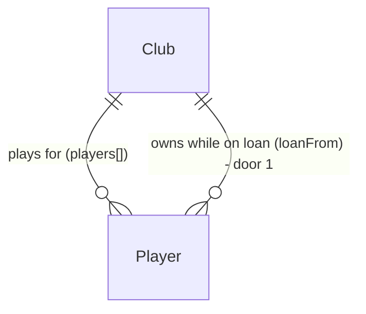

# Empréstimo de jogadores

## Problem

Hoje um jogador só muda de clube por compra, venda, dispensa, contratação de livre ou promoção da base. O usuário não tem como dar minutos a um jovem que não entra no time (e, desde a AD-023, quem não joga evolui 0,65×), nem como aliviar a folha de um reserva caro sem vendê-lo ou pagar a dispensa, nem como reforçar o time por uma temporada sem pagar o valor de mercado de um jogador. O autor escolheu «empréstimo de jogadores» como próxima feature em 02/10/2026 (a candidata que sobrou do handoff); não há métrica, só a escolha do autor.

Quando isto sair, com o mercado aberto o usuário pode emprestar um jogador do elenco a um clube da IA, que o põe para jogar e paga o salário até o fim da temporada, e pode pegar emprestado um reserva de um clube da IA pagando uma taxa e o salário até o fim da temporada. Na virada, todo emprestado volta ao clube dono.

## Flow

Reusa o mercado (`engine/market`: janelas, `detach`, limites de elenco, `askingPrice`, `marketValue`), a escalação da IA (`engine/lineup.aiLineup`), a virada (`engine/rollover.nextSeason`), o padrão de ação da store (`commit` + `refusalText`) e as telas Elenco e Mercado. O jogador emprestado fica fisicamente no clube que o recebe (door 1), então partida, folha de salários, evolução e copa não mudam.

1. Elenco, botão «Emprestar» numa linha -> `engine/market.loanDestination` (new, no door - placement per conventions) escolhe o clube que o receberia, sem sorteio (door 2); a tela confirma com o nome desse clube
2. «Confirmar» -> `store.loanOut` (new) -> `engine/market.loanOut` (new) tira o jogador do elenco do usuário (`detach`, exists) e o põe no clube escolhido com `loanFrom` = id do clube do usuário (door 1)
3. Mercado, «Negociação» de um jogador de clube da IA -> «Pegar emprestado» -> `store.loanIn` (new) -> `engine/market.loanIn` (new) cobra a taxa, tira o jogador do dono e o põe no elenco do usuário com `loanFrom` = id do dono
4. cada rodada -> `engine/market.closeRoundMarket` (exists) - as compras, vendas e dispensas da IA e as propostas pelo elenco do usuário pulam quem tem `loanFrom`
5. virada -> `engine/rollover.nextSeason` (exists) devolve cada jogador com `loanFrom` ao clube dono e apaga o campo, antes de envelhecer, aposentar e vencer contratos (door 3)
6. Mercado, aba «Emprestados» -> `ui/Market` (exists) lista os emprestados pelo usuário e os emprestados a ele

## Impact

| Front | What changes |
| --- | --- |
| domain | new term: empréstimo de jogador (`loanFrom`, o clube dono). Distinto do empréstimo bancário de `Finance.loan` (tela Finanças, `loan_limit`), que não muda; na tela o de jogadores aparece como «Emprestar», «Pegar emprestado» e «Emprestados» |
| domain | existing term: o limite de 30 do elenco do usuário (`SQUAD_MAX`) passa a contar os jogadores que ele emprestou, para a volta na virada nunca passar de 30. Quem lê: `buyPlayer`, `signFreeAgent`, `promoteJunior` e o novo `loanIn` |
| domain | existing term: «à venda», «dispensar», «renovar» e as propostas da IA valem só para quem não está emprestado; quem o usuário pegou emprestado aparece no elenco com «Emprestado» e sem essas ações |
| domain | existing behaviour: as compras da IA (`tryAiPurchase`), a venda no vermelho (`sellFromTheRed`), a dispensa depois da compra (`aiSign`) e a compra pelo usuário (`buyPlayer`) ignoram jogador emprestado |
| stored data | nada a migrar: `Player.loanFrom` é opcional, ausente = não emprestado; save continua v8 (como AD-021, AD-023, AD-024). Um save de antes não tem empréstimo nenhum |

## Relations

One-way constraints: um jogador emprestado está no `players` do clube que o recebeu e tem `loanFrom` = id do clube dono, diferente do clube onde está (door 1). Nunca há empréstimo entre dois clubes da IA: um dos dois lados é sempre o clube do usuário no momento do empréstimo. Um emprestado não é reemprestado, vendido, dispensado nem renovado. O empréstimo acaba sempre na virada (door 3).

## Surface

None - nothing consumed outside. O arquivo exportado continua sendo o envelope da AD-018; o `GameState` dentro dele pode ter `loanFrom` em jogadores.

## Landing

| One-way door | Literal shape | Alternative rejected |
| --- | --- | --- |
| 1. onde vive o empréstimo no save | `Player.loanFrom?: string` - id do clube dono; o jogador fica no `players` do clube que o recebeu; ausente = não emprestado; save continua v8 | uma lista `market.loans[]` com `{ playerId, ownerId, borrowerId }`: segunda fonte de verdade sobre onde o jogador está, que diverge numa demissão ou numa aposentadoria, e toda partida, folha e evolução teriam de consultá-la; o jogador ficar no dono com um campo «jogando em»: partida, escalação da IA, folha e evolução teriam de olhar dois clubes |
| 2. para onde vai quem o usuário empresta | determinístico, sem sorteio e sem tocar o `rngState`: entre os clubes da IA do país do usuário com menos de 30 jogadores, aqueles cuja escalação da IA (`aiLineup`) com o jogador acrescentado o põe entre os 11; desses, o de maior soma de força dos 11 mais fortes, empate pelo menor id; nenhum = recusa | sorteio num fluxo novo do `rngState`: o usuário confirmaria sem saber o destino, e o resultado mudaria entre recarregar e não recarregar; propostas de empréstimo vindas da IA a cada rodada: outra fila de ofertas, outra tela e outro fluxo de sorteio para a mesma decisão |
| 3. quando o empréstimo acaba | na virada, primeiro passo de `nextSeason` depois do histórico: cada jogador com `loanFrom` sai da escalação e do elenco de onde está e entra no `players` do dono, sem `loanFrom`; envelhecer, aposentar e vencer contrato acontecem já no dono | acabar ao fim da última rodada da liga: a copa e a tela Fim da temporada ainda leem o elenco; duração escolhida pelo usuário (rodadas): um contador por jogador e uma devolução no meio da temporada, fora das janelas |

- A taxa (20% do valor de mercado) e as regras de quem pode ser emprestado são reversíveis: não mudam o save nem a forma do jogador
- Nothing else in this change is hard to reverse

## Criteria

### S1: emprestar um jogador do elenco (P1)

O usuário cede um jogador a um clube da IA até o fim da temporada; o clube o põe para jogar e paga o salário.

**Acceptance Criteria**

1. WHILE o mercado está aberto the system SHALL mostrar em cada linha do elenco do usuário, exceto nos jogadores emprestados a ele, o botão «Emprestar» (⇄, `aria-label` «Emprestar <nome>»).
2. WHEN o usuário toca «Emprestar» e existe clube de destino (door 2) THEN the system SHALL mostrar a confirmação «Confirmar empréstimo» com «Emprestar <nome> para <clube> até o fim da temporada? O salário fica com o clube que o recebe.», «Confirmar» e «Cancelar», sem mudar nada ainda.
3. WHEN o usuário confirma THEN the system SHALL tirar o jogador do elenco, da escalação e da lista «à venda» do usuário, pôr o jogador no elenco do clube de destino com `loanFrom` = id do clube do usuário, cancelar as propostas por ele, sem mexer no caixa de nenhum dos dois clubes, e gravar o jogo.
4. The system SHALL escolher o clube de destino pela door 2: clube da IA do país do usuário, com menos de 30 jogadores, cuja `aiLineup` com o jogador acrescentado o tem entre os 11; entre eles, o de maior soma de força dos 11 mais fortes, empate pelo menor id.
5. IF nenhum clube atende a door 2 THEN the system SHALL mostrar «Nenhum clube quer esse jogador agora» e não abrir a confirmação.
6. IF o elenco do usuário tem 18 jogadores ou menos THEN the system SHALL recusar com «Elenco no mínimo (18)».
7. IF o jogador está no último ano de contrato THEN the system SHALL recusar com «Renove o contrato antes de emprestar».
8. IF o mercado está fechado THEN the system SHALL não mostrar «Emprestar», e o motor SHALL recusar com «Mercado fechado».
9. WHILE o jogador está emprestado the system SHALL fazer o clube que o recebeu pagar o salário dele a cada rodada e escalá-lo pela regra da IA, como faz com o próprio elenco.

**Independent test:** com o mercado aberto, emprestar um reserva jovem; o elenco do usuário perde a linha, a folha do usuário cai pelo salário dele, e o jogador aparece no clube de destino.

### S2: pegar emprestado um jogador da IA (P1)

O usuário traz um reserva de um clube da IA até o fim da temporada, pagando uma taxa ao dono e o salário.

**Acceptance Criteria**

10. WHILE o mercado está aberto e o jogador escolhido em «Negociação» é de um clube da IA, não está entre os 11 de maior força do dono (a regra de titular da AC 20 de elenco-mercado-financas) e não está emprestado THEN the system SHALL mostrar o botão «Pegar emprestado (<taxa>)» com a taxa = 20% do valor de mercado, arredondada para R$ 10.000, no mínimo R$ 10.000.
11. WHEN o usuário toca «Pegar emprestado» THEN the system SHALL tirar a taxa do caixa do usuário (e somar a `pendingOut`), somá-la ao caixa do dono (e a `pendingIn`), tirar o jogador do elenco e da escalação do dono, pô-lo no elenco do usuário fora da escalação, com `loanFrom` = id do dono, e gravar o jogo.
12. IF o jogador está entre os 11 de maior força do dono THEN the system SHALL mostrar em «Negociação» «Titular: o clube não empresta» no lugar do botão, e o motor SHALL recusar com o mesmo texto.
13. IF o jogador está emprestado THEN the system SHALL mostrar em «Negociação» «Emprestado: não pode ser negociado» no lugar da oferta e do botão, e o motor SHALL recusar compra e empréstimo com o mesmo texto.
14. IF o elenco do usuário mais os jogadores que ele emprestou somam 30 ou mais THEN the system SHALL recusar com «Elenco cheio (30)»; o mesmo limite SHALL valer para comprar, contratar livre e promover da base.
15. IF o dono tem 18 jogadores ou menos THEN the system SHALL recusar com «O clube não vende: elenco no mínimo».
16. IF a taxa é maior que o caixa do usuário THEN the system SHALL recusar com «Caixa insuficiente».
17. WHILE o jogador está emprestado ao usuário the system SHALL mostrar «Emprestado» na linha do elenco, sem «À venda», «Dispensar», «Emprestar» e sem o botão de renovar, o usuário SHALL pagar o salário dele a cada rodada, e o motor SHALL recusar pôr à venda, dispensar e renovar com «Emprestado: não pode ser negociado».

**Independent test:** escolher no Mercado um reserva de clube da IA, pegar emprestado, ver o caixa cair pela taxa e o jogador no elenco com «Emprestado».

### S3: a IA respeita o empréstimo e a virada devolve (P1)

**Acceptance Criteria**

18. The system SHALL nunca fazer um clube da IA comprar, vender (inclusive no vermelho) ou dispensar um jogador com `loanFrom`, e nunca gerar proposta da IA por um jogador emprestado ao usuário.
19. WHEN a temporada vira THEN the system SHALL devolver cada jogador com `loanFrom` ao elenco do clube dono, sem `loanFrom`, fora da escalação do clube onde estava, antes de envelhecer, aposentar e vencer contratos (door 3).
20. WHEN um jogador que o usuário emprestou volta na virada THEN the system SHALL tratá-lo como do elenco do usuário em tudo o que a virada faz (idade, contrato, relatório «Antes»/«Depois» de força).
21. WHEN o usuário troca de clube no meio da temporada (carreira-dinamica) THEN the system SHALL manter os empréstimos como estão: cada jogador volta na virada ao clube indicado em `loanFrom`.

**Independent test:** emprestar um jogador e pegar outro emprestado, jogar até a virada, e ver o primeiro de volta no elenco do usuário e o segundo de volta no dono.

### S4: a lista e as telas cabem (P2)

**Acceptance Criteria**

22. WHILE o mercado está aberto the system SHALL mostrar a aba «Emprestados (<n>)» no Mercado, com n = jogadores emprestados pelo usuário + emprestados a ele, e duas listas: «Emprestados por você» (Nome, Pos, Força, Clube onde joga) e «Emprestados a você» (Nome, Pos, Força, Clube dono); lista sem jogador mostra «Nenhum».
23. The system SHALL caber em 400 × 700 px sem rolagem no elenco com o botão «Emprestar» nas linhas, na confirmação de empréstimo aberta e na aba «Emprestados» com um jogador em cada lista (AD-010).

**Independent test:** `npm run check:layout` mede `squadLoan` (elenco com a confirmação de empréstimo aberta) e `marketLoans` (aba «Emprestados» com as duas listas preenchidas) além das telas de hoje.

## Out of scope

| Excluded | Why |
| --- | --- |
| empréstimo entre dois clubes da IA | não aparece para o usuário e mexeria no balanço das 5 temporadas |
| propostas de empréstimo vindas da IA | a decisão de door 2 dá o destino na hora; outra fila de ofertas é outra feature |
| duração escolhida, chamar de volta antes da virada, opção de compra | o empréstimo fica sempre até a virada (door 3); cada um desses é um contador ou um contrato a mais |
| taxa recebida ao emprestar | emprestar já alivia a folha; uma taxa recebida viraria fonte de caixa para emprestar reservas fracos em série |
| empréstimo no boletim «Transferências» | o boletim é das transferências da IA; a aba «Emprestados» mostra os do usuário |
| aviso na tela Nova temporada de quem voltou | a volta aparece no elenco; um relatório a mais pede outra linha numa tela que já cabe justa |

## Assumptions

| Assumption | Chosen default | Rationale | Confirmed? |
| --- | --- | --- | --- |
| quem paga o salário | o clube onde o jogador está | é o que alivia a folha de quem empresta e faz quem pega emprestado pagar o que usa; a folha já soma `club.players` | n |
| taxa de quem pega emprestado | 20% do valor de mercado, arredondada a R$ 10.000, mínimo R$ 10.000 | bem mais barato que comprar (100% ou 150%), mas não de graça; o valor some na virada | n |
| quem a IA empresta | só reservas: fora dos 11 de maior força do dono | mesma regra de titular que já encarece a compra (AC 20); impede tirar a estrela de um rival por 20% | n |
| para onde vai quem o usuário empresta | o clube mais forte do país em que ele seria titular (door 2) | o usuário vê o destino antes de confirmar; jogar pesa na evolução (AD-023) | n |
| último ano de contrato | não pode ser emprestado | voltaria na virada já sem contrato, sem chance de renovar enquanto estava fora | n |
| limite de 30 | conta os emprestados pelo usuário | a volta na virada nunca deixa o elenco acima de 30 | n |
| decisões do autor | defaults recomendados sem rodada de perguntas | o autor pediu em 02/10/2026 «pode começar e seguir até o fim» (preferência registrada desde 26/09/2026) | y |

**Open questions:** none - all resolved or logged above.

## Observable

| Surface | Decision | Landing |
| --- | --- | --- |
| screen Elenco | o botão novo por linha | AC 1, AC 8, AC 17, AC 23 |
| screen Elenco | destructive action confirms | AC 2, AC 3 |
| screen Elenco | error state | AC 5, AC 6, AC 7 (mensagem na barra, como as recusas de hoje) |
| screen Elenco | empty state | n/a - o elenco nunca fica vazio (mínimo 18) |
| screen Elenco | loading state | n/a - ação síncrona no motor, gravação em fila como as de hoje |
| screen Mercado «Negociação» | o botão novo e quando some | AC 10, AC 12, AC 13 |
| screen Mercado «Negociação» | error state | AC 14, AC 15, AC 16 (mensagem na barra) |
| screen Mercado aba «Emprestados» | empty state | AC 22 («Nenhum») |
| screen Mercado aba «Emprestados» | density and ordering | AC 22, AC 23 |
| screen Mercado aba «Emprestados» | loading state | n/a - lida do jogo em memória |
| screen Mercado | unauthorised state | n/a - jogo local, sem contas |
| screen Mercado fechado | o que aparece | AC 8 (sem «Emprestar»); a aba «Emprestados» é do mercado aberto, como «Propostas» |
| arquivo exportado | forma | existing - envelope da AD-018; o `GameState` ganha `loanFrom` opcional |

## Sources

- Pedido do autor em 02/10/2026: «sim, pode começar e seguir até o fim» - em resposta a «Próxima candidata: empréstimo de jogadores. Começo o plano dela?».
- `.specs/STATE.md` AD-003, AD-006, AD-010, AD-018, AD-021, AD-023, AD-024 - o documento, o dinheiro inteiro, a tela sem rolagem, o envelope e os campos opcionais sem migração que esta feature segue.
