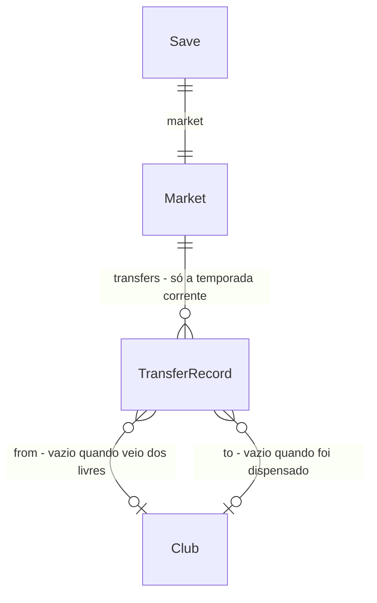

# Gastos da IA

## Problem

Os clubes da IA só gastam dinheiro com salário, com a taxa de quem contratam para voltar a ter 18 jogadores e com a compra de um jogador do usuário quando ele aceita uma proposta. Nenhum clube da IA compra de outro clube da IA, amplia estádio ou reage a estar rico ou endividado. O patrocínio foi calibrado para que cada clube empate na folha, então todo prêmio e toda bilheteria acima disso vira caixa parado.

Quem paga é o usuário. O mercado só tem um lado: os elencos da IA mudam só pela base e pelos livres, um clube rico da IA não se reforça, e um clube que o usuário desmonta não se recupera com dinheiro. O caixa dos rivais na lista de clubes vira um número sem significado.

Evidência: medido em 26/09/2026 para multiplas-temporadas (C53), em 5 temporadas e 3 seeds sem usuário, o caixa final dividido pelo inicial dá mínimo −0,4, mediana 6,1 e máximo 24,0. Isso foi antes da copa nacional, que paga bilheteria e prêmio por fase aos clubes da IA também. O handoff de multiplas-temporadas deixou isso anotado: «A IA não gasta dinheiro, então o caixa dos clubes da IA só cresce». Não há métrica de uso.

Quando isto for entregue, nas janelas de transferência os clubes da IA com dinheiro sobrando compram reforços de outros clubes da IA, pagando ao jogador um salário maior que o da tabela. Um clube da IA no vermelho vende o jogador mais valioso para quem pode pagar. Quem lota o estádio amplia. A folha maior dos reforços consome o caixa, e o dinheiro das compras passa dos clubes ricos para os que vendem. O usuário vê essas transferências numa aba nova da tela Mercado, e o caixa dos clubes da IA fica numa faixa estreita em vez de crescer sem parar.

## Flow

Reutiliza o fechamento de rodada do mercado (`market.closeRoundMarket`), o preço pedido (`market.askingPrice`), a taxa de livre e de dispensa (`market.releaseCost`), a escalação da IA (`lineup.aiLineup`), a folha e o salário da tabela (`finance.payroll`, `finance.salaryFor`), a ampliação (`finance.expandStadium`) e a cadeia de migração (`migrate.migrateSave`). Nenhum deles ganha uma cópia para a IA.

1. rodada de liga fecha -> `engine/season.finishRound` (exists) - chama `closeRoundFinances` e depois `closeRoundMarket`, como hoje
2. `engine/finance.closeRoundFinances` (exists) - fecha a rodada. Em seguida, cada clube da IA que jogou em casa com público igual à capacidade e tem 20 rodadas de folha além do custo amplia o estádio via `expandStadium`. `aiBudget` vive aqui, porque `market` já importa `finance`
3. `engine/market.closeRoundMarket` (exists) - as propostas expiram, `fillAiSquads` completa os elencos e registra cada contratação no boletim (door 2). Depois, se a próxima rodada abre ou mantém a janela, roda as vendas de clubes no vermelho e as compras da IA com o `Rng` da door 3. Só então vêm os juniores e as propostas ao usuário, como hoje
4. `market.acceptOffer` (exists) - a venda de um jogador do usuário para a IA também entra no boletim (door 2)
5. `engine/rollover.nextSeason` (exists) - esvazia o boletim na virada
6. `persistence` (exists) grava o save v6 (door 1). A tela Mercado (exists) ganha a aba «Transferências», que lê `market.transfers`

## Impact

| Front | What changes |
| --- | --- |
| domain | new term: sobra (`aiBudget`) - o caixa de um clube da IA menos 10 rodadas da folha que ele teria depois do gasto. Como o caixa inicial é 10 rodadas da folha, a IA só gasta o que ganhou. Vive em `engine/finance` |
| domain | new term: boletim (`Market.transfers`) - as transferências da temporada feitas por clubes da IA, uma linha por movimento. Vive em `engine/types` e `engine/market` |
| domain | existing term: `fillAiSquads` só completava elencos. Agora também escreve no boletim. Quem depende dele: `closeRoundMarket` e o teste de AC 40 de elenco-mercado-financas |
| domain | existing term: `acceptOffer` só movia jogador e dinheiro. Agora também escreve no boletim. Quem usa: a tela Mercado (aba Propostas) |
| domain | existing term: um jogador de um clube da IA podia ser comprado pelo usuário a qualquer momento da janela. Agora pode ter trocado de clube na rodada anterior. Quem lê: a lista «Comprar» da tela Mercado e `buyPlayer` (que já procura o vendedor em todos os clubes) |
| domain | existing criterion: multiplas-temporadas C53 fixa o caixa de 5 temporadas entre −2× e 30×, com mediana entre 3× e 10×. Esta entrega **substitui** essa faixa pela do AC 14. O teste `caixa em 5 temporadas` muda de faixa no commit que fecha o AC 14, e isso é uma renegociação aprovada neste plano |
| domain | existing criterion: elenco-mercado-financas C13 (caixa de uma temporada entre 50% e 250%, mediana entre 90% e 160%) mede o custo corrente, que é o que a calibração do patrocínio controla. Com a IA gastando, o caixa deixa de ser essa medida: o teste passa a somar só bilheteria, patrocínio, salários e juros das rodadas de liga (AC 26). As faixas não mudam |
| domain | existing criterion: multiplas-temporadas «força estável em 5 temporadas» fixa a média das 18 melhores de cada divisão a até 4 pontos da temporada 1. Sem compras a deriva medida é 3,0; todo mercado ativo medido ficou entre 3,9 e 6,4. Esta entrega **substitui** o limite por 5 (AC 25) |
| domain | existing checks que fixam a sequência do `Rng` por rodada (ofertas, juniores, partidas) não mudam: as compras usam um fluxo próprio (door 3). Os que fixam caixa, elenco ou lista de livres de um clube da IA depois de uma rodada de janela podem mudar; a regra para eles está em `## Superseded checks of earlier features` de `checks.md` |
| stored data | migrate on read: v5 (e, pela cadeia, v1 a v4) vira v6 com `market.transfers: []`. Nada é reconstruído para trás (door 1) |

## Relations

Restrições de mão única:
- `Market.transfers` sempre existe, mesmo vazio, e só guarda a temporada corrente; a virada esvazia (door 1).
- Uma linha guarda o nome do jogador e os ids dos clubes, e nunca é reescrita (door 1).

## Surface

None - nothing consumed outside. É um SPA estático sem API (AD-001).

## Landing

| One-way door | Literal shape | Alternative rejected |
| --- | --- | --- |
| 1. save v6 | `schemaVersion: 6`; `Market.transfers: TransferRecord[]`; `TransferRecord { round: number, kind: "buy" \| "free" \| "release", playerId: string, playerName: string, fromId: string \| null, toId: string \| null, amount: number }`. `round` é o número (1-based) da rodada de liga que acabou de fechar; `fromId` null = veio dos livres; `toId` null = dispensado | não gravar e mostrar só as transferências da última rodada na tela de resultados - a janela dura 5 rodadas e o usuário perderia o que aconteceu antes; guardar todas as temporadas - o save cresce sem limite, e o histórico por temporada já existe para o que importa |
| 2. o que entra no boletim | só movimentos em que um clube da IA paga ou dispensa: compra de outro clube da IA (`buy`), compra de um jogador do usuário por proposta aceita (`buy`), contratação de livre, inclusive por `fillAiSquads` (`free`), e dispensa de sobra de elenco (`release`). Compras, dispensas e contratações do próprio usuário não entram | registrar também os movimentos do usuário - ele já vê os seus na tela Finanças, e a lista viraria o extrato dele em vez do mercado |
| 3. `Rng` das compras da IA | `createRng(mix32(mix32(rngState, 0xA1), roundNumber))`, com o `rngState` com que a rodada foi jogada, o mesmo que `closeRoundMarket` já recebe | `mix32(rngState, roundNumber * 16 + 13)` direto - cabe no esquema de sais das partidas, mas 13 × 16 = 0xD0 é a base que a copa (door 3 de copa-nacional) já aninha, e dois esquemas planos dividindo o mesmo espaço são como uma colisão entra sem ninguém ver |

- Nada mais nesta entrega é difícil de reverter. As constantes (10 rodadas de reserva, 20 para ampliar, 25% de chance, +4 de força, até 32 anos, vendedor com mais de 20, salário 1,2×) são calibração medida (ver Assumptions) e ficam fixadas pelos checks.

## Criteria

### S1: A IA compra reforços com o que sobra (P1)

Nas rodadas de janela, clubes da IA com sobra compram um jogador melhor para a posição mais fraca do time titular.

**Acceptance Criteria**

1. The sistema SHALL calcular a sobra de um clube da IA para um gasto `g` com salário novo `s` como `caixa − 10 × (folha + s)`, e SHALL permitir o gasto só quando `g ≤ sobra`
2. WHEN uma rodada de liga fecha e a próxima rodada da liga está numa janela aberta THEN o sistema SHALL dar a cada clube da IA, na ordem das divisões (A depois B) e dos clubes dentro delas, uma chance de 25% de tentar uma compra, sorteada do `Rng` da door 3
3. WHEN um clube da IA tenta uma compra THEN o sistema SHALL escolher como alvo a posição do titular de menor força em `aiLineup`, e SHALL considerar só jogadores dessa posição com força pelo menos 4 acima desse titular, idade até 32, preço dentro da sobra, de outro clube da IA com mais de 20 jogadores e fora dos titulares desse clube em `aiLineup`. Livres não entram
4. WHEN há candidatos THEN o sistema SHALL comprar o de maior força, desempatando pelo menor preço e depois pelo menor id. O preço é `askingPrice` do vendedor, que para um reserva é o `marketValue`
5. WHEN a compra acontece THEN o sistema SHALL mover o jogador com contrato de 3 temporadas e salário igual ao maior entre o que ele tinha e 1,2 × `salaryFor(força)` arredondado a R$ 100, SHALL tirar o preço do caixa do comprador e somar em `pendingOut`, e SHALL somar o preço no caixa e em `pendingIn` do vendedor
6. IF o comprador passa de 22 jogadores com a compra THEN o sistema SHALL dispensar o jogador de menor força da mesma posição que não é titular em `aiLineup`, pagando `releaseCost` e mandando-o para os livres com contrato 0
7. IF nenhum candidato cabe na sobra ou nenhum tem a força mínima THEN o sistema SHALL encerrar a tentativa sem mudar caixa nem elenco
8. The sistema SHALL nunca tirar um jogador do clube do usuário por uma compra da IA; o usuário só perde jogador por proposta aceita, como hoje

**Independent test:** um save com um clube da IA de caixa alto e um lateral fraco, fechando a rodada 1: o clube compra o melhor lateral que cabe na sobra, o vendedor recebe o preço e o boletim ganha a linha.

### S2: Clube da IA no vermelho vende (P1)

Um clube da IA com caixa negativo passa o jogador mais valioso para quem pode pagar.

**Acceptance Criteria**

9. WHEN uma rodada de liga fecha, a próxima rodada da liga está numa janela aberta e um clube da IA tem caixa abaixo de zero com mais de 18 jogadores THEN o sistema SHALL vender o jogador dele de maior `marketValue`, antes das compras da mesma rodada, pelo `marketValue` sem acréscimo de titular
10. WHEN há clubes da IA com menos de 30 jogadores e sobra para esse valor e o salário novo do AC 5 THEN o comprador SHALL ser o de maior sobra, desempatando pelo menor id. O salário do AC 5 e a dispensa do AC 6 valem para ele
11. IF nenhum clube da IA pode pagar THEN o sistema SHALL manter o jogador e o caixa do vendedor sem mudança

**Independent test:** um clube da IA com caixa −R$ 1.000.000 fecha a rodada 1: o jogador mais valioso vai para o clube de maior sobra, e o caixa dos dois muda pelo valor de mercado.

### S3: A IA amplia estádio lotado (P2)

**Acceptance Criteria**

12. WHEN uma rodada de liga fecha e um clube da IA jogou em casa com público igual à capacidade, sem obra em andamento, com a capacidade + 5.000 até 80.000 e caixa − R$ 4.000.000 de pelo menos 20 × folha THEN o sistema SHALL iniciar a ampliação pelas mesmas regras de `expandStadium`
13. The sistema SHALL nunca ampliar o estádio do clube do usuário sem a ação dele

**Independent test:** um clube da IA com estádio de 30.000 lotado e caixa alto fecha uma rodada em casa: o caixa cai R$ 4.000.000 e `expansionRoundsLeft` vira 6.

### S4: O caixa da IA fica numa faixa (P1)

Em várias temporadas, o caixa para de crescer sem limite e a IA de fato gasta.

**Acceptance Criteria**

14. The sistema SHALL, em 3 seeds (1, 2, 3) e 5 temporadas sem usuário, deixar o caixa final de cada um dos 40 clubes entre −2× e 15× o inicial, com a mediana entre 2× e 4×
15. The sistema SHALL, nas mesmas 3 seeds e 5 temporadas, fazer em cada seed entre 50 e 600 compras da IA entre clubes (AC 3–5 e AC 9–10) somadas, e pelo menos uma em cada temporada

25. The sistema SHALL, nas mesmas 3 seeds e 5 temporadas, manter a média das 18 melhores de cada divisão a até 5 pontos da temporada 1, em toda temporada
26. The sistema SHALL, em 5 seeds (1 a 5) e uma temporada inteira sem usuário, deixar o resultado corrente de cada clube da Série A (caixa inicial + bilheteria + patrocínio − salários − juros das 38 rodadas de liga) entre 50% e 250% do caixa inicial, com a mediana entre 90% e 160%

**Independent test:** a simulação de 5 temporadas das seeds 1 a 3 imprime as faixas de caixa, a deriva de força e a contagem de compras por temporada.

### S5: O usuário vê o mercado da IA (P1)

**Acceptance Criteria**

16. WHEN um clube da IA compra de outro clube da IA, contrata livre para voltar a 18 jogadores (`fillAiSquads`), dispensa ou compra um jogador do usuário por proposta aceita THEN o sistema SHALL anexar uma linha a `market.transfers` com o número da rodada, o tipo, o jogador, a origem, o destino e o valor (door 1, door 2)
17. WHEN o usuário compra, dispensa, contrata livre ou promove junior THEN o sistema SHALL não anexar linha por essa ação (a venda por proposta aceita é a do AC 16)
18. WHEN «Próxima temporada» é confirmada THEN o sistema SHALL começar a temporada nova com `market.transfers` vazio
19. The tela Mercado SHALL ter a aba «Transferências», com uma linha por movimento, a mais recente primeiro: rodada, jogador, «de» (clube ou «Livre»), «para» (clube ou «Livre») e valor em reais. Com a janela fechada, a tela mostra o aviso de mercado fechado e, ao lado dele, o painel «Transferências» com a mesma lista, sem abas
20. WHILE `market.transfers` está vazio a aba «Transferências» SHALL mostrar «Nenhuma transferência nesta temporada»
21. The aba «Transferências» SHALL caber no painel sem rolar a página, com a lista rolando dentro do próprio painel (AD-010)

**Independent test:** jogar da rodada 1 à 5 de um jogo novo e abrir Mercado → Transferências: aparecem as compras da IA, a mais recente no topo.

### S6: Save v6 (P1)

**Acceptance Criteria**

22. WHEN um save v5 é carregado THEN o sistema SHALL convertê-lo em v6 com `market.transfers: []` e nenhum outro campo mudado
23. WHEN um save v1 a v4 é carregado THEN o sistema SHALL convertê-lo em v6 pela cadeia existente
24. IF um save com `schemaVersion` acima de 6 é carregado THEN o sistema SHALL recusá-lo como incompatível, como hoje acontece acima de 5

**Independent test:** carregar a fixture v5 da copa-nacional: o jogo abre, o Mercado mostra «Nenhuma transferência nesta temporada».

## Out of scope

| Excluded | Why |
| --- | --- |
| empréstimo bancário para a IA | a venda do AC 9 já tira o clube do vermelho; empréstimo da IA pede regra de pagamento própria |
| IA mudando preço de ingresso | a bilheteria da IA já segue a forma na tabela; mexer no preço é calibração de outra frente |
| IA fazendo propostas maiores ou mais frequentes pelos jogadores do usuário | as propostas já exigem caixa do comprador; subir a frequência muda o jogo do usuário, não o dinheiro da IA |
| IA renovando contratos por salário diferente de `salaryFor(força)` | a renovação da virada já existe e não é gasto discricionário |
| patrocínio recalculado pela folha nova | quebraria a calibração de elenco-mercado-financas C13; a folha maior consumir o caixa é o mecanismo desta entrega |
| transferências entre países | depende do sub-projeto 4b |
| IA comprando livres fora do completar elenco | medido: cada livre contratado é reposto por um jogador novo na virada, e a força das divisões inflou até 6 pontos em 5 temporadas |
| IA vendendo titular fora do vermelho | medido: os grandes vendiam 15–25 jogadores cada e acumulavam caixa até 23× |

## Assumptions

| Assumption | Chosen default | Rationale | Confirmed? |
| --- | --- | --- | --- |
| compras em data de copa | só rodadas de liga disparam compras, vendas e ampliação; datas de copa não | a janela é definida pela rodada de liga (AC 16 de elenco-mercado-financas), e a copa não abre mercado | n |
| ordem dentro da rodada | fecha finanças → ampliação → expiram propostas → `fillAiSquads` → vendas do vermelho → compras → juniores → propostas ao usuário | a IA gasta antes das propostas ao usuário, então só clube que ainda tem caixa faz proposta | n |
| valor de uma linha `release` | o `releaseCost` pago; `free` guarda a taxa de contratação; `buy` o preço | o boletim mostra o que saiu do caixa em cada movimento | n |
| boletim na aba de vendas do usuário | a proposta aceita aparece no boletim com o clube do usuário como origem | é dinheiro da IA indo para o usuário, então pertence ao mercado da IA | n |
| calibração | 10 rodadas de reserva, 20 para ampliar, 25%, +4, até 32 anos, vendedor com mais de 20, salário 1,2×. Medido em 27/09/2026 (3 seeds × 5 temporadas): caixa −0,29 / 2,94 / 11,74 (mín / mediana / máx), deriva 4,26, resultado corrente de uma temporada 0,99 / 1,50 / 2,25, ~290 movimentos da IA por seed | a primeira versão (8 / 25% / +3 / 32, livres e titulares à venda) mediu 23× de máximo e 4,6 de deriva; ~100 combinações foram medidas | y |
| quem decide | o autor delegou: «siga toda a sua recomendação, não me pergunte mais» (26/09/2026, brainstorm da copa); este plano segue essa preferência e para só na revisão | user delegated | y |

**Open questions:** none - all resolved or logged above.

## Observable

| Surface | Decision | Landing |
| --- | --- | --- |
| screen Mercado, aba «Transferências» | empty state | AC 20 |
| screen Mercado, aba «Transferências» | loading state | n/a - o save já está em memória quando a tela abre; não há busca |
| screen Mercado, aba «Transferências» | error state | n/a - a aba só lê `market.transfers`, que a migração garante existir (AC 22) |
| screen Mercado, aba «Transferências» | unauthorised state | n/a - jogo local de um jogador, sem conta |
| screen Mercado, aba «Transferências» | density and ordering | AC 19, AC 21 |
| screen Mercado, aba «Transferências» | destructive action confirms | n/a - a aba só lê; não tem ação |
| screen Mercado, aba «Transferências» | janela fechada | AC 19 |

## Sources

- `.specs/STATE.md`, handoff de multiplas-temporadas: «A IA não gasta dinheiro, então o caixa dos clubes da IA só cresce; se isso pesar, é assunto para um sub-projeto futuro»
- `.specs/features/multiplas-temporadas/checks.md` C53 e a renegociação da seção Handoff - a medição de caixa em 5 temporadas
- pedido do autor em 27/09/2026: «tambem ja planeje a questão do dinheiro da maquina»
- renegociação de 27/09/2026: o build parou porque as regras não fechavam as faixas; o autor delegou o redesenho com as metas «IA gasta de verdade, mediana ≤ 4×, máximo ≤ ~15×, força estável, faixa de uma temporada intacta». A deriva de força não fecha em 4 com nenhum mercado ativo medido, então o limite vira 5 (AC 25)
