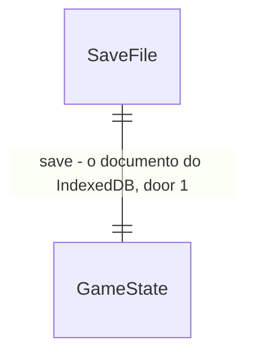

# Lançamento

## Problem

O jogo só existe no computador do autor: não há endereço público, e quem quisesse jogar precisaria clonar o repositório e rodar `npm run dev`. O repositório nem tem remoto no GitHub.

Para quem jogasse, o save vive só no IndexedDB de um navegador: não sai dali para outro aparelho ou navegador, some quando o usuário limpa os dados do site, e o navegador pode apagá-lo sob pressão de espaço porque o armazenamento não é pedido como persistente. Se uma tela quebrar (erro de render), o React desmonta tudo e sobra uma página em branco, sem caminho para salvar a carreira.

A página também não se apresenta: sem ícone na aba, sem descrição para buscador ou link compartilhado, e sem lugar que diga que clubes e jogadores são fictícios ou que dê o crédito das músicas CC0 e das fontes.

Evidência: roteiro aprovado em 26/09/2026, sub-projeto 5 «lançamento (polish, exportar/importar save, deploy)». Em 28/09/2026 o autor disse «siga com o subprojeto 5» e «vá até o fim sem minha aprovação, corrija o que precisar». Não há métrica de uso: o jogo nunca teve usuário.

Quando isto for entregue:
- o jogo abre num endereço público do GitHub Pages, publicado por um workflow que só publica com testes, lint e build verdes;
- o técnico exporta a carreira para um arquivo e importa esse arquivo em outro navegador;
- uma tela quebrada mostra «Algo deu errado» com «Exportar jogo» e «Recarregar», em vez de página em branco;
- a tela inicial tem «Sobre», com o aviso de ficção, os créditos e a versão.

## Flow

Reutiliza `engine/migrate.migrateSave` para ler qualquer save de v1 a v8, `persistence/save.saveGame` para gravar o importado no único slot, o padrão de confirmação de `NewGameButton` (AC 10 de nucleo-liga-partida) para substituir um save, o `Banner` para falha de gravação e o `scripts/layout-check.mjs` para medir a tela nova a 400 × 700.

1. «Exportar jogo» (tela inicial ou tela de erro) → `store` (exists) entrega o `game` em memória → `engine/saveFile.encodeSaveFile` (door 1) monta o texto do arquivo → `ui` baixa o arquivo pelo navegador
2. «Importar jogo» (tela inicial) → o usuário escolhe um arquivo → `engine/saveFile.decodeSaveFile` (door 1) confere o envelope, passa `save` por `migrateSave` (exists) e confere a forma do documento → erro vira aviso na tela inicial
3. documento válido → confirmação se já há save → `store` (exists) grava com `saveGame` (exists) e abre o jogo como «Continuar» abriria
4. primeira gravação bem-sucedida da sessão → `store` (exists) pede `navigator.storage.persist()` uma vez
5. erro de render em qualquer tela → `ui/ErrorBoundary` (new, no door - placement per conventions) mostra a tela de erro
6. «Sobre» → `store` (exists) muda a fase para `"about"` → tela Sobre → «Voltar» à tela inicial
7. push em `main` → `.github/workflows/deploy.yml` (door 2) roda test, lint e build com `base: "./"` (door 3) → publica `dist/` no GitHub Pages

## Impact

| Front | What changes |
| --- | --- |
| domain | new term: `arquivo de save` - o envelope JSON exportado (door 1), vive em `engine/saveFile` |
| domain | new term: fase `"about"` - mais um valor de `Phase` no store; quem ramifica em `phase`: `App` (qual tela e se mostra a faixa do topo) e `audio.setPhase` (qual música) |
| domain | existing term: menu da tela inicial - era «Continuar» + «Novo jogo»; passa a «Continuar», «Exportar jogo», «Importar jogo», «Novo jogo», «Sobre». O teste de ordem dos botões em `Home.test.tsx` muda (Superseded em `checks.md`) |
| domain | existing term: `package.json` `version` - 0.1.0 passa a 1.0.0, e a tela Sobre lê esse valor |
| build | `vite.config.ts` ganha `base: "./"`; as URLs `/fonts/...` do CSS passam a sair relativas no `dist/` |
| repo | ganha `.github/workflows/`; `bash.exe.stackdump` sai do repositório e entra no `.gitignore`. O remoto `origin` (repositório privado `forzion-futmanager`) não foi criado: a criação do repositório foi negada pela permissão da sessão em 28/09/2026 e fica com o autor (pergunta aberta 2) |
| stored data | nothing to migrate - o save no IndexedDB não muda de forma; o arquivo exportado carrega o mesmo documento |

## Relations

One-way constraints: `format` é sempre `"forzion-futmanager-save"` (door 1); `save` é um documento com `schemaVersion` que `migrateSave` aceita. No columns and no types here.

## Surface

| Route | In | Out | Status |
| --- | --- | --- | --- |
| `GET` URL pública do GitHub Pages | nada | `index.html` com título «Forzion FutManager» | `200` |

O arquivo de save não é HTTP; o que a leitura dele devolve é o conjunto que vira linha de `Coverage`:

| Arquivo | In | Out | Resultado da leitura |
| --- | --- | --- | --- |
| `forzion-futmanager-t<temporada>-<clube>.json` | `game` em memória | `format` · `exportedAt` · `save` | `ok`, `invalid_json`, `not_a_save`, `unsupported_version`, `malformed` |

## Landing

| One-way door | Literal shape | Alternative rejected |
| --- | --- | --- |
| 1. formato do arquivo exportado | `{ "format": "forzion-futmanager-save", "exportedAt": "<ISO 8601>", "save": <GameState> }`, JSON com indentação de 2 espaços, `.json`; a importação só aceita esse envelope | o `GameState` cru: nada distingue um save de outro JSON qualquer, e um campo novo no arquivo (versão do app, checksum) não teria onde entrar sem ambiguidade. O arquivo fica no disco do usuário para sempre, então o envelope não pode mudar de nome |
| 2. hospedagem e publicação | GitHub Pages por GitHub Actions (`actions/upload-pages-artifact` + `actions/deploy-pages`), gatilho `push` em `main` e `workflow_dispatch`, com `npm ci`, `npm test`, `npm run lint`, `npm run build` antes de publicar | Netlify, Vercel ou Cloudflare Pages: pedem conta e login que não existem neste PC; o `gh` já está autenticado com escopo `workflow`. Publicar pelo branch `gh-pages`: publica mesmo com teste vermelho |
| 3. caminho base do build | `base: "./"` no `vite.config.ts` | `base: "/forzion-futmanager/"`: amarra o build ao nome do repositório e quebra num domínio próprio na raiz; o jogo não tem rotas, então caminho relativo serve em qualquer lugar |

- Nothing else in this change is hard to reverse. O texto da tela Sobre, a ordem do menu, o nome do arquivo baixado e o momento do pedido de armazenamento persistente mudam numa linha.

## Criteria

### S1: Exportar a carreira para um arquivo (P1)

O técnico baixa um arquivo com a carreira inteira.

**Acceptance Criteria**

1. WHILE há um jogo com clube escolhido carregado, a tela inicial SHALL mostrar o botão «Exportar jogo»
2. WHEN o técnico toca «Exportar jogo» THEN o sistema SHALL baixar um arquivo `forzion-futmanager-t<temporada>-<apelido do clube em minúsculas, sem acento, espaços trocados por hífen>.json`
3. The arquivo exportado SHALL ser JSON com exatamente as chaves `format` (`"forzion-futmanager-save"`), `exportedAt` (data ISO 8601) e `save` (o `GameState` em memória, igual campo a campo)
4. WHILE não há jogo com clube escolhido, a tela inicial SHALL esconder «Exportar jogo»

**Independent test:** com um save, tocar «Exportar jogo» e abrir o arquivo baixado.

### S2: Importar um arquivo de save (P1)

O técnico leva a carreira para outro navegador.

**Acceptance Criteria**

5. WHILE a tela inicial está carregada, ela SHALL mostrar o botão «Importar jogo», que abre a escolha de arquivo `.json`
6. WHEN o arquivo escolhido é um arquivo de save válido e não há save gravado THEN o sistema SHALL gravar o documento no slot e abrir o jogo na mesma tela que «Continuar» abriria
7. WHEN o arquivo escolhido é válido e já há save gravado (ou um save incompatível) THEN o sistema SHALL pedir «Isso substitui o jogo salvo. Continuar?» com «Sim, substituir» e «Cancelar», e só gravar depois de «Sim, substituir»
8. WHEN o técnico toca «Cancelar» na confirmação THEN o save gravado SHALL continuar igual e a tela inicial SHALL voltar ao menu
9. WHEN o arquivo traz um save de versão antiga (v1 a v7) THEN o sistema SHALL importá-lo já migrado para a v8, igual ao que `migrateSave` devolve
10. IF o arquivo não é JSON THEN a tela inicial SHALL mostrar «Arquivo inválido: não é um jogo salvo» e o save gravado SHALL continuar igual
11. IF o JSON não tem `format` igual a `"forzion-futmanager-save"` THEN a tela inicial SHALL mostrar «Arquivo inválido: não é um jogo salvo» e o save gravado SHALL continuar igual
12. IF o `save` tem `schemaVersion` que `migrateSave` não aceita THEN a tela inicial SHALL mostrar «Versão do jogo salvo não suportada (<versão>)» e o save gravado SHALL continuar igual
13. IF o `save` v8 não tem a forma de um jogo (sem `leagues` com clubes, sem `market`, `history` ou `cups` em lista, `seed`, `rngState` ou `season` não inteiros, ou `userClubId` que não é clube de nenhuma liga) THEN a tela inicial SHALL mostrar «Arquivo corrompido: não foi possível ler o jogo» e o save gravado SHALL continuar igual
14. IF a gravação do importado falha THEN o sistema SHALL abrir o jogo importado mesmo assim e mostrar o aviso «Não foi possível salvar» do `Banner`
15. The sistema SHALL devolver, para o arquivo que ele mesmo exportou, um jogo igual campo a campo ao exportado (ida e volta)

**Independent test:** exportar num navegador, importar em outro perfil e continuar a mesma temporada.

### S3: Uma tela quebrada não perde a carreira (P1)

Erro de render vira uma tela com saída.

**Acceptance Criteria**

16. IF uma tela lança erro durante o render THEN o sistema SHALL mostrar «Algo deu errado» com os botões «Recarregar» e, havendo jogo em memória com clube escolhido, «Exportar jogo»
17. WHEN o técnico toca «Recarregar» na tela de erro THEN o sistema SHALL recarregar a página
18. WHEN o técnico toca «Exportar jogo» na tela de erro THEN o sistema SHALL baixar o mesmo arquivo do AC 2 e do AC 3
19. WHEN uma tela lança erro durante o render THEN o sistema SHALL registrar o erro com `console.error`

**Independent test:** forçar um erro numa tela em teste e ver a tela de erro com os dois botões.

### S4: O save pede armazenamento persistente (P2)

O navegador não apaga a carreira para liberar espaço.

**Acceptance Criteria**

20. WHEN a primeira gravação bem-sucedida da sessão termina THEN o sistema SHALL chamar `navigator.storage.persist()` uma única vez na sessão
21. IF `navigator.storage.persist` não existe ou rejeita THEN o sistema SHALL seguir sem erro e sem aviso

**Independent test:** escolher um clube com `navigator.storage.persist` espionado e ver uma chamada; jogar outra rodada e ver que não houve segunda.

### S5: A tela Sobre e a apresentação da página (P2)

A página se apresenta e dá os créditos.

**Acceptance Criteria**

22. WHILE a tela inicial está carregada, ela SHALL mostrar o botão «Sobre», e a ordem do menu SHALL ser «Continuar» (se há save), «Exportar jogo» (AC 1), «Importar jogo», «Novo jogo», «Sobre»
23. WHEN o técnico toca «Sobre» THEN o sistema SHALL mostrar a tela Sobre com «Forzion FutManager», «Versão 1.0.0» (o `version` do `package.json`) e o aviso «Clubes, jogadores e competições são fictícios.»
24. The tela Sobre SHALL listar as 5 músicas com título, autor e «CC0» (Old Tricks, Hush Hamlet, Apple Cider e Aura Horizon de Zane Little Music; Summer Memories de Juhani Junkala) e as fontes Exo 2 e Barlow Semi Condensed com «SIL Open Font License 1.1»
25. The tela Sobre SHALL dizer «O jogo fica salvo só neste navegador. Use Exportar jogo para levá-lo a outro aparelho.»
26. WHEN o técnico toca «Voltar» na tela Sobre THEN o sistema SHALL mostrar a tela inicial
27. The tela Sobre e a tela inicial com os 5 botões SHALL caber em 400 × 700 sem rolagem de página (AD-010), medidas por `npm run check:layout`
28. The `index.html` SHALL ter um ícone SVG próprio (`favicon.svg`), `meta name="description"`, `meta name="theme-color"`, `og:title`, `og:description` e um `<noscript>` em português

**Independent test:** abrir a tela inicial, tocar «Sobre», ler os créditos, voltar.

### S6: Publicação pública (P1)

O jogo abre num endereço público, e só código verde é publicado.

**Acceptance Criteria**

29. The `dist/` gerado por `npm run build` SHALL referenciar scripts, estilos, fontes e músicas por caminhos relativos, sem nenhum `src="/`, `href="/` ou `url(/` que aponte para a raiz
30. WHEN há push em `main` THEN o workflow `deploy.yml` SHALL rodar `npm ci`, `npm test`, `npm run lint` e `npm run build`, nessa ordem, antes de publicar
31. IF qualquer um desses passos falha THEN o workflow SHALL não publicar
32. WHEN o workflow termina verde THEN a URL do GitHub Pages SHALL responder `200` com uma página cujo `<title>` é «Forzion FutManager»
33. The repositório SHALL não versionar `bash.exe.stackdump`, e `.gitignore` SHALL ignorar `*.stackdump`

**Independent test:** `gh run list` com a última execução verde e `curl` da URL com `200`.

## Out of scope

| Excluded | Why |
| --- | --- |
| instalar como app (PWA com service worker e jogo offline) | pede ícones PNG e estratégia de cache; o jogo já roda sem rede depois de carregado, exceto músicas ainda não baixadas |
| vários slots de save | o slot único é a door 1 de nucleo-liga-partida; exportar cobre o uso de guardar carreiras |
| save na nuvem, contas, ranking | pede backend, contra AD-001 |
| domínio próprio | decisão e custo do autor; `base: "./"` já serve na raiz de um domínio |
| analytics e telemetria | nenhum pedido; exige aviso de privacidade |
| achados não bloqueantes do Verifier do 4c (L-023, L-024, L-025) | são lacunas de teste, não defeitos visíveis; ficam no Handoff |

## Assumptions

| Assumption | Chosen default | Rationale | Confirmed? |
| --- | --- | --- | --- |
| visibilidade do repositório | privado, `arthuurw/forzion-futmanager` | tornar o código público é decisão do autor; privado é reversível e não expõe nada | n |
| GitHub Pages num repositório privado | tentar; se a API recusar pelo plano da conta, parar antes de tornar o repositório público e deixar o workflow pronto | o plano da conta não é legível pelo token (`gh api user` sem `plan`) | n |
| onde fica «Exportar jogo» dentro do jogo | só na tela inicial e na tela de erro | a tela inicial abre em todo carregamento e o save no slot é o último gravado; a faixa do topo não cabe mais um botão a 400 px | n |
| versão Node do CI | 24, a mesma deste PC (v24.18.0) | o que roda aqui roda lá | n |
| `npm run check:layout` no CI | não roda no CI | precisa de Chrome instalado e de uma porta local; roda aqui como prova do AC 27 | n |
| texto do ícone | «F» em itálico nas cores do título sobre fundo escuro, SVG feito à mão | nenhuma arte existe; SVG não pede ferramenta | n |
| autorização para push e deploy | concedida | «vá até o fim sem minha aprovação» em 28/09/2026 | y |

**Open questions:**

| # | Kind | Question | Until answered |
| --- | --- | --- | --- |
| 1 | blocks go-live | a conta aceita GitHub Pages em repositório privado? | AC 32 fica sem URL pública; o resto do lançamento está pronto |
| 2 | blocks go-live | criar o repositório no GitHub e fazer o primeiro push: negado pela permissão da sessão (classificador do modo automático) em 28/09/2026 | AC 32 (C35) fica sem prova até o autor criar o repositório, ativar o Pages e fazer push |

## Observable

| Surface | Decision | Landing |
| --- | --- | --- |
| tela inicial | empty state (sem save) | AC 4, AC 5, AC 22 |
| tela inicial | loading | existing - «Carregando…» sem botões (Home.test) |
| tela inicial | error state (importação) | AC 10, AC 11, AC 12, AC 13 |
| tela inicial | destructive action confirms | AC 7, AC 8 |
| tela inicial | density and ordering | AC 22, AC 27 |
| tela inicial | unauthorised | n/a - jogo local sem contas |
| tela Sobre | empty, loading, error, unauthorised | n/a - texto estático, sem dado a carregar |
| tela Sobre | density | AC 27 |
| tela de erro | error state | AC 16, AC 19 |
| tela de erro | destructive action confirms | n/a - recarregar não apaga nada; o save gravado continua |
| arquivo de save | structure | AC 3 (door 1) |
| arquivo de save | versioning | AC 9, AC 12 - a versão é o `schemaVersion` do documento |
| arquivo de save | duplicates | AC 7 - importar o mesmo arquivo de novo só substitui o slot |
| URL pública | response | AC 32 |
| URL pública | caching, rate limits | n/a - política do GitHub Pages, fora do nosso controle |
| workflow `deploy.yml` | output and exit | AC 30, AC 31 |
| workflow `deploy.yml` | concurrency | existing no GitHub - `concurrency: pages` no workflow evita duas publicações ao mesmo tempo (decidido no build) |
| página (`index.html`) | copy someone reads | AC 28 |

## Sources

- Roteiro de 26/09/2026 (memória do projeto): sub-projeto 5 «lançamento (polish, exportar/importar save, deploy)»
- AD-001 (SPA estático, deploy grátis), AD-003 (save JSON versionado), AD-010 (sem rolagem a 400 × 700), AD-015 (nome do produto)
