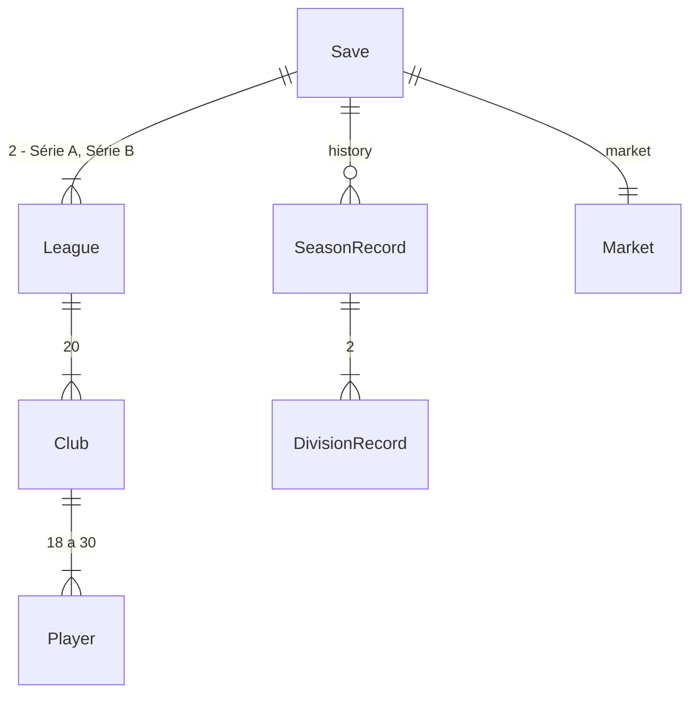

# Múltiplas temporadas

## Problem

Hoje o jogo acaba na rodada 38. A tela Fim mostra o campeão, e o único botão é «Novo jogo». O técnico não vê o time envelhecer nem os jovens crescerem. Não disputa acesso nem foge do rebaixamento, e não tem meta a cumprir. Nada do que ele constrói na temporada (elenco, caixa, estádio) passa para a seguinte. Contratos não existem, então nenhum jogador sai por fim de contrato e ninguém é renovado. Também não fica registro de campeões nem de artilheiros.

Por isso o jogo dura uma temporada, e o Brasfoot original é jogado por dezenas delas.

Evidência: roteiro aprovado em 26/09/2026, em que o sub-projeto 3 é «múltiplas temporadas». Em 26/09/2026 o autor escolheu:
- evolução e aposentadoria, contratos, premiação e diretoria, histórico e artilharia;
- Série B já neste sub-projeto;
- diretoria com meta e folga, com demissão só no fim da temporada;
- jogo novo podendo começar na Série A ou na B.

Não há métrica de uso.

Quando isto for entregue, o campeonato terá Série A e Série B, cada uma com 20 clubes, e 4 clubes sobem e 4 descem por temporada. No fim da temporada o técnico vê:
- os campeões e os clubes que sobem e descem;
- o prêmio pela sua posição;
- o veredito da diretoria.

Se for demitido, escolhe um de 3 clubes mais fracos. Se não for, segue para a próxima temporada. Na virada, os jogadores envelhecem e mudam de força, os veteranos se aposentam e os contratos vencidos acabam. Durante a temporada ele renova quem está no último ano de contrato e acompanha a artilharia e as estatísticas. O histórico de campeões fica guardado.

## Flow

Reutiliza o fechamento de rodada (`finishRound`), que agora fecha as duas divisões. Reutiliza também o documento único de save (AD-003, versão 4) e os geradores de jogador e de liga (`generate`).

1. jogo novo -> `engine/generate` (exists) - gera a Série A (20 identidades da AD-009) e a Série B (20 identidades novas, AD-011), com contratos e estatísticas zeradas (door 1)
2. «Jogar rodada» -> `engine/live` (exists) - a rodada ao vivo tem as 20 partidas das duas divisões, cada divisão com o seu `Rng` por partida (door 2). A tela «Ao vivo» (exists) mostra só as 10 da divisão do usuário
3. `engine/season.finishRound` (exists) - escreve os resultados das duas divisões; `engine/condition` (exists) passa a somar jogos e gols da temporada; `engine/finance` e `engine/market` (exist) fecham as duas divisões. Depois da rodada 38, paga o prêmio por posição
4. tela Fim (exists) -> `engine/season` (exists) `seasonReview` - campeões, quem sobe e quem desce, prêmio, veredito da diretoria e, se demitido, 3 propostas de emprego
5. «Próxima temporada» -> `engine/rollover` (new, no door - placement per conventions) - troca 4 clubes entre as divisões, grava o histórico, faz a evolução, as aposentadorias e os fins de contrato, repõe os elencos da IA, cria o calendário novo e fixa a meta da diretoria. Tudo usa o `Rng` da virada (door 3)
6. `persistence` (exists) grava o save v4 (door 1); a tela «Nova temporada» (new, no door - placement) mostra o que mudou no elenco do usuário e a nova meta

## Impact

| Front | What changes |
| --- | --- |
| domain | new term: divisão (`League` 0 = Série A, 1 = Série B) - a liga do usuário deixa de ser sempre `leagues[0]` |
| domain | existing term: `userLeague(state)` devolvia `leagues[0]`, agora devolve a liga que contém o clube do usuário. Quem usa: `live`, `finance`, `market`, `season`, `store` e todas as telas |
| domain | existing term: `LiveRound.matches` tinha as 10 partidas da liga, agora tem as 20 das duas divisões, cada uma com `leagueId`. Quem usa: tela «Ao vivo» (lista, contagem), `finishRound`, `userMatch` |
| domain | new term: `contractSeasons` (UI «Contrato») - temporadas restantes, contando a atual |
| domain | new term: estatísticas do jogador - `seasonGames`, `seasonGoals`, `careerGames`, `careerGoals` |
| domain | new term: `SeasonRecord` - uma entrada do histórico por temporada encerrada |
| domain | new term: meta da diretoria (`boardGoal`) - posição máxima aceitável na temporada |
| domain | existing criterion AC 19 do sub-projeto 2 (valor = salário × 50 × fator de idade): o valor passa a seguir a força atual, `salaryFor(força) × 50 × fator`. Os números não mudam para quem nunca evoluiu, mas um jovem que cresceu passa a valer mais que o salário antigo indicaria. Quem usa: `askingPrice`, propostas da IA, lista do mercado |
| domain | existing criterion C43 de partida-ao-vivo e C52 do sub-projeto 2 (versão incompatível): agora só uma versão acima de 4 é incompatível |
| domain | existing: a tela Fim só mostrava campeão e «Novo jogo». Agora mostra o resumo da temporada e «Próxima temporada», e «Novo jogo» continua disponível na tela Início |
| domain | existing: o patrocínio é o valor da Série A; na Série B o clube recebe 60% dele. Quem usa: `closeRoundFinances` |
| stored data | migrate on read: v3, v2 e v1 viram v4. Entra a Série B gerada da seed, com as rodadas já jogadas simuladas só com placar. Os jogadores ganham contrato de 1 a 4 temporadas e estatísticas zeradas, o save ganha histórico vazio, e a meta da diretoria é calculada (door 1) |

## Relations

Restrições de mão única:
- `leagues[0]` é sempre a Série A e `leagues[1]` a Série B; um clube muda de liga mantendo o id (door 4).
- `contractSeasons` é inteiro ≥ 1 enquanto o jogador está num clube (door 1).
- O histórico só cresce; uma temporada encerrada nunca é reescrita (door 1).

## Surface

None - nothing consumed outside. É um SPA estático sem API (AD-001).

## Landing

| One-way door | Literal shape | Alternative rejected |
| --- | --- | --- |
| 1. save v4 | `schemaVersion: 4`; `leagues: [serieA, serieB]` com `League.id` `"l1"` e `"l2"`; `Player.contractSeasons`, `Player.seasonGames`, `Player.seasonGoals`, `Player.careerGames`, `Player.careerGoals`; `GameState.history: SeasonRecord[]` com `SeasonRecord { season, userClubId, userLeagueId, userPosition, verdict, prize, divisions: DivisionRecord[] }` e `DivisionRecord { leagueId, championId, promotedIds, relegatedIds, topScorer: { name, clubName, goals } \| null }`; `GameState.boardGoal: number`. Migração v3/v2/v1 -> v4 na leitura | histórico em outro store do IndexedDB - duas gravações podem divergir (AD-003); nomes guardados no `DivisionRecord` só para o artilheiro, porque jogadores se aposentam e somem do save |
| 2. `Rng` das partidas da Série B | partida `i` da Série B usa `createRng(mix32(mix32(rngState, 0xB), roundNumber*16 + i))`; a Série A continua com `mix32(rngState, roundNumber*16 + i)` (door 2 de partida-ao-vivo) | índices 10 a 19 no mesmo esquema - colidiriam com os sais 14 e 15 do mercado (door 3 do sub-projeto 2) |
| 3. `Rng` da virada | evolução, aposentadoria, fins de contrato da IA, reposição de elencos, calendário e juniores usam `createRng(mix32(rngState, 0x5E45 + season))`, e a virada avança `rngState` uma vez | sortear com o `Rng` da última rodada - a virada ficaria acoplada à ordem dos sorteios da rodada 38 |
| 4. ids e ordem das divisões | Série B com ids `c21` a `c40`; um clube que sobe ou desce muda de array mantendo o id; os 4 que sobem entram no fim do array da Série A | renomear o clube ao trocar de divisão - resultados e histórico apontariam para quem não existe |

- Nothing else in this change is hard to reverse. Tabelas de evolução, prêmios e meta são constantes.

## Criteria

### S1: Série B (P1)

Duas divisões jogam a mesma rodada, e o técnico pode estar em qualquer uma.

**Acceptance Criteria**

1. WHEN um jogo novo é criado THEN o sistema SHALL gerar a Série A com as 20 identidades da AD-009 e a Série B com 20 identidades fixas novas (AD-011), com clubes da B mais fracos: força base de 50 a 66 contra 58 a 80 da A
2. The tela «Escolher clube» SHALL mostrar os 20 clubes da Série A e os 20 da Série B em duas abas, «Série A» e «Série B»
3. WHEN uma rodada é jogada THEN as 20 partidas, 10 de cada divisão, SHALL ter resultado, e cada divisão SHALL avançar para a mesma rodada seguinte
4. WHILE a rodada está ao vivo, a lista «Jogos da rodada» SHALL mostrar só as 10 partidas da divisão do usuário
5. The tela Rodada e o painel «Classificação» da tela Elenco SHALL mostrar a tabela da divisão do usuário, com um seletor «Série A» / «Série B» para ver a outra
6. The lista do mercado SHALL incluir os jogadores dos 39 outros clubes das duas divisões e os livres
7. WHILE um clube está na Série B, ele SHALL receber 60% do seu patrocínio por rodada
8. WHEN 2000 partidas entre times iguais são simuladas THEN as faixas de gols e de vitória do mandante SHALL continuar as do núcleo (AC 22 e 23), como hoje

**Independent test:** começar na Série B, jogar uma rodada ao vivo vendo só os 10 jogos da B, e abrir a tabela da A pelo seletor.

### S2: Virada de temporada (P1)

Depois da rodada 38, a temporada fecha com acesso e rebaixamento, e a próxima começa.

**Acceptance Criteria**

9. WHEN a rodada 38 termina THEN a tela «Fim da temporada N» SHALL mostrar o campeão de cada divisão, os 4 que sobem da B e os 4 que descem da A, a posição final do usuário, o prêmio e o veredito da diretoria
10. WHEN o usuário escolhe «Próxima temporada» THEN os 4 últimos da Série A SHALL ir para a Série B e os 4 primeiros da Série B SHALL ir para a Série A
11. WHEN a nova temporada começa THEN cada divisão SHALL ter um calendário novo de 38 rodadas em turno e returno, `currentRound` 0, a temporada SHALL ser N + 1, e o mercado SHALL estar aberto com 3 juniores novos
12. WHEN a nova temporada começa THEN cada jogador SHALL ter condição 100, 0 amarelos e 0 suspensões, e SHALL manter lesão e moral
13. WHEN a nova temporada começa THEN as propostas pendentes SHALL sumir, e o registro da última rodada, o caixa, o estádio e o empréstimo de cada clube SHALL continuar
14. WHEN a nova temporada começa THEN o sistema SHALL mostrar a tela «Nova temporada» com os jogadores do usuário que se aposentaram, os que saíram por fim de contrato, a mudança de força de cada jogador do elenco e a nova meta
15. IF a página é recarregada na tela Fim THEN o jogo SHALL voltar à tela Fim com o mesmo resumo, e «Próxima temporada» SHALL gerar a mesma temporada seguinte

**Independent test:** jogar até a rodada 38 (ou pular com «Pular para o fim» a cada rodada), ver o resumo, avançar e ver a nova tabela com os 4 clubes trocados.

### S3: Evolução e aposentadoria (P2)

Os jogadores envelhecem, os jovens crescem, os veteranos caem e se aposentam.

**Acceptance Criteria**

16. WHEN a temporada vira THEN cada jogador SHALL mudar de força por um sorteio inteiro, conforme a idade antes do aniversário, e ficar entre 40 e 95:

    | Idade | Mudança de força |
    | --- | --- |
    | até 20 | +2 a +6 |
    | 21 a 23 | +1 a +4 |
    | 24 a 27 | −1 a +2 |
    | 28 a 30 | −2 a +1 |
    | 31 a 33 | −4 a 0 |
    | 34 ou mais | −6 a −2 |

17. WHEN a temporada vira THEN cada jogador SHALL ficar 1 ano mais velho
18. WHEN a temporada vira THEN se aposenta, depois do aniversário, 20% dos jogadores com 34 anos, 50% dos com 35 e todos com 36 ou mais, e o aposentado SHALL sair do save
19. WHEN a temporada vira e um clube da IA tem menos de 22 jogadores THEN ele SHALL receber juniores da própria base até 22, a cada vez na posição com menos jogadores, com idade de 18 a 20 e força = média do elenco − 8 ± 4
20. WHEN a temporada vira THEN a lista de livres SHALL voltar a ter pelo menos 40 jogadores, completada com jogadores novos de 19 a 31 anos e força de 45 a 70
21. The valor de mercado de um jogador SHALL ser `salaryFor(força atual)` × 50 × fator de idade do AC 19 do sub-projeto 2, arredondado para R$ 10.000
22. WHEN 5 temporadas são jogadas em 3 seeds THEN a força média dos 18 melhores de cada clube, por divisão, SHALL ficar a até 4 pontos da média da temporada 1

**Independent test:** avançar uma temporada e ver na tela «Nova temporada» um jovem que subiu, um veterano que caiu e quem se aposentou.

### S4: Contratos (P2)

Cada jogador tem contrato; o técnico renova quem quer manter.

**Acceptance Criteria**

23. WHEN um jogo novo é criado THEN cada jogador de clube SHALL ter contrato de 1 a 4 temporadas, sorteado
24. WHEN o usuário compra um jogador, contrata um livre ou promove um júnior THEN o contrato SHALL ser de 3, 2 e 3 temporadas, respectivamente
25. The tela Elenco SHALL mostrar a coluna «Contr.» com as temporadas restantes de cada jogador, e «Último ano» quando resta 1
26. WHEN o usuário escolhe «Renovar» num jogador com 1 temporada restante THEN o contrato SHALL passar a 3 e o salário SHALL passar a `salaryFor(força atual)`; a tela SHALL mostrar o salário novo antes de confirmar
27. WHEN a temporada vira THEN o contrato de cada jogador SHALL cair 1, e quem estava no último ano SHALL sair do clube e ir para os livres
28. WHEN a temporada vira THEN os clubes da IA SHALL renovar antes do vencimento todo jogador no último ano com até 32 anos, por 1 a 3 temporadas e salário `salaryFor(força atual)`; os de 33 ou mais saem

**Independent test:** ver «Último ano» num titular, renovar vendo o salário novo, deixar outro vencer e vê-lo nos livres na temporada seguinte.

### S5: Premiação e diretoria (P2)

A posição rende dinheiro, e a diretoria cobra uma meta.

**Acceptance Criteria**

29. WHEN a rodada 38 termina THEN cada clube SHALL receber prêmio de (21 − posição) × R$ 1.000.000 na Série A e (21 − posição) × R$ 250.000 na Série B
30. WHEN uma temporada começa THEN a meta do usuário SHALL ser, pela posição r do clube no ranking de força (média dos 11 melhores) da própria divisão:
    - Série A: terminar até a posição mín(16, r + 3), e 16 aparece como «Não cair»;
    - Série B: «Subir» (até a 4ª) se r ≤ 4, senão até a posição mín(20, r + 3).
31. The tela Elenco SHALL mostrar a meta da temporada, como «Meta: até o 8º», «Meta: não cair» ou «Meta: subir»
32. WHEN a temporada termina com o usuário até a posição da meta THEN o veredito SHALL ser «Meta cumprida»
33. WHEN a temporada termina com o usuário 5 ou mais posições abaixo da meta, ou rebaixado com meta «Não cair», THEN o veredito SHALL ser «Demitido»; nos demais casos, «Meta não cumprida»
34. WHILE o veredito é «Demitido», a tela Fim SHALL mostrar 3 propostas de emprego (os 3 clubes logo abaixo do clube atual no ranking de força das 40 equipes, ou os 3 mais fracos se não houver 3 abaixo), e «Próxima temporada» SHALL só avançar depois que o usuário escolher uma
35. WHEN o usuário demitido escolhe um clube THEN a nova temporada SHALL começar com ele no comando desse clube, com escalação automática

**Independent test:** forçar uma temporada ruim, ver «Demitido», escolher uma das 3 propostas e começar a temporada seguinte no novo clube.

### S6: Histórico e artilharia (P3)

O jogo guarda campeões e artilheiros, e mostra os números de cada jogador.

**Acceptance Criteria**

36. WHEN uma rodada termina THEN cada jogador que entrou em campo SHALL somar 1 jogo na temporada, e cada gol SHALL somar 1 gol na temporada para quem marcou
37. WHEN a temporada vira THEN jogos e gols da temporada SHALL ser somados à carreira e zerados
38. WHEN a temporada termina THEN o sistema SHALL gravar no histórico, para cada divisão, o campeão, os que sobem e os que descem e o artilheiro (nome, clube e gols), além do clube, da posição, do prêmio e do veredito do usuário
39. The tela «Histórico» SHALL ter três abas:
    - «Artilharia»: os 10 maiores artilheiros da temporada da divisão do usuário, com nome, clube e gols;
    - «Estatísticas»: jogos e gols na temporada e na carreira de cada jogador do elenco;
    - «Campeões»: por temporada, o campeão e o artilheiro de cada divisão e a posição do usuário.
40. WHEN nenhuma temporada terminou THEN a aba «Campeões» SHALL mostrar «Nenhuma temporada encerrada»; sem gols na temporada, a aba «Artilharia» SHALL mostrar «Nenhum gol ainda»

**Independent test:** jogar algumas rodadas e ver a artilharia; virar a temporada e ver o campeão no histórico.

### S7: Save compatível (P1)

Quem já tem um jogo salvo continua de onde parou.

**Acceptance Criteria**

41. WHEN o jogo lê um save v3, v2 ou v1 THEN o sistema SHALL migrá-lo para v4:
    - Série B gerada da seed, com as rodadas já jogadas pela A simuladas na B só com placar;
    - contratos de 1 a 4 temporadas;
    - estatísticas zeradas;
    - histórico vazio;
    - meta da diretoria calculada;
    - Série A, finanças e mercado intactos.
42. IF o save lido tem `schemaVersion` maior que 4 THEN a tela Início SHALL mostrar «Jogo salvo incompatível (versão X)» e oferecer apenas «Novo jogo»
43. WHEN 5 temporadas são jogadas em 3 seeds sem ação do usuário THEN o caixa final de cada clube SHALL ficar entre −1× e 8× o inicial, e a mediana entre 0,8× e 3×

**Independent test:** abrir um save v3 do sub-projeto 2 e ver a Série B no seletor da classificação, com a mesma rodada da A.

## Out of scope

| Excluded | Why |
| --- | --- |
| Série C e divisões abaixo | duas divisões bastam para acesso e rebaixamento; mais ligas entram com os países (sub-projeto 4) |
| copas e torneios | sub-projeto 4 |
| potencial escondido e olheiros | a evolução por idade já dá a curva; potencial individual é um sistema à parte |
| negociação de renovação e recusa do jogador | a renovação sai pela fórmula, como o salário de compra |
| demissão no meio da temporada | o autor escolheu avaliar só no fim |
| propostas de emprego sem ser demitido | só a demissão abre propostas nesta entrega |
| transferências entre clubes da IA | a IA se renova pela base; como no sub-projeto 2 |
| estatísticas além de jogos e gols (cartões, notas) | o pedido foi histórico e artilharia |

## Assumptions

| Assumption | Chosen default | Rationale | Confirmed? |
| --- | --- | --- | --- |
| identidades da Série B | 20 apelidos fictícios inspirados em clubes da Série B (ex.: «Macaca Campineira», «Bugre Campineiro», «Papão da Curuzu»), com cidade ou estado e cores, sem nome real (AD-008) | mesmo padrão da AD-009 | n |
| onde a virada acontece | a virada só roda quando o usuário aperta «Próxima temporada»; até lá, o save fica na rodada 38 encerrada | recarregar na tela Fim mostra o mesmo resumo (AC 15) | n |
| prêmio | pago ao fechar a rodada 38, antes do resumo, e mostrado no resumo e no registro do clube | o resumo mostra dinheiro que já está no caixa | n |
| ranking de força | média dos 11 melhores disponíveis (`bestElevenMean`, que já existe) | já é a força usada na escolha de clube | n |
| juniores da base do usuário na virada | 3 juniores novos na janela da temporada, como hoje; o usuário não recebe reposição automática | o usuário monta o próprio elenco | n |
| elenco do usuário abaixo de 18 na virada | pode ficar; «Jogar rodada» só exige 11 disponíveis, e o mercado abre na rodada 1 | o mínimo de 18 vale para vender e dispensar, não para jogar | n |
| tabela de desempate | igual à do núcleo (P, V, SG, GP, nome) nas duas divisões | já provada | n |

**Open questions:** none - all resolved or logged above.

## Observable

| Surface | Decision | Landing |
| --- | --- | --- |
| screen «Escolher clube» | density and ordering | AC 2: abas A e B, 20 cartões cada, como hoje |
| screen «Ao vivo» | density and ordering | AC 4: só a divisão do usuário |
| screen «Fim da temporada» | empty, loading, error states | n/a - sempre há campeão ao fim da rodada 38; falha ao gravar usa o aviso existente |
| screen «Fim da temporada» | destructive action confirms | n/a - «Próxima temporada» não apaga nada; a temporada encerrada vai para o histórico |
| screen «Fim da temporada» | density and ordering | AC 9, AC 34 |
| screen «Nova temporada» | empty state | lista vazia mostra «Ninguém se aposentou» ou «Nenhum contrato encerrado» (mesmo padrão) - AC 14 |
| screen «Histórico» | empty state | AC 40 |
| screen «Histórico» | loading, error, unauthorised | n/a - dados em memória, jogo local sem contas |
| screen «Histórico» | density and ordering | AC 39: artilharia por gols decrescente, depois nome; campeões da temporada mais recente para a mais antiga |
| screen «Elenco» | density and ordering | AC 25, AC 31 |
| screen «Elenco» | destructive action confirms | AC 26: renovação mostra o salário novo antes de confirmar |
| collection histórico | grouping, ordering, duplicates | uma entrada por temporada, nunca reescrita (Relations) |

## Sources

- Roteiro de 26/09/2026 (memória do projeto): sub-projeto 3 = múltiplas temporadas.
- Respostas do autor em 26/09/2026:
  - escopo: evolução e aposentadoria, contratos, premiação e diretoria, histórico e artilharia;
  - Série B agora;
  - diretoria: meta com folga, demissão só no fim, 3 propostas de clubes mais fracos;
  - início na Série A ou B.
- `.specs/STATE.md`: AD-003, AD-006, AD-008, AD-009 e AD-010.
