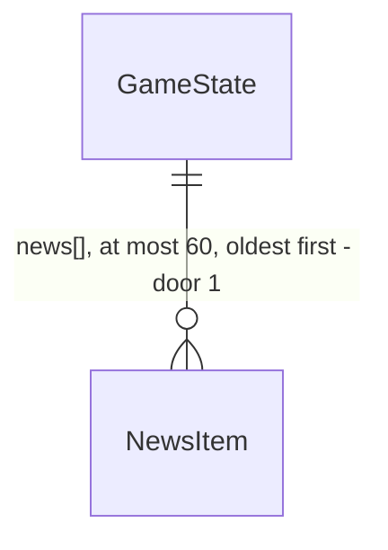

# Caixa de notícias

## Problem

O que acontece numa data fica espalhado ou some: a lesão aparece como selo «LES» no elenco, a suspensão como «SUS», a proposta na aba «Propostas» do Mercado, a força que subiu como uma seta pequena, as compras da IA no boletim «Transferências», a classificação na copa só na tela da copa. Quem joga rápido («Jogar rodada» em sequência) não vê que o artilheiro se lesionou ou que chegou uma proposta antes de ela expirar. O autor escolheu esta feature em 02/10/2026 entre seis candidatas; não há métrica.

Quando isto sair, cada data fechada gera as notícias do clube do usuário, a tela da rodada mostra as notícias daquela data na aba «Notícias», e o Histórico guarda as últimas 60 na aba «Notícias», da mais nova para a mais velha.

## Flow

Reusa o fechamento de data do motor (`engine/season.finishRound` e `engine/cup.finishCupDate`, que já recebem o jogo de antes e devolvem o de depois), a lista de transferências da IA (`market.transfers`), as propostas (`market.offers`), o registro de força (`ratingLog`), os avisos e as propostas de emprego (AD-024), e as telas Rodada e Histórico.

1. fechamento de uma data da liga -> `engine/season.finishRound` (exists) -> `engine/news.dateNews` (new, door 1) compara o jogo de antes com o de depois e devolve as notícias do clube do usuário, em ordem fixa
2. fechamento de uma data de copa -> `engine/cup.finishCupDate` (exists) -> `engine/news.dateNews` (o mesmo)
3. `engine/news.appendNews` (new) acrescenta as notícias a `GameState.news` e corta as mais velhas acima de 60 (door 1)
4. tela Rodada -> `ui/Round` (exists) mostra a aba/painel «Notícias (<n>)» com as notícias da data que acabou de ser jogada
5. tela Histórico -> `ui/History` (exists) ganha a aba «Notícias» com todas as guardadas
6. o texto de cada notícia sai dos dados no momento de mostrar -> `ui/newsText` (new, no door - placement per conventions); o save guarda dados, não frases (AD-004)

## Impact

| Front | What changes |
| --- | --- |
| domain | new term: notícia (`NewsItem`) - um fato de uma data sobre o clube do usuário, com a temporada e a data (rodada da liga ou fase da copa) |
| domain | existing behaviour: a tela Rodada ganha um painel; no desktop são 4 colunas em vez de 3, no celular uma aba a mais |
| stored data | `GameState.news?` opcional, ausente = nenhuma; save continua v8 (como AD-021, AD-023, AD-024, AD-026). Um save de antes abre sem notícias e as ganha na próxima data |

## Relations

One-way constraints: cada notícia guarda o nome do jogador (o jogador pode se aposentar e sumir) e ids de clube (clubes nunca somem); o texto em PT-BR nunca vai para o save. A lista só cresce pelo fim e perde as mais velhas acima de 60.

## Surface

None - nothing consumed outside. O arquivo exportado (AD-018) leva `news` junto com o jogo.

## Landing

| One-way door | Literal shape | Alternative rejected |
| --- | --- | --- |
| 1. notícias no save | `GameState.news?: NewsItem[]`, no máximo 60, da mais velha para a mais nova; `NewsItem = { season: number; date: { kind: "league"; round: number } \| { kind: "cup"; cupId: string; phase: number } } & ( { kind: "injury"; playerName: string; rounds: number } \| { kind: "suspension"; playerName: string; rounds: number; cupId?: string } \| { kind: "rating"; playerName: string; rating: number; delta: 1 \| -1 } \| { kind: "offer"; playerName: string; clubId: string; amount: number } \| { kind: "transfer"; playerName: string; fromId: string; toId: string; amount: number } \| { kind: "board"; warnings: number } \| { kind: "job"; clubIds: string[] } \| { kind: "cup"; cupId: string; phase: number; result: "advanced" \| "champion" \| "out"; opponentId: string } )`; save continua v8 | frases prontas em PT-BR no save: mistura texto de tela com dado (AD-004) e congela a frase de hoje em todo save; notícias só em memória: somem ao recarregar, e o Histórico não teria nada a mostrar |

- O limite de 60, a ordem dos tipos numa data e as frases são reversíveis
- Nothing else in this change is hard to reverse

## Criteria

### S1: as notícias de cada data (P1)

O motor gera as notícias do clube do usuário ao fechar cada data, na ordem: copa, lesão, suspensão, força, proposta, diretoria, emprego, transferência.

**Acceptance Criteria**

1. WHEN uma data fecha e um jogador do usuário tem `injuryRounds` maior que antes THEN the system SHALL criar a notícia `injury` com o nome e as rodadas.
2. WHEN uma data fecha e um jogador do usuário tem `suspendedRounds` da liga maior que antes THEN the system SHALL criar `suspension` com as rodadas; WHEN a suspensão nova é de uma copa (`cupDiscipline[cupId].suspendedRounds`) THEN SHALL criar `suspension` com o `cupId`.
3. WHEN uma rodada da liga fecha e um jogador do usuário ganhou um passo de força nessa rodada (`ratingLog`) THEN the system SHALL criar `rating` com a força nova e o sentido.
4. WHEN uma rodada fecha com propostas da IA por jogadores do usuário THEN the system SHALL criar uma `offer` por proposta, com o clube, o valor e o jogador.
5. WHEN uma rodada fecha e a diretoria aumentou os avisos (`boardWarnings`) THEN the system SHALL criar `board` com o número de avisos.
6. WHEN uma rodada fecha e chegou uma proposta de emprego que não havia antes THEN the system SHALL criar `job` com os clubes.
7. WHEN uma rodada fecha THEN the system SHALL criar uma `transfer` para cada compra da IA dessa rodada (`market.transfers` com `kind: "buy"` e a rodada) em que o comprador ou o vendedor é da divisão do usuário.
8. WHEN uma data de copa fecha com um confronto do usuário THEN the system SHALL criar `cup` com `advanced` (venceu e há fase seguinte), `champion` (venceu a última fase) ou `out` (perdeu), e o adversário.
9. The system SHALL guardar as notícias em `GameState.news`, acrescentando as da data no fim e mantendo só as 60 mais novas; sem clube do usuário, SHALL não criar nenhuma.
10. The system SHALL gerar as mesmas notícias jogando a data ao vivo, pulando para o fim, ou reabrindo o jogo com a data ao vivo pendente (o mesmo fechamento, AD-019).

**Independent test:** jogar algumas rodadas pelo motor com um fixture que força uma lesão e uma proposta e ler `news`.

### S2: onde aparecem (P1)

**Acceptance Criteria**

11. WHEN a tela Rodada mostra uma data THEN the system SHALL mostrar o painel «Notícias» (no celular, a aba «Notícias (<n>)») com as notícias daquela data, na ordem guardada; sem notícia, SHALL mostrar «Nada de novo nesta data.».
12. The system SHALL escrever cada notícia assim: lesão «<nome> se lesionou e fica fora por <n> rodada(s).»; suspensão «<nome> está suspenso por <n> rodada(s)» + « na liga.» ou « na <copa>.»; força «<nome> subiu para <força>.» ou «<nome> caiu para <força>.»; proposta «<clube> oferece <valor> por <nome>.»; diretoria «Aviso da diretoria (<n>/3): a campanha está abaixo do aceitável.»; emprego «<clubes> querem contratar você.» (um: «<clube> quer contratar você.»); transferência «<comprador> contratou <nome> (<vendedor>) por <valor>.» (sem artigo: os apelidos dos clubes têm gênero variado); copa «<copa>: classificado para <fase seguinte>.», «<copa>: campeão!» ou «<copa>: eliminado por <adversário>.» (1 rodada no singular).
13. WHEN o usuário abre a aba «Notícias» do Histórico THEN the system SHALL listar todas as notícias guardadas, da mais nova para a mais velha, cada uma com «Temporada <n> · Rodada <r>» ou «Temporada <n> · <copa> · <fase>» e o texto; sem nenhuma, «Nenhuma notícia ainda.».
14. The system SHALL caber em 400 × 700 px sem rolagem a tela Rodada com a aba «Notícias» aberta e o Histórico na aba «Notícias» (AD-010).

**Independent test:** depois de uma rodada com lesão, a tela Rodada mostra a frase da lesão na aba «Notícias», e o Histórico mostra a mesma frase com a temporada e a rodada.

## Out of scope

| Excluded | Why |
| --- | --- |
| notícias de outros clubes (lesões, demissões da IA) | o foco é o clube do usuário; as compras da IA da divisão já entram |
| não lidas, contador no elenco | a tela Rodada aparece depois de toda data; um contador pede outro estado no save |
| notícia da virada da temporada | a tela «Nova temporada» já mostra aposentados, contratos e força |
| venda feita pelo próprio usuário | foi ele que fez; a transferência dele não está na lista da IA da rodada |

## Assumptions

| Assumption | Chosen default | Rationale | Confirmed? |
| --- | --- | --- | --- |
| quantas guardar | 60 | ~1,5 temporada de datas com 1 a 2 notícias; o save cresce pouco | n |
| onde mostrar | painel na tela Rodada e aba no Histórico | a tela Rodada aparece depois de cada data, que é quando a notícia importa | n |
| transferências de quem | compras da IA em que um lado é da divisão do usuário | é o mercado com que ele disputa; as 4 divisões gerariam dezenas por rodada | n |
| decisões do autor | defaults recomendados sem rodada de perguntas | o autor pediu em 02/10/2026 «1, 2 e 3. siga até o fim» | y |

**Open questions:** none - all resolved or logged above.

## Observable

| Surface | Decision | Landing |
| --- | --- | --- |
| screen Rodada painel «Notícias» | empty state | AC 11 |
| screen Rodada painel «Notícias» | density and ordering | AC 11, AC 14 |
| screen Rodada painel «Notícias» | loading state | n/a - as notícias chegam com a data fechada, na mesma atualização da tela |
| screen Rodada painel «Notícias» | error state | n/a - nada a buscar; uma notícia de clube que não existe mais não acontece (clubes nunca somem) |
| screen Rodada | unauthorised state | n/a - jogo local, sem contas |
| screen Histórico aba «Notícias» | empty state | AC 13 |
| screen Histórico aba «Notícias» | density and ordering | AC 13, AC 14 |
| texto das notícias | cada tipo | AC 12 |
| save | campo novo | AC 9, door 1 |

## Sources

- Pedido do autor em 02/10/2026: «1, 2 e 3. siga até o fim. já coloque no state as outras. use a /tlc-spec-lean».
- `.specs/STATE.md` AD-004, AD-010, AD-019, AD-024 - texto fora do save, tela sem rolagem, a data pendente e a carreira que esta feature lê.
