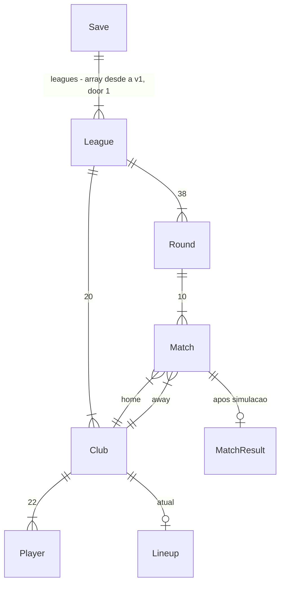

# Núcleo: liga + partida

## Problem

Hoje não existe jogo. Quem quer jogar um manager de futebol em texto, no estilo Brasfoot, dentro do navegador, não tem opção: o original é Windows, fechado, e não roda na web. A única evidência é o pedido do autor deste projeto (26/09/2026): recriar o Brasfoot pra lançar publicamente. Não há métrica de demanda e não inventamos uma.

Quando isto for entregue, uma pessoa abre o link, cria um jogo com 20 clubes fictícios, escolhe um, escala, joga 38 rodadas lendo a narração da sua partida e a tabela, vê o campeão, e ao fechar e reabrir o navegador retoma de onde parou.

## Flow

Nada existe ainda; o que este feature reutiliza é interno: um único `Rng` semeado (door 2) alimenta tanto a geração quanto a simulação, e um único documento de save (door 1) é lido e escrito por todas as telas.

1. clique em «Novo jogo» -> `engine/generate` (new, dentro da fronteira door 3) - gera `League` com 20 `Club`, 22 `Player` cada e 38 `Round` a partir do `Rng` (door 2); entrega `GameState`
2. escolha do clube -> `store` (new, no door - placement per conventions) - grava `userClubId`; entrega ao hop 3
3. `persistence` (door 1) - faz `put` do documento inteiro em IndexedDB; se falhar, sinaliza erro à UI e o estado segue em memória
4. «Jogar rodada» -> `engine/lineup` (new, dentro da fronteira door 3) - valida a escalação do usuário e monta a dos 19 clubes de IA (melhores 11 em 4-4-2)
5. `engine/match` (new, dentro da fronteira door 3) - simula as 10 partidas minuto a minuto com o `Rng` (door 2); entrega `MatchResult` de cada uma e o log de eventos completo da partida do usuário
6. `engine/table` (new, dentro da fronteira door 3) - recalcula a classificação; `currentRound` avança; volta ao hop 3 (`persistence`, door 1)
7. reload da página -> `persistence` (door 1) lê o documento e confere `schemaVersion`; `store` (new, placement) hidrata; a tela é escolhida pelo estado: sem save → Início; `currentRound` < 38 → Rodada; `currentRound` = 38 → Fim
8. out: nenhuma chamada externa. Deploy estático; nada sai da máquina do jogador.

## Impact

Tudo é novo. Nada existe pra ser perturbado. As linhas de domínio fixam nomes porque nome vaza: vira tipo, chave do save e texto de tela.

| Front | What changes |
| --- | --- |
| domain | new term: `League` (UI «Liga») - 20 clubes, 38 rodadas, pontos corridos em turno e returno; lives in `src/engine` |
| domain | new term: `Club` (UI «Clube») - nome, elenco de 22, escalação atual |
| domain | new term: `Player` (UI «Jogador») - nome, `position`, `age`, `rating` (UI «Força», 40–95) |
| domain | new term: `Round` (UI «Rodada») - 10 `Match`; `Match` (UI «Partida») - mandante, visitante, `MatchResult` após simulação |
| domain | new term: `Lineup` (UI «Escalação») - `formation` + 11 titulares, um por slot de posição |
| domain | new term: `MatchEvent` - tipos `kickoff`, `shot_saved`, `shot_missed`, `goal`, `halftime`, `fulltime`; só `goal` é persistido (door 7) |
| stored data | nothing to migrate - greenfield; o primeiro save já nasce com `schemaVersion: 1` |

## Relations

One-way constraints: `Save.leagues` é array (door 1); `Club.id` e `Player.id` únicos dentro do save (door 1); um `Player` pertence a exatamente um `Club`; `Player.position` está em {GK, DF, MF, FW} (door 4). Sem colunas nem tipos aqui.

## Surface

`None - nothing consumed outside`. Sem rota HTTP, sem API. As telas do SPA (Início, Escolher clube, Elenco, Rodada, Tabela, Fim) não são consumidas por nada fora deste código; seus estados estão em `## Observable`. O documento de save será consumido por export/import e nuvem em sub-projetos futuros, por isso é uma porta (door 1), não uma rota.

## Landing

| One-way door | Literal shape | Alternative rejected |
| --- | --- | --- |
| 1. Documento de save | IndexedDB, banco `brasfoot` versão 1, store `saves`, chave `slot-1`, valor `{ schemaVersion: 1, seed, rngState, season: 1, userClubId, leagues: League[] }`, gravado inteiro num único `put` | `localStorage` - quota de ~5 MB e síncrono; sub-projeto 4 (várias ligas) estoura. `league: League` singular - sub-projeto 4 precisa de array e migrar é backfill |
| 2. RNG determinístico | `interface Rng { next(): number; getState(): number }` implementado por mulberry32; `seed` e `rngState` vivem no save; nenhum `Math.random` em `src/engine/**` | `Math.random` - bug de simulação irreprodutível e teste de balanceamento impossível |
| 3. Fronteira do motor | `src/engine/**` compilado por `tsconfig.engine.json` com `lib: ["ES2022"]` (sem DOM) e regra ESLint `no-restricted-imports` bloqueando `react`, `react-dom`, `zustand` e `idb` dentro dele | pacote separado em monorepo - tooling extra pra dev solo; a fronteira é o que importa, a pasta é reversível |
| 4. Modelo do jogador | `position` em {GK, DF, MF, FW}; `rating` inteiro 40–95; `age` inteiro | atributos múltiplos (velocidade, chute, ...) - 5× o custo de balanceamento e perde a leitura de um número só, que é o Brasfoot |
| 5. Dependências de runtime | `react`, `react-dom`, `zustand`, `idb`; nenhuma outra em runtime | `redux` - boilerplate sem ganho pra um store só; `dexie` - mais pesado que `idb` pra um documento; `react-router` - a tela é função do estado do jogo, sem deep link |
| 6. Idioma dos identificadores | código, tipos e chaves do save em inglês (`Club`, `rating`, `currentRound`); texto de tela em PT-BR | identificadores em português - acento e cedilha em nomes, mistura com APIs em inglês, e o save vira contrato bilíngue |
| 7. Registro persistido da partida | `MatchResult { homeGoals, awayGoals, goals: { minute, clubId, playerId }[] }`; o log completo de eventos não é salvo | log completo - ~60 KB por rodada com 5 ligas (sub-projeto 4), e nada lê o log depois da tela de rodada |

- Nada mais aqui é difícil de reverter: formações fixas, fórmulas do simulador, gerador de nomes e layout são refactor.

## Criteria

### S1: Novo jogo até o elenco (P1)

Uma pessoa cria um jogo, escolhe um clube e vê o elenco; o save já existe.

**Acceptance Criteria**

1. WHEN o jogador clica em «Novo jogo» sem save existente THEN o sistema SHALL gerar 1 liga com exatamente 20 clubes, cada um com exatamente 22 jogadores: 3 GK, 7 DF, 7 MF, 5 FW
2. WHEN uma liga é gerada THEN cada jogador SHALL ter `rating` inteiro entre 40 e 95 e `age` inteiro entre 17 e 36, ambos inclusive
3. WHEN uma liga é gerada THEN a média de `rating` dos 11 melhores de cada clube SHALL variar pelo menos 15 pontos entre o clube mais forte e o mais fraco
4. WHEN uma liga é gerada THEN todos os nomes de clube e todos os nomes de jogador SHALL ser únicos dentro do save
5. WHEN uma liga é gerada THEN o calendário SHALL ter 38 rodadas de 10 partidas em que cada clube enfrenta cada outro exatamente duas vezes, uma como mandante e uma como visitante, e joga exatamente uma partida por rodada
6. WHEN duas ligas são geradas com a mesma `seed` THEN elas SHALL ser idênticas em nomes, ratings, idades e calendário
7. WHEN a liga está gerada THEN a tela «Escolher clube» SHALL listar os 20 clubes em ordem alfabética, cada um com a média de `rating` dos seus 11 melhores
8. WHEN o jogador seleciona um clube THEN o sistema SHALL gravar o save em IndexedDB antes de mostrar a tela «Elenco»
9. WHEN a tela «Elenco» abre THEN ela SHALL listar os 22 jogadores com nome, posição, idade e força, ordenados por posição (GK, DF, MF, FW) e, dentro da posição, por força decrescente
10. IF já existe um save WHEN o jogador clica em «Novo jogo» THEN o sistema SHALL pedir confirmação com o texto «Isso apaga o jogo salvo. Continuar?» e só sobrescrever após confirmar
11. WHILE o save está sendo lido na abertura da página, a tela «Início» SHALL mostrar «Carregando…» e nenhum botão
12. WHEN a leitura do save termina sem save THEN a tela «Início» SHALL mostrar apenas o botão «Novo jogo»
13. WHEN a leitura do save termina com save válido THEN a tela «Início» SHALL mostrar os botões «Continuar» e «Novo jogo»

**Independent test:** abrir a página, «Novo jogo», escolher clube, ver 22 jogadores; recarregar e ver «Continuar».

### S2: Escalar e jogar uma rodada (P1)

O jogador escala, joga a rodada, lê a narração da sua partida e vê a tabela atualizada.

**Acceptance Criteria**

14. WHEN a tela «Elenco» abre THEN ela SHALL oferecer exatamente as formações 4-4-2, 4-3-3, 3-5-2 e 4-5-1
15. WHEN o jogador escolhe uma formação THEN o sistema SHALL preencher os 11 slots com o jogador de maior `rating` ainda disponível para a posição de cada slot
16. WHEN o jogador troca o titular de um slot THEN o sistema SHALL aceitar apenas jogadores cuja `position` é igual à do slot
17. IF a escalação não tem exatamente 11 titulares distintos com 1 GK e as contagens de DF, MF e FW da formação THEN o botão «Jogar rodada» SHALL ficar desabilitado com a mensagem «Faltam N titulares»
18. WHEN o jogador clica em «Jogar rodada» THEN o sistema SHALL simular as 10 partidas da rodada atual e mostrar os eventos da partida do jogador em ordem de minuto, o placar final dela e os 9 outros placares
19. WHEN uma partida é simulada THEN o log SHALL começar com `kickoff` no minuto 1, conter `halftime` no minuto 45 e terminar com `fulltime` no minuto 90, e todo evento SHALL ter minuto entre 1 e 90 e o `clubId` de um dos dois clubes
20. WHEN uma partida é simulada THEN o placar SHALL ser igual à contagem de eventos `goal` de cada clube, e cada `goal` SHALL apontar um `playerId` titular do clube que marcou
21. WHEN as mesmas duas escalações são simuladas duas vezes a partir do mesmo estado de `Rng` THEN os dois logs SHALL ser idênticos
22. WHEN 2000 partidas entre escalações idênticas (todos com `rating` 70, 4-4-2) são simuladas com seeds 1 a 2000 THEN a média de gols por partida SHALL ficar entre 2.3 e 3.1 e a taxa de vitória do mandante SHALL ficar entre 40% e 52%
23. WHEN 2000 partidas entre mandante com todos `rating` 85 e visitante com todos `rating` 55 são simuladas com seeds 1 a 2000 THEN a taxa de vitória do mandante SHALL ser no mínimo 75%
24. WHEN uma rodada é simulada THEN cada clube de IA SHALL escalar seus 11 de maior `rating` por slot em 4-4-2
25. WHEN uma rodada termina THEN a tabela SHALL atribuir 3 pontos por vitória, 1 por empate e 0 por derrota, e mostrar as colunas P, J, V, E, D, GP, GC e SG ordenadas por P, V, SG e GP decrescentes e, persistindo o empate, por nome do clube crescente
26. WHEN uma rodada termina THEN o sistema SHALL gravar o save antes de mostrar os resultados
27. IF a gravação do save falha THEN o sistema SHALL mostrar os resultados mesmo assim e exibir «Não foi possível salvar» na tela
28. WHEN uma rodada termina THEN a tela «Rodada» SHALL mostrar «Rodada N de 38» com N igual ao número da próxima rodada a jogar

**Independent test:** escalar, jogar a rodada 1, ver narração com gols batendo com o placar, tabela com 20 clubes e J igual a 1 pra todos.

### S3: Temporada completa e retomada (P2)

O jogador termina as 38 rodadas, vê o campeão, e retoma o save após fechar o navegador.

**Acceptance Criteria**

29. WHEN a rodada 38 termina THEN o sistema SHALL mostrar a tela «Fim» com o nome do campeão (1º da tabela) e a tabela final, sem o botão «Jogar rodada»
30. WHEN a página é recarregada com save válido e o jogador clica em «Continuar» THEN o sistema SHALL restaurar a mesma rodada atual, a mesma tabela e a mesma escalação do jogador
31. IF o save lido tem `schemaVersion` diferente de 1 THEN a tela «Início» SHALL mostrar «Jogo salvo incompatível (versão X)» e oferecer apenas «Novo jogo»
32. IF IndexedDB não está disponível THEN o sistema SHALL permitir jogar normalmente e mostrar o aviso fixo «Salvamento indisponível neste navegador»
33. WHEN o save é gravado duas vezes com o mesmo estado THEN o documento lido depois SHALL ser idêntico ao gravado
34. WHEN o jogador recarrega a página antes de jogar a rodada N e joga a rodada N com a mesma escalação THEN os resultados SHALL ser os mesmos que seriam sem o reload

**Independent test:** jogar 38 rodadas, ver campeão; fechar a aba, reabrir, «Continuar», ver a tela «Fim».

## Out of scope

Product capabilities only.

| Excluded | Why |
| --- | --- |
| Substituições, cartões, lesões, cansaço | próxima fatia do sub-projeto 1; o modelo de eventos já comporta |
| Jogador fora de posição | a penalidade precisa de balanceamento; v1 só aceita posição igual ao slot |
| Transferências, salários, caixa | sub-projeto 2 |
| Segunda temporada, envelhecimento, rebaixamento | sub-projeto 3 |
| Copas, outras ligas, outros países | sub-projeto 4; o save já nasce com `leagues[]` |
| Narração progressiva animada e botão «Pular» | polish, sub-projeto 5; v1 mostra o log completo de uma vez |
| Múltiplos slots de save, export/import, nuvem | sub-projeto 5; o formato versionado já permite |
| Artilharia e estatísticas por jogador | precisa histórico por jogador; próxima fatia |
| Tática além da formação (marcação, estilo de jogo) | balanceamento; próxima fatia |
| Simular várias rodadas de uma vez | conveniência; entra quando a temporada ficar longa de testar à mão |
| i18n | só PT-BR até lançar |

## Assumptions

| Assumption | Chosen default | Rationale | Confirmed? |
| --- | --- | --- | --- |
| Vantagem de mando de campo | existe, calibrada pelo AC 22 (40–52% de vitória do mandante) | Brasileirão real fica perto de 48–52% | n |
| Como os nomes fictícios são gerados | jogadores por gerador de sílabas PT-BR; clubes por «<Nome> <Sufixo>» de listas fixas | fictício sem risco jurídico; o mecanismo é reversível | y |
| Formação dos clubes de IA | 4-4-2 fixo | variar formação de IA não muda nada observável em v1 | n |
| Quantidade de saves | 1 slot, chave `slot-1` | múltiplos slots são sub-projeto 5 | y |
| Desempenho da simulação | sem critério de tempo | 10 partidas × 90 minutos é trivial e tempo não é medível de forma estável em CI | n |
| Testes de balanceamento (AC 22, 23) rodam no CI | sim | seed fixa torna as 2000 simulações determinísticas; um run resolve | n |
| Estilo visual | tabelas e listas, sem animação, tema claro | fidelidade ao original; polish é sub-projeto 5 | n |

**Open questions:** none - all resolved or logged above.

## Observable

| Surface | Decision | Landing |
| --- | --- | --- |
| screen «Início» | loading state | AC 11 |
| screen «Início» | empty state (sem save) | AC 12 |
| screen «Início» | estado com save | AC 13 |
| screen «Início» | error state (save incompatível) | AC 31 |
| screen «Início» | error state (IndexedDB indisponível) | AC 32 |
| screen «Início» | destructive action confirms («Novo jogo» sobre save) | AC 10 |
| screen «Escolher clube» | density and ordering | AC 7 |
| screen «Escolher clube» | empty, loading, error | n/a - a lista sempre tem 20 clubes gerados em memória, sem I/O |
| screen «Elenco» | ordering | AC 9 |
| screen «Elenco» | invalid lineup state | AC 17 |
| screen «Elenco» | empty, loading | n/a - o elenco sempre tem 22 jogadores, em memória |
| screen «Rodada» | content and ordering | AC 18, AC 19 |
| screen «Rodada» | error state (save falhou) | AC 27 |
| screen «Rodada» | progress indicator | AC 28 |
| screen «Rodada» | loading | n/a - a simulação é síncrona e termina em milissegundos, sem estado intermediário |
| screen «Tabela» | ordering and columns | AC 25 |
| screen «Fim» | content | AC 29 |
| screen «Fim» | destructive action | n/a - só «Novo jogo», que já confirma pelo AC 10 |
| all screens | unauthorised state | n/a - sem contas nem login neste sub-projeto |
| collection «clubes gerados» | naming, duplicates | AC 4 |
| collection «calendário» | grouping and ordering | AC 5 |

## Sources

- Brainstorm de 26/09/2026 com o autor - escopo do sub-projeto 1, stack, modelo de simulação, dados fictícios
- `.specs/STATE.md` AD-001 a AD-008 - decisões que este plano obedece
