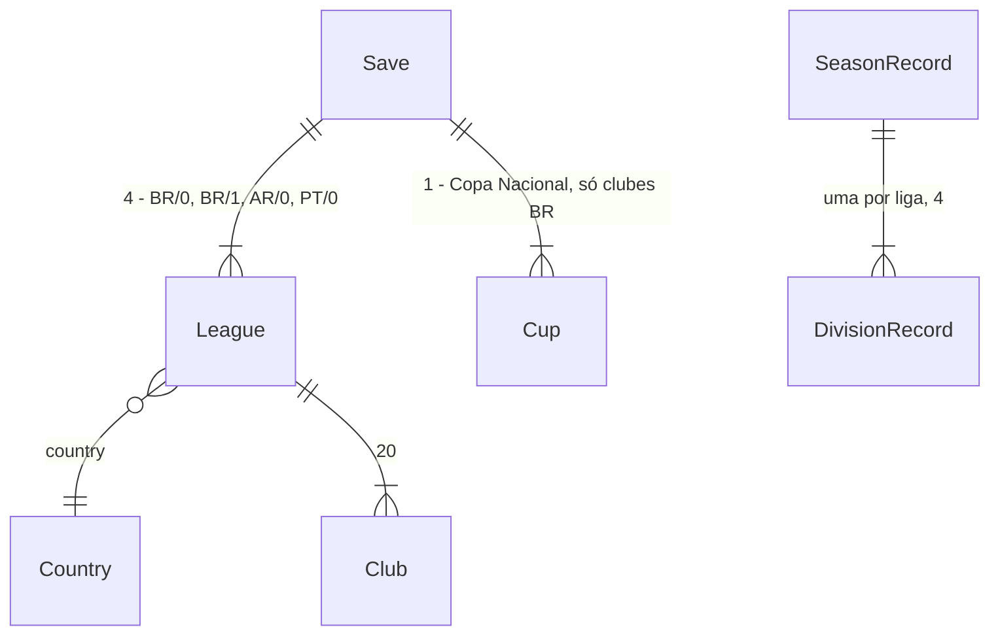

# Países

## Problem

O mundo do jogo é só o Brasil: duas divisões de 20 clubes, a copa nacional e um mercado em que todo clube é brasileiro. O técnico nunca treina fora do país, e a proposta de emprego depois de uma demissão é sempre de outro clube brasileiro. O elenco só se reforça com jogador de clube brasileiro. Um craque da Série A não tem para onde ir além de outro brasileiro.

No Brasfoot original, e no futebol que o jogo imita, trabalhar ou contratar no exterior é parte da carreira. A copa continental (sub-projeto 4c) precisa de clubes de outro país para existir.

Evidência: roteiro aprovado em 26/09/2026. O sub-projeto 4 foi quebrado em 4a copa nacional → 4b países → 4c copa continental; a 4a foi entregue em 27/09/2026. Em 27/09/2026 o autor pediu «pode planejar o 4b» e mantém a preferência de 26/09/2026: «siga toda a sua recomendação, não me pergunte mais». Não há métrica de uso.

Quando isto for entregue:
- um jogo novo tem mais dois países, Argentina e Portugal, cada um com uma liga de 20 clubes fictícios inspirados nas ligas reais;
- o técnico pode começar em qualquer um dos três países, e as propostas de emprego podem vir de fora;
- o técnico pode comprar jogador de qualquer clube do mundo;
- as tabelas, o histórico e a tela de fim mostram as quatro ligas.

## Flow

Reutiliza a geração de liga (`generate.generateLeague` com `DivisionSpec`), o calendário (`calendar.nextDate`, que já lê `leagues[0]`), as rodadas ao vivo (`live.startRound`, que já monta todas as ligas), o fechamento por divisão (`season.finishRound`, `finance.closeRoundFinances`), a virada (`rollover.nextSeason`), o ranking de força (`board.strengthRanking`) e a cadeia de migração (`migrate.migrateSave`). Nenhum ganha cópia por país: o país e o nível viajam na `League`.

1. jogo novo -> `engine/generate` (exists) - gera Série A e Série B como hoje, depois a Liga Argentina e a Liga Portuguesa, cada uma do seu fluxo (door 3), com nomes de jogador do país (door 4). Grava `country` e `tier` em cada liga (door 1)
2. escolher clube -> tela ChooseClub (exists) - uma aba por liga, as quatro
3. «Jogar rodada» -> `engine/live.startRound` (exists) - monta as partidas das quatro ligas. As novas usam a semente da door 2
4. `engine/season.finishRound` (exists) - fecha cada liga com finanças pelo **nível** da liga, não pelo índice do array. A copa nacional continua só com os 40 clubes do Brasil (`cup.seedingByStrength` recebe só as ligas `BR`)
5. `engine/market` (exists) - o usuário compra de qualquer clube. As compras da IA e a venda do vermelho só acontecem entre clubes do mesmo país
6. rodada 38 -> `engine/season.seasonReview` (exists) e `engine/board` (exists) - veredito e meta pelo nível e pelo país da liga do usuário. As propostas de emprego vêm do ranking de todos os 80 clubes
7. `engine/rollover.nextSeason` (exists) - sobe e desce só entre níveis consecutivos do mesmo país; Argentina e Portugal ficam com os mesmos 20
8. `persistence` (exists) grava o save v7 (door 1). As telas Tabela, Histórico, Fim e Mercado (exist) listam as quatro ligas

## Impact

| Front | What changes |
| --- | --- |
| domain | new term: país (`League.country`, `"BR"`, `"AR"` ou `"PT"`) - o país da liga. Os nomes de tela vêm de uma tabela `COUNTRIES` no motor, não do save |
| domain | new term: nível (`League.tier`, 0 = primeira divisão do país) - substitui o índice do array onde ele queria dizer «divisão». Quem usa o índice hoje com esse sentido: `finance.sponsorshipPaid`, `finance.prizeFor`, `board.boardGoalFor`, `board.goalLabel`, `board.verdictFor`, `live` (sal da Série B), `season.seasonReview`, `rollover.nextSeason` (sobe e desce), as telas ChooseClub, End, History, NewSeason e Table (`DIVISION_LABEL[i]`) - cerca de 50 pontos |
| domain | existing term: `DIVISION_LABEL` (`["Série A", "Série B"]`) vira o rótulo por liga: «Série A», «Série B», «Liga Argentina», «Liga Portuguesa» |
| domain | existing term: `allClubs(state)` passa de 40 para 80 clubes. Quem usa: lista «Comprar», `buyPlayer`, `jobOffers`, `userCupGoal` (ranking de força), `takenNames`, `fillAiSquads`, compras da IA. `userCupGoal` passa a rankear só os clubes do Brasil |
| domain | existing term: propostas de emprego (`board.jobOffers`) já rankeiam todos os clubes; com 80, as três ofertas podem ser de fora do Brasil |
| domain | existing criterion: gastos-da-ia C19, C20, C21 e C34 medem os clubes do Brasil e continuam valendo. As ligas novas dividem o mercado de livres, então a medição tem de ser refeita. multiplas-temporadas «força estável» e as faixas de caixa ganham equivalentes para Argentina e Portugal (AC 22, AC 23) |
| domain | existing criterion: testes que contam clubes ou linhas (ex.: lista «Comprar» com 39 clubes, `leagues` com 2 elementos, 40 ids únicos) passam a contar 79, 4 e 80 |
| stored data | migrate on read: v6 (e, pela cadeia, v1 a v5) vira v7. Série A e B ganham `country: "BR"` e `tier` 0 e 1. Liga Argentina e Liga Portuguesa são geradas da seed (door 3), com as rodadas já jogadas no calendário simuladas só com placar (door 5). Nenhum dinheiro nem condição mudam nos clubes que já existiam |

## Relations

Restrições de mão única:
- `leagues[0]` continua a Série A e `leagues[1]` a Série B (door 4 de multiplas-temporadas); as ligas novas entram depois, `leagues[2]` = Argentina e `leagues[3]` = Portugal (door 1).
- Todo `League` tem `country` e `tier`; um clube só muda de liga dentro do mesmo país (door 1).
- Toda liga tem 20 clubes e 38 rodadas, para o calendário único seguir `leagues[0]` (door 1).

## Surface

None - nothing consumed outside. É um SPA estático sem API (AD-001).

## Landing

| One-way door | Literal shape | Alternative rejected |
| --- | --- | --- |
| 1. save v7 | `schemaVersion: 7`; `League.country: "BR" \| "AR" \| "PT"`, `League.tier: number` (0 = primeira divisão). Ordem: `leagues = [Série A (BR, 0), Série B (BR, 1), Liga Argentina (AR, 0), Liga Portuguesa (PT, 0)]`. Ids: ligas `"l3"` e `"l4"`; clubes `c41`–`c60` (AR) e `c61`–`c80` (PT). `COUNTRIES` (código → nome «Brasil», «Argentina», «Portugal») fica no motor, fora do save | `GameState.countries: { id, leagues: League[] }[]` - quebraria `leagues` como array plano (AD-003) e a door 4 de multiplas-temporadas, e obrigaria todo leitor de `leagues` a mudar; país deduzido do id do clube - um clube que um dia troque de país (4c ou depois) quebraria a dedução |
| 2. semente das partidas das ligas novas | a liga de índice `k ≥ 2` usa `mix32(mix32(rngState, 0xE0), k)` como base de `matchSeed`, no lugar de `rngState`. Série A (base `rngState`) e Série B (base `mix32(rngState, 0xB)`) não mudam | `mix32(rngState, 0xA + k)` - cabe hoje, mas divide o espaço plano com `round * 16 + i` das partidas e com os sais do mercado, que é como uma colisão entra sem ninguém ver |
| 3. fluxos de geração | Liga Argentina de `createRng(mix32(seed, 8))`, Liga Portuguesa de `createRng(mix32(seed, 9))`, geradas depois da Série B e do mercado, com os nomes já tomados. Série A, Série B, mercado e `rngState` de uma seed ficam iguais aos da v6 | gerar as ligas novas do `rng` principal - mudaria o `rngState` e todas as partidas de toda seed já salva |
| 4. nomes por país | `generatePlayerName(rng, country)` com um conjunto de nomes por país: `BR` é o de hoje, sem mudança; `AR` com nomes e sobrenomes de som hispano-argentino; `PT` com nomes de som português europeu. Livres e juniores continuam `BR` | um só conjunto para todos - uma liga argentina cheia de «Cauã» e «Jackson» desfaz a ilusão do país |
| 5. migração v6 → v7 | Série A e B ganham `country: "BR"` e `tier`; as ligas novas vêm da door 3 com os nomes já tomados no save. Cada rodada com índice `< leagues[0].currentRound` é simulada só com placar (`runToEnd`), com a door 2 sobre `mix32(seed, 10)` no lugar de `rngState`. Clubes novos ficam com finanças iniciais e condição fresca | começar as ligas novas zeradas no meio da temporada - `currentRound` divergiria de `leagues[0]` e o calendário único quebraria |

- A door 1 alcança o 4c: a copa continental vai ler `country` para escolher os classificados. Vai também para o `STATE.md` como AD-016.
- Nada mais nesta entrega é difícil de reverter.

## Criteria

### S1: Dois países novos no jogo novo (P1)

**Acceptance Criteria**

1. WHEN um jogo novo é criado THEN o sistema SHALL ter 4 ligas na ordem Série A, Série B, Liga Argentina e Liga Portuguesa, com `country` `BR`, `BR`, `AR`, `PT` e `tier` 0, 1, 0, 0
2. The Liga Argentina e a Liga Portuguesa SHALL ter 20 clubes cada, com ids `c41`–`c60` e `c61`–`c80`, e 22 jogadores por clube no formato de elenco atual
3. The sistema SHALL dar à Liga Argentina 20 identidades fixas inspiradas na primeira divisão argentina e à Liga Portuguesa 20 inspiradas na portuguesa (apelido + cidade ou região + cores), em `AR_IDENTITIES` e `PT_IDENTITIES`, sem nome ou escudo real (AD-008)
4. The sistema SHALL gerar os jogadores da Liga Argentina com nomes do conjunto `AR` e os da Liga Portuguesa com nomes do conjunto `PT`; nenhum nome de jogador se repete no save
5. The força-base dos clubes SHALL ficar entre 60 e 76 na Liga Argentina e entre 58 e 80 na Liga Portuguesa, espalhada como nas divisões do Brasil
6. WHEN um jogo novo é criado com uma seed THEN a Série A, a Série B, o mercado e `rngState` SHALL ser iguais aos da mesma seed na v6 (door 3)

**Independent test:** `newGame(1)` tem 4 ligas e 80 clubes, e a Série A é igual à da v6.

### S2: As quatro ligas jogam a mesma rodada (P1)

**Acceptance Criteria**

7. WHEN uma rodada de liga é jogada THEN o sistema SHALL jogar as 10 partidas de cada uma das 4 ligas e avançar o `currentRound` das 4
8. The partida `i` da rodada `n` da liga de índice `k ≥ 2` SHALL usar a semente da door 2; as partidas da Série A e da Série B SHALL continuar com as sementes de hoje
9. WHEN uma rodada fecha THEN cada clube da Argentina e de Portugal SHALL receber o patrocínio inteiro (nível 0) e, na rodada 38, o prêmio (21 − posição) × R$ 250.000
10. The copa nacional SHALL continuar com os 40 clubes do Brasil, e nenhum clube da Argentina ou de Portugal SHALL entrar no chaveamento

**Independent test:** depois da rodada 1, as quatro ligas estão na rodada 2 e cada clube tem um registro de rodada.

### S3: Virada por país (P1)

**Acceptance Criteria**

11. WHEN «Próxima temporada» é confirmada THEN o sistema SHALL subir e descer 4 clubes só entre a Série A e a Série B, e a Liga Argentina e a Liga Portuguesa SHALL começar a temporada com os mesmos 20 clubes
12. WHEN uma temporada fecha THEN o histórico SHALL ter um registro de divisão para cada uma das 4 ligas, com campeão e artilheiro; Argentina e Portugal SHALL ter `promotedIds` e `relegatedIds` vazios

**Independent test:** depois de uma virada, os 20 ids da Liga Argentina são os mesmos, e a Série A trocou 4.

### S4: Diretoria e emprego em qualquer país (P1)

**Acceptance Criteria**

13. WHILE o clube do usuário está numa liga sem rebaixamento (Argentina ou Portugal) a meta da diretoria SHALL ser `min(20, posto no ranking de força da liga + 3)` e o rótulo SHALL ser «até o Nº»
14. WHILE o clube do usuário está numa liga sem rebaixamento a demissão SHALL acontecer só por terminar 5 ou mais posições abaixo da meta
15. WHEN o usuário é demitido THEN as 3 propostas de emprego SHALL vir do ranking de força dos 80 clubes, com a regra de hoje (os 3 logo abaixo dele), podendo ser de qualquer país
16. The meta de copa SHALL ser calculada pelo ranking de força só dos clubes do Brasil, e um usuário na Argentina ou em Portugal SHALL ter meta de copa -1 (sem copa)

**Independent test:** um usuário demitido do 5º mais forte da Liga Portuguesa recebe 3 propostas, e numa seed conhecida pelo menos uma é de outro país.

### S5: Mercado com o mundo (P1)

**Acceptance Criteria**

17. The usuário SHALL poder comprar jogador de qualquer um dos 79 outros clubes, nas mesmas regras de hoje (janela, preço, elenco)
18. The lista «Comprar» SHALL ter um filtro de país («Brasil», «Argentina», «Portugal»), começando no país do clube do usuário
19. The compras da IA e a venda do vermelho (gastos-da-ia AC 3–11) SHALL acontecer só entre clubes do mesmo país
20. The propostas da IA pelos jogadores do usuário SHALL continuar vindo só de clubes da liga do usuário

**Independent test:** um usuário da Série A compra um jogador da Liga Argentina na janela, e o jogador chega com contrato de 3 temporadas.

### S6: Telas com as quatro ligas (P1)

**Acceptance Criteria**

21. The tela de escolha de clube SHALL ter uma aba por liga, «Série A», «Série B», «Liga Argentina» e «Liga Portuguesa», e a tela Tabela SHALL deixar escolher qualquer uma das 4
22. The telas Histórico, Fim e Nova temporada SHALL mostrar o nome da liga do usuário e os campeões das 4 ligas, sem rolar a página (AD-010)

**Independent test:** escolher um clube na aba «Liga Portuguesa» e jogar uma rodada: a Tabela abre na Liga Portuguesa.

### S7: Equilíbrio dos países novos (P1)

**Acceptance Criteria**

23. The sistema SHALL, em 3 seeds (1, 2, 3) e 5 temporadas sem usuário, deixar o caixa final de cada clube da Argentina e de Portugal entre −2× e 15× o inicial, com a mediana de cada país entre 1,2× e 4× (piso renegociado de 2× em 27/09/2026: medido na seed 1–3, Portugal deu 1,67× por não ter receita de copa)
24. The sistema SHALL, nas mesmas seeds e temporadas, manter a média das 18 melhores da Liga Argentina e da Liga Portuguesa a até 5 pontos da temporada 1
25. The faixas de gastos-da-ia C19, C20, C21 e C34 SHALL continuar valendo para os clubes do Brasil

**Independent test:** a simulação de 5 temporadas imprime as faixas por país.

### S8: Save v7 (P1)

**Acceptance Criteria**

26. WHEN um save v6 na rodada 0 é carregado THEN o sistema SHALL convertê-lo em v7 com as ligas novas iguais às de um jogo novo da mesma seed, e sem mudar nada da Série A, da Série B, do mercado, da copa nem do usuário
27. WHEN um save v6 na rodada 12 é carregado THEN as ligas novas SHALL estar na rodada 12, com as 12 primeiras rodadas com placar pela door 5, e caixa e condição iniciais
28. WHEN um save v1 a v5 é carregado THEN o sistema SHALL convertê-lo em v7 pela cadeia
29. IF um save com `schemaVersion` acima de 7 é carregado THEN o sistema SHALL recusá-lo como incompatível

**Independent test:** carregar a fixture v6 da gastos-da-ia: o jogo abre, e a Tabela mostra a Liga Argentina.

## Out of scope

| Excluded | Why |
| --- | --- |
| mais países (Inglaterra, Espanha, Itália...) | cada país custa 20 identidades, nomes e calibração; a door 1 aceita mais ligas sem save novo |
| segunda divisão na Argentina e em Portugal | dobra clubes e simulação sem mudar a experiência de quem treina lá; `tier` já comporta |
| copas nacionais da Argentina e de Portugal | a copa é o sub-projeto 4a; replicar pede um calendário com mais datas por país |
| nacionalidade do jogador e limite de estrangeiros | não foi pedido; os nomes por país já dão a cor local |
| moeda por país | AD-006 fixa reais inteiros; câmbio não muda nenhuma decisão do jogo |
| compras da IA entre países | as faixas de gastos-da-ia foram medidas por país fechado; abrir as fronteiras para a IA pede nova calibração |
| propostas de clubes de fora pelos jogadores do usuário | mantém gastos-da-ia/elenco-mercado-financas como estão; entra junto com as compras da IA entre países |

## Assumptions

| Assumption | Chosen default | Rationale | Confirmed? |
| --- | --- | --- | --- |
| quais países | Argentina e Portugal | a Argentina alimenta a copa continental do 4c (América do Sul); Portugal é o destino europeu mais ligado ao mercado brasileiro e fala português | n |
| divisões por país novo | uma liga de 20 clubes, sem rebaixamento | mantém 38 rodadas e o calendário único; o custo de conteúdo e de simulação fica em 40 clubes | n |
| força dos países novos | Argentina 60–76, Portugal 58–80 (Série A 58–80 e Série B 50–66 hoje) | a Argentina um pouco abaixo da Série A no topo; Portugal na mesma faixa da Série A | n |
| usuário começar fora | pode escolher qualquer clube das 4 ligas no início | é o jeito mais direto de «treinar fora»; as propostas de emprego completam a carreira | n |
| dinheiro | mesma moeda, patrocínio pela mesma fórmula, prêmio da primeira divisão igual ao da Série A | a calibração de patrocínio garante empate na folha em qualquer liga; faixas do AC 23 conferem | n |
| faixas | se AC 23, 24 ou 25 falharem, o builder para e traz a medição; não mexe em constante nem em faixa | faixas são obrigação aprovada | n |
| quem decide | o autor delegou em 26/09/2026 e em 27/09/2026 («pode planejar o 4b») | user delegated | y |

**Open questions:** none - all resolved or logged above.

## Observable

| Surface | Decision | Landing |
| --- | --- | --- |
| screen ChooseClub | abas e densidade em tela estreita | AC 21; existing - as abas quebram linha em ≤ 900 px (commit `77a3c43`) |
| screen Tabela | escolher liga | AC 21 |
| screen Mercado, lista «Comprar» | filtro de país e país inicial | AC 18 |
| screen Mercado, lista «Comprar» | filtro sem resultado | existing - a lista já mostra o vazio de filtro («Nenhum jogador») |
| screen Histórico, Fim, Nova temporada | densidade com 4 ligas | AC 22 |
| todas as telas | loading, error, unauthorised | n/a - o save já está em memória; jogo local sem conta |

## Sources

- roteiro de 26/09/2026: 4a copa nacional → 4b países → 4c copa continental (`.specs/features/copa-nacional/plan.md`, Problem)
- pedido do autor em 27/09/2026: «pode planejar o 4b»
- `.specs/STATE.md` AD-003, AD-008, AD-009, AD-011, AD-013
