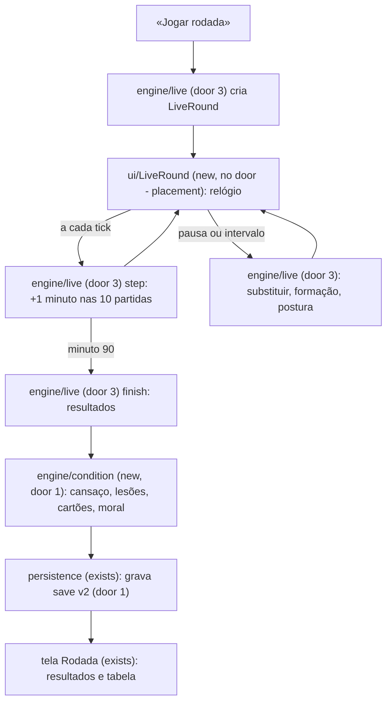
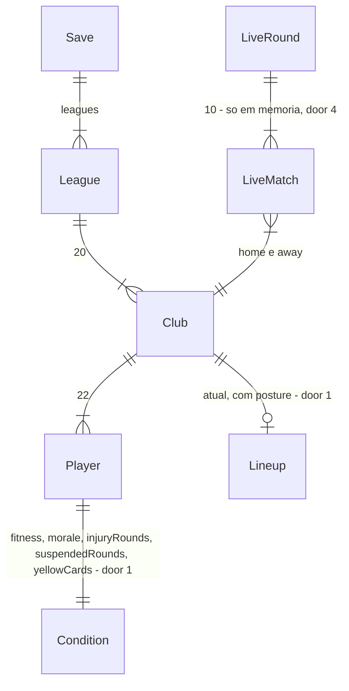

# Partida ao vivo e dinâmica do elenco

## Problem

Hoje «Jogar rodada» resolve as 10 partidas num instante e mostra só o resultado. O técnico não acompanha nada acontecer e não pode reagir: não substitui, não muda o esquema, não segura um resultado. Fora de campo, todo jogador está sempre 100%: ninguém se cansa, se machuca, leva cartão ou fica desmotivado. A única decisão de gestão do jogo é escalar os 11 melhores uma vez, e ela vale pra temporada inteira.

Evidência: pedido do autor em 26/09/2026, após jogar a versão atual: "a simulação de todas as partidas da rodada deveria ser mais dinâmica, onde eu acompanhasse o desenrolar das partidas e pudesse tomar decisões (substituições, alteração do esquema tático, etc.)" e "quero mais dinâmicas no jogo em si: cartões amarelos, vermelhos, lesões, mood do jogador, saúde". Não há métrica de uso.

Quando isto for entregue, o técnico assiste à rodada em tempo real. O relógio corre, a narração da sua partida aparece lance a lance e os placares das outras 9 mudam ao lado. Ele pode pausar a qualquer momento, substituir, trocar a formação e mudar a postura do time. Cartões, lesões, cansaço e moral mudam quem está disponível e quanto cada jogador rende na rodada seguinte.

## Flow

Reutiliza o modelo minuto a minuto da AD-007: `simulateMatch` deixa de rodar 90 minutos de uma vez e vira um passo de um minuto. Reutiliza também o documento de save (door 1 do núcleo) e o `Rng` semeado (door 2 do núcleo).

1. «Jogar rodada» -> `engine/live` (door 3) - cria um `LiveRound` a partir do `GameState`, com as 10 partidas no minuto 0, cada uma com seu próprio `Rng` (door 2)
2. `ui/LiveRound` (new, no door - placement per conventions) - dispara o relógio; a cada tick chama `step` e redesenha
3. `engine/live` (door 3) - `step` avança as 10 partidas um minuto: posse, finalização, gol, cartão, lesão, cansaço e substituições da IA
4. pausa ou intervalo -> `engine/live` (door 3) - aplica substituição, formação ou postura no time do usuário, validando os limites
5. minuto 90 -> `engine/live` (door 3) `finish` - devolve os `MatchResult` (door 7 do núcleo, inalterado)
6. `engine/condition` (door 1) - aplica o pós-jogo: condição física, dias de lesão, suspensões e moral; recupera quem não jogou
7. `persistence` (exists) - grava o documento com `schemaVersion: 2` (door 1); a tela Rodada (exists) mostra resultados e tabela
8. out: nenhuma chamada externa. Recarregar a página no meio da rodada recomeça a rodada do minuto 0 (door 4).

## Impact

| Front | What changes |
| --- | --- |
| domain | new term: `LiveRound` - estado em memória de uma rodada em andamento: minuto, 10 partidas, jogadores em campo, substituições feitas; lives in `src/engine/live` |
| domain | new term: `Posture` (UI «Postura») - `defensive`, `balanced`, `attacking`; muda a chance de criar e de sofrer finalizações |
| domain | new term: `fitness` (UI «Condição») - 0 a 100 por jogador; cai durante a partida, recupera entre rodadas |
| domain | new term: `morale` (UI «Moral») - inteiro de −2 a +2 por jogador, mostrado como seta estilo PES |
| domain | new term: `injuryRounds` e `suspendedRounds` - rodadas que o jogador ainda fica fora; `yellowCards` - amarelos acumulados |
| domain | existing term: `Lineup` meant "os 11 escalados antes do jogo", now also "quem está em campo agora", que muda com substituições e expulsões - `engine/season.sheetFor`, `validateLineup` e a tela Elenco usam hoje |
| domain | existing term: `MatchEvent` ganha `yellow`, `red`, `injury`, `substitution` - `narrate` e a tela Rodada ramificam no tipo hoje |
| domain | existing term: jogador "disponível" era todo o elenco; agora exclui lesionados e suspensos - `autoLineup`, `validateLineup` e a IA de escalação ramificam nisso |
| domain | existing criterion AC 16 do núcleo (slot aceita só a mesma posição) é substituído pelo AC 23 deste plano (fora de posição permitido com penalidade) - tela Elenco e `assignSlot` |
| domain | existing criterion AC 31 do núcleo (save com `schemaVersion` ≠ 1 é incompatível): passa a migrar v1 e só recusar versões > 2 |
| stored data | migrate on read: save v1 ganha em cada jogador `fitness: 100`, `morale: 0`, `injuryRounds: 0`, `suspendedRounds: 0`, `yellowCards: 0`, e em cada clube `posture: "balanced"`; grava como v2 no próximo save |

## Relations

One-way constraints: os campos de condição vivem no próprio `Player` do save (door 1); `LiveRound` e `LiveMatch` nunca são persistidos (door 4). Sem colunas nem tipos aqui.

## Surface

`None - nothing consumed outside`. Sem rota nem API. O que muda de contrato é o documento de save (door 1), consumido por export/import e nuvem no futuro.

## Landing

| One-way door | Literal shape | Alternative rejected |
| --- | --- | --- |
| 1. Save v2 | `schemaVersion: 2`; `Player` ganha `fitness` (inteiro 0–100), `morale` (inteiro −2..2), `injuryRounds`, `suspendedRounds`, `yellowCards` (inteiros ≥ 0); `Lineup` ganha `posture: "defensive" \| "balanced" \| "attacking"`; `migrate(v1) -> v2` na leitura com os defaults do Impact | declarar v1 incompatível - o autor perde a temporada em andamento; guardar condição num mapa à parte por `playerId` - dois lugares pra manter em sincronia |
| 2. Um `Rng` por partida | seed de cada partida = `mix32(rngState, roundNumber * 16 + matchIndex)`; `rngState` do save avança uma vez por rodada | um stream único pras 10 partidas - uma substituição do usuário mudaria o resultado dos outros 9 jogos |
| 3. Motor ao vivo como passo | `startRound(state) -> LiveRound`, `step(live) -> LiveRound` (1 minuto), `substitute`, `changeFormation`, `changePosture`, `finish(live) -> RoundOutcome`; `playRound` vira `finish` de uma rodada sem decisões | manter `simulateMatch` de 90 minutos e simular "ao vivo" só na UI - decisões no meio do jogo não teriam efeito |
| 4. Rodada ao vivo só em memória | nada é gravado entre o minuto 0 e o 90; recarregar recomeça do minuto 0 com as mesmas seeds | gravar o `LiveRound` a cada minuto - 90 escritas por rodada e um segundo formato de save |
| 5. Regras de disciplina | 3 amarelos acumulados = 1 rodada de suspensão e zera a contagem; 2º amarelo no mesmo jogo = vermelho; vermelho = 1 rodada de suspensão; expulso não pode ser substituído | suspensão configurável - ninguém pediu e vira tela de opções |
| 6. Efeito da condição na força | força efetiva = `rating × (0,7 + 0,3 × fitness/100) × (1 + 0,03 × morale) × (fora de posição ? 0,75 : 1)`; lesionado sai de campo na hora | atributos separados de fôlego e ânimo - quebra a AD-005 (um número só) |

- Nada mais aqui é difícil de reverter: velocidade do relógio, taxas de cartão e lesão, recuperação entre rodadas e textos de narração são ajuste.

## Criteria

### S1: Rodada ao vivo (P1)

O técnico assiste às 10 partidas avançando minuto a minuto, com a sua narrada.

**Acceptance Criteria**

1. WHEN o jogador clica em «Jogar rodada» THEN o sistema SHALL abrir a tela «Ao vivo» com o relógio em 0' e as 10 partidas em 0 x 0
2. WHILE o relógio está rodando na velocidade normal, o sistema SHALL avançar 1 minuto de jogo a cada 300 ms
3. WHEN um minuto avança THEN a tela SHALL acrescentar à narração os eventos da partida do jogador naquele minuto, com o mais recente visível sem rolar a página
4. WHEN sai um gol em qualquer partida THEN o placar daquela partida SHALL mudar na lista de jogos no mesmo tick e piscar por 2 segundos
5. WHEN o jogador clica em «Pausar» THEN o relógio SHALL parar no minuto atual até ele clicar em «Continuar»
6. WHEN o relógio chega a 45' THEN o sistema SHALL pausar sozinho e mostrar «Intervalo»
7. WHEN o jogador escolhe a velocidade 2x ou 4x THEN o relógio SHALL avançar 1 minuto a cada 150 ms ou 75 ms
8. WHEN o jogador clica em «Pular para o fim» THEN o sistema SHALL simular os minutos restantes sem animação e ir direto ao 90'
9. WHEN o relógio chega a 90' THEN o sistema SHALL gravar o save e mostrar a tela Rodada com os 10 resultados e a tabela, como hoje
10. WHEN a mesma rodada é jogada duas vezes a partir do mesmo save, com as mesmas decisões nos mesmos minutos, THEN os 10 resultados SHALL ser idênticos
11. WHEN o usuário faz uma substituição na sua partida THEN os resultados das outras 9 partidas SHALL ser iguais aos que seriam sem a substituição
12. IF a página é recarregada durante a rodada ao vivo THEN o sistema SHALL mostrar a tela Elenco antes da rodada, com o save intacto

**Independent test:** jogar uma rodada, pausar no 30', ver os placares parados, continuar, ver o intervalo parar no 45', pular pro fim e ver a tabela.

### S2: Decisões durante o jogo (P1)

O técnico substitui, troca a formação e muda a postura com a partida pausada.

**Acceptance Criteria**

13. WHILE o relógio está pausado, a tela «Ao vivo» SHALL mostrar os 11 em campo com condição e moral, e o banco com os jogadores disponíveis
14. WHEN o jogador troca um titular por um reserva com a partida pausada THEN o reserva SHALL entrar no mesmo slot a partir do minuto seguinte e a narração SHALL registrar a substituição
15. IF o time já fez 5 substituições THEN o sistema SHALL recusar a sexta e mostrar «Limite de 5 substituições»
16. IF o jogador tenta pôr de volta alguém que já saiu THEN o sistema SHALL recusar a troca
17. IF o jogador tenta substituir um expulso THEN o sistema SHALL recusar a troca e mostrar «Jogador expulso não pode ser substituído»
18. WHEN o jogador muda a formação durante o jogo THEN os 11 em campo SHALL ser redistribuídos pelos slots da nova formação sem sair ninguém, e quem ficar fora de posição SHALL aparecer marcado
19. WHEN o jogador muda a postura para «Ofensiva» THEN o time SHALL criar mais finalizações e sofrer mais finalizações que em «Equilibrada»
20. WHEN 2000 partidas entre times iguais são simuladas com o mandante em «Ofensiva» e o visitante em «Equilibrada» THEN a média de finalizações do mandante SHALL ser pelo menos 15% maior que com os dois em «Equilibrada»
21. WHEN 2000 partidas entre times iguais são simuladas com o mandante em «Defensiva» THEN a média de gols sofridos pelo mandante SHALL ser pelo menos 15% menor que com os dois em «Equilibrada»
22. WHEN um clube de IA tem um jogador lesionado em campo, ou chega ao 60' com um jogador abaixo de 60 de condição e reserva da mesma posição disponível, THEN a IA SHALL substituí-lo, respeitando o limite de 5
23. WHEN um jogador ocupa um slot de posição diferente da sua THEN a força efetiva dele SHALL ser 75% da força normal, e o slot SHALL aceitar a escalação

**Independent test:** pausar no 60', fazer 5 substituições, ver a sexta recusada, mudar pra 4-3-3 e ver um meia marcado fora de posição.

### S3: Cartões e suspensões (P2)

Faltas geram cartões, expulsão deixa o time com 10, e o acúmulo suspende.

**Acceptance Criteria**

24. WHEN 2000 partidas entre times iguais são simuladas THEN a média de amarelos por partida SHALL ficar entre 3,0 e 5,5 e a de vermelhos entre 0,08 e 0,30
25. WHEN um jogador recebe o 2º amarelo na mesma partida THEN o sistema SHALL registrar um vermelho e ele SHALL sair de campo
26. WHEN um jogador é expulso THEN o time dele SHALL jogar o resto da partida com um jogador a menos, e a força do setor dele SHALL cair
27. WHEN um jogador chega a 3 amarelos acumulados THEN ele SHALL ficar suspenso na rodada seguinte e a contagem SHALL voltar a 0
28. WHEN um jogador é expulso THEN ele SHALL ficar suspenso na rodada seguinte
29. WHILE um jogador está suspenso, a escalação SHALL não aceitá-lo, e a tela Elenco SHALL mostrá-lo com o selo «SUS»

**Independent test:** simular até alguém levar vermelho, ver o time com 10, e na rodada seguinte ver o jogador com «SUS» e fora das opções de escalação.

### S4: Condição física e lesões (P2)

Jogar cansa, descansar recupera, e lesão tira o jogador por algumas rodadas.

**Acceptance Criteria**

30. WHILE um jogador está em campo, a condição dele SHALL cair entre 0,25 e 0,45 ponto por minuto, mais rápido acima de 30 anos
31. WHEN uma rodada termina THEN quem não jogou SHALL recuperar 30 pontos de condição e quem jogou SHALL recuperar 15, sem passar de 100
32. WHEN 2000 partidas entre times iguais são simuladas THEN a média de lesões por partida SHALL ficar entre 0,10 e 0,40
33. WHEN um jogador se lesiona THEN ele SHALL sair de campo na hora, e ficar fora de 1 a 4 rodadas
34. WHILE um jogador está lesionado, a escalação SHALL não aceitá-lo, e a tela Elenco SHALL mostrá-lo com o selo «LES» e as rodadas que faltam
35. WHEN a escalação salva tem um lesionado ou suspenso THEN «Jogar rodada» SHALL ficar desabilitado com «Faltam N titulares», como hoje
36. WHEN um jogador com condição 50 enfrenta um igual com condição 100 THEN a força efetiva dele SHALL ser 85% da do outro

**Independent test:** jogar 3 rodadas com o mesmo time, ver a condição cair na tela Elenco; poupar um jogador e vê-lo recuperar.

### S5: Moral (P3)

Resultados e tempo de jogo mexem com o ânimo, e o ânimo com o rendimento.

**Acceptance Criteria**

37. WHEN o time vence THEN quem jogou SHALL ganhar +1 de moral, até +2
38. WHEN o time perde THEN quem jogou SHALL perder 1 de moral, até −2
39. WHEN um jogador fica 3 rodadas seguidas sem entrar em campo THEN a moral dele SHALL cair 1, até −2
40. WHEN a moral de um jogador é +2 THEN a força efetiva dele SHALL ser 6% maior que com moral 0
41. The tela Elenco SHALL mostrar a moral de cada jogador como uma seta de 5 níveis: ↓ vermelha (−2), ↘ laranja (−1), → amarela (0), ↗ verde-clara (+1), ↑ verde (+2)

**Independent test:** vencer 2 jogos seguidos e ver as setas dos titulares subirem; deixar um reserva 3 rodadas no banco e ver a seta dele cair.

### S6: Save compatível (P1)

O save da versão atual continua jogável.

**Acceptance Criteria**

42. WHEN o jogo lê um save com `schemaVersion` 1 THEN o sistema SHALL migrá-lo para a versão 2 com condição 100, moral 0, sem lesões, suspensões ou amarelos, e postura «Equilibrada»
43. IF o save lido tem `schemaVersion` maior que 2 THEN a tela «Início» SHALL mostrar «Jogo salvo incompatível (versão X)» e oferecer apenas «Novo jogo»
44. WHEN 2000 partidas entre times iguais, com condição 100, moral 0 e postura «Equilibrada», são simuladas THEN as faixas de gols e de vitória do mandante do núcleo (AC 22 e 23 do núcleo) SHALL continuar valendo

**Independent test:** abrir o jogo com um save criado antes desta entrega, clicar «Continuar» e jogar a rodada seguinte ao vivo.

## Out of scope

Product capabilities only.

| Excluded | Why |
| --- | --- |
| Treino e recuperação acelerada | depende de calendário semanal; próxima fatia |
| Pênaltis, prorrogação e cobranças de bola parada | não existem na liga de pontos corridos; entram com as copas (sub-projeto 4) |
| Instruções individuais (marcação, função) | só a postura do time nesta entrega |
| Cartões e lesões por gravidade (entorse x fratura) | uma faixa de 1 a 4 rodadas basta pra decisão de escalação |
| Moral afetada por salário, contrato ou mídia | depende do sub-projeto 2 (finanças) |
| Replay em 2D ou 3D do lance | o jogo é de texto; o placar e a narração são a visualização |
| IA que troca formação ou postura | só substituições de IA nesta entrega |

## Assumptions

| Assumption | Chosen default | Rationale | Confirmed? |
| --- | --- | --- | --- |
| Limite de substituições | 5 por jogo, sem janelas | regra atual do futebol; o Brasfoot clássico usava 3 | n |
| Jogador fora de posição | permitido com 75% da força (AC 23), substituindo o AC 16 do núcleo | sem isso, mudar formação no jogo e cobrir expulsão travam | n |
| Velocidade do relógio | 300 ms por minuto (90' em 27 s), com 2x e 4x | rápido o bastante pra 38 rodadas, lento o bastante pra ler | n |
| Pausa automática | só no intervalo | pausar a cada gol cansa em 38 rodadas; o gol pisca (AC 4) | n |
| Recarregar no meio da rodada | recomeça a rodada do 0' (door 4) | salvar ao vivo custa um segundo formato de save | n |
| Duração das lesões | 1 a 4 rodadas, uniforme | simples, e já força decisão de escalação | n |
| Taxas de cartão e lesão | faixas dos AC 24 e 32, perto do Brasileirão real | calibradas por teste de 2000 partidas, como o núcleo | n |
| Moral inicial | 0 pra todos | ninguém tem histórico no início | y |

**Open questions:** none - all resolved or logged above.

## Observable

| Surface | Decision | Landing |
| --- | --- | --- |
| screen «Ao vivo» | estado rodando | AC 2, AC 3 |
| screen «Ao vivo» | estado pausado | AC 5, AC 13 |
| screen «Ao vivo» | estado intervalo | AC 6 |
| screen «Ao vivo» | estado encerrado | AC 9 |
| screen «Ao vivo» | loading | n/a - o LiveRound nasce em memória em milissegundos, sem I/O |
| screen «Ao vivo» | error state (save falhou no 90') | existing - AC 27 do núcleo, aviso «Não foi possível salvar» |
| screen «Ao vivo» | ação recusada (limite, expulso, volta de quem saiu) | AC 15, AC 16, AC 17 |
| screen «Ao vivo» | empty state (banco sem disponíveis) | AC 13 - lista vazia com «Sem reservas disponíveis» |
| screen «Ao vivo» | density and ordering (10 jogos) | AC 4 - sua partida em destaque, as outras 9 na ordem do calendário |
| screen «Ao vivo» | caber na janela | existing - AD-010, abas no celular |
| screen «Elenco» | selos de indisponível | AC 29, AC 34 |
| screen «Elenco» | condição e moral | AC 36, AC 41 |
| screen «Elenco» | escalação inválida por indisponível | AC 35 |
| screen «Início» | save antigo | AC 42 |
| screen «Início» | save de versão futura | AC 43 |
| all screens | unauthorised state | n/a - sem contas |
| collection «eventos da partida» | ordering | AC 3 - ordem de minuto, mais recente embaixo |

## Sources

- Pedidos do autor em 26/09/2026 citados no Problem
- `.specs/STATE.md` AD-002, AD-005, AD-007, AD-010 - restrições que o plano obedece
- `.specs/features/nucleo-liga-partida/plan.md` - AC 16, 22, 23, 27 e 31 que este plano altera ou reaproveita
