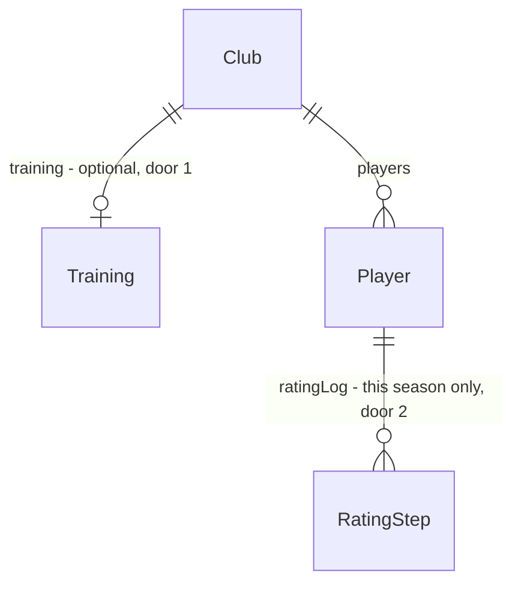

# Treino e evolução

## Problem

O rating de um jogador só muda na virada de temporada: `ageOneSeason` (`src/engine/rollover.ts`) sorteia um delta pela idade na tabela `EVOLUTION`, e nada do que o usuário faz durante o ano pesa nesse delta. Entre uma rodada e outra, o usuário não tem decisão nenhuma sobre o elenco além da escalação. Um jovem que joga todas as partidas evolui tanto quanto um que fica no banco, e a evolução só aparece uma vez por ano, na tela «Nova temporada».

Com esta feature, o usuário escolhe a intensidade do treino do clube (Leve / Normal / Forte), e o rating dos jogadores sobe e desce **durante a temporada**, rodada a rodada. A idade, o treino e os minutos jogados pesam na evolução. O elenco mostra ▲/▼ com a rodada da última mudança. Treinar forte faz evoluir mais, mas recupera menos o físico e lesiona mais; treinar leve faz o contrário.

## Flow

Reusa a tabela de idade `EVOLUTION`, o fechamento de rodada `finishRound`, a aplicação de condição `applyRound`/`playerAfterRound`, o `editLineup` da store e a tela «Nova temporada»; nada disso é duplicado.

1. Elenco: seletor «Treino» -> `store.setTraining` (new, beside `setPosture`) - grava `Club.training` do clube do usuário pelo `editLineup` (door 1)
2. `startRound` / `startCupDate` -> `sideFor` (exists) - copia `club.training` para `LiveSide.training`; `injuries` (exists, `live.ts`) multiplica a chance de lesão pelo fator do treino, com o mesmo número de sorteios
3. `finishRound` / `finishCupDate` -> `applyRound` (exists, `condition.ts`) - a recuperação de físico de cada jogador soma o ajuste do treino do seu clube
4. `finishRound` (exists, `season.ts`) -> `evolveRound` (new, `src/engine/training.ts`) - só em rodada de liga: sorteia, por jogador de clube, subir ou descer 1 no rating, com fluxo próprio (door 3), e anota em `Player.ratingLog` (door 2)
5. `nextSeason` (exists, `rollover.ts`) - `ageOneSeason` deixa de somar o delta de idade (o sorteio continua sendo consumido, para o resto da virada sortear igual); o relatório `changes` vem da soma do `ratingLog`; o `ratingLog` de todo mundo é zerado
6. out: Elenco mostra ▲/▼ e «+1 na rodada N» a partir do `ratingLog`; «Nova temporada» mostra antes/depois da temporada

## Impact

| Front | What changes |
| --- | --- |
| domain | new term: `Training` - `"light" \| "normal" \| "hard"`, a intensidade do clube; lives in `engine/types.ts`, rules in `engine/training.ts` |
| domain | existing term: `EVOLUTION` era a faixa sorteada uma vez na virada; agora é a fonte das chances por rodada (média anual igual) - lida por `rollover.ts` e por `training.ts` |
| domain | existing term: `RolloverReport.changes` era antes/depois da virada; agora é antes/depois da temporada que acabou - lido por `NewSeason.tsx` |
| stored data | nothing to migrate: `Club.training` e `Player.ratingLog` são opcionais; ausentes = Normal e sem mudança; save continua v8 (como AD-021) |

## Relations

One-way constraints: `training` ausente vale Normal (door 1); cada `RatingStep` tem delta +1 ou -1 e a rodada da liga em que aconteceu, e a lista é zerada na virada (door 2).

## Surface

None - nothing consumed outside; a SPA não expõe rotas.

## Landing

| One-way door | Literal shape | Alternative rejected |
| --- | --- | --- |
| 1. intensidade do treino no save | `Club.training?: "light" \| "normal" \| "hard"`; ausente = `"normal"`; save continua `schemaVersion: 8` | `Lineup.training`: a escalação é recalculada por `autoLineup` na virada e em várias telas, e o treino não é da escalação; save v9 com migração: dois campos opcionais não pedem migração, como AD-021 |
| 2. mudanças de rating da temporada no save | `Player.ratingLog?: { round: number; delta: 1 \| -1 }[]`, `round` = número da rodada da liga (1-based); zerado em todos os jogadores (clubes, livres, juniores) na virada | `lastChange` único: não dá a soma da temporada que a «Nova temporada» mostra; `seasonStartRating`: dá a soma, mas não a rodada da última mudança |
| 3. fluxo de sorteio da evolução | liga de índice `d` na rodada `n`: `createRng(mix32(mix32(rngState, 0x7e), n * 16 + d))`, com o `rngState` de antes da rodada; ordem: clubes da liga, depois jogadores do clube | usar o `rngState` do save direto: mudaria o sorteio do mercado e das partidas seguintes, e todas as seeds dos testes de balanço |

- Nothing else in this change is hard to reverse

## Criteria

### S1: o rating evolui durante a temporada (P1)

Depois de cada rodada da liga, os jogadores sobem ou descem pela idade, pelo treino e pelos minutos.

**Acceptance Criteria**

1. WHEN uma rodada da liga fecha THEN the system SHALL sortear, para cada jogador de cada clube de cada liga, subir 1 com chance `up` e descer 1 com chance `down`, nunca os dois, com `up = u(idade) × T(treino) × M(jogou) / R` e `down = d(idade) / R`, onde `R` é o número de rodadas da liga
2. The system SHALL usar `u` e `d` por faixa de idade iguais às partes positiva e negativa da média da faixa de `EVOLUTION`: até 20 → u 2,5 d 0; até 23 → u 1,5 d 0; até 27 → u 1/3 d 1/3; até 30 → u 0 d 1; até 33 → u 0 d 2,5; acima → u 0 d 4
3. The system SHALL usar `T` = 0,5 (Leve), 1 (Normal), 1,5 (Forte) e `M` = 1 para quem entrou em campo na rodada, 0,5 para quem não entrou
4. IF o rating já está em 95 (sobe) ou 40 (desce) THEN the system SHALL manter o rating e não anotar a mudança
5. WHEN o rating muda THEN the system SHALL anotar `{ round: <número da rodada>, delta }` no fim do `ratingLog` do jogador
6. WHEN uma data de copa fecha THEN the system SHALL não mudar rating nenhum
7. The system SHALL sortear a evolução por fluxo próprio (door 3), sem consumir o `rngState` do save nem as sementes das partidas: o `rngState` avança uma vez por rodada, como antes da feature
8. The system SHALL tratar clube sem `training` como Normal, e todo clube da IA fica em Normal
9. WHEN a temporada vira THEN the system SHALL não somar delta de idade ao rating, manter aniversário e aposentadoria sorteados como antes, e zerar o `ratingLog` de todo jogador
10. The system SHALL manter a força média estável: a média dos 18 melhores de cada clube da Série A fica a até 5 pontos da primeira temporada, em 5 temporadas (seeds do teste de balanço) e em 20 temporadas (seed 5)

**Independent test:** jogar uma temporada inteira sem usuário e ver ratings mudando rodada a rodada, com o `ratingLog` preenchido e a força média estável.

### S2: o treino custa físico e lesão (P1)

A intensidade escolhida muda a recuperação de físico e a chance de lesão.

**Acceptance Criteria**

11. WHEN uma data fecha THEN the system SHALL somar à recuperação de físico de cada jogador do clube −10 (Forte), 0 (Normal) ou +10 (Leve), no descanso (30) e depois de jogar (15), dentro de 0 a 100
12. WHILE a partida é jogada the system SHALL multiplicar a chance de lesão por minuto de um lado por 1,3 (Forte), 1 (Normal) ou 0,8 (Leve), com o mesmo número de sorteios por minuto

**Independent test:** a mesma rodada com o clube em Forte e em Leve mostra físico e lesões diferentes, e em Normal sai igual à de antes.

### S3: o usuário escolhe e vê (P1)

O Elenco tem o seletor de treino e mostra as mudanças; a «Nova temporada» resume a temporada.

**Acceptance Criteria**

13. WHEN o usuário escolhe «Leve», «Normal» ou «Forte» no seletor «Treino» do Elenco THEN the system SHALL gravar `Club.training` como `"light"`, `"normal"` ou `"hard"` e manter a escolha ao reabrir o jogo
14. The system SHALL mostrar abaixo do seletor a linha do treino escolhido: Leve «Recupera mais o físico e evolui menos.»; Normal «Equilíbrio entre físico e evolução.»; Forte «Evolui mais, recupera menos o físico e lesiona mais.»
15. WHEN um jogador do Elenco tem `ratingLog` não vazio THEN the system SHALL mostrar ao lado da força ▲ (último delta +1) ou ▼ (último −1), com o rótulo acessível «+1 na rodada N» ou «−1 na rodada N» da última mudança
16. IF o `ratingLog` do jogador está vazio ou ausente THEN the system SHALL não mostrar seta
17. WHEN a temporada vira THEN the system SHALL mostrar na «Nova temporada», para cada jogador do usuário que ficou, «Antes» = rating − soma do `ratingLog` da temporada e «Depois» = rating

**Independent test:** escolher Forte no Elenco, jogar rodadas até um jogador mudar e ver a seta com a rodada; virar a temporada e ver antes/depois.

## Out of scope

| Excluded | Why |
| --- | --- |
| treino individual por jogador | o autor escolheu a intensidade do clube |
| treino da IA diferente de Normal | a IA não decide treino; o balanço é calibrado em Normal |
| evolução de livres e juniores do mercado | não treinam em clube; ficam como estão até alguém contratar |
| treino afetando o declínio dos veteranos | o treino pesa só na chance de subir; YAGNI |

## Assumptions

| Assumption | Chosen default | Rationale | Confirmed? |
| --- | --- | --- | --- |
| números do treino | T 0,5/1/1,5; recuperação ±10; lesão ×0,8/×1,3 | valores do design aprovado; custo e ganho da mesma ordem | y |
| fator de minutos | M 0,5 para quem não entrou em campo | jovem sem jogar evolui pela metade; o balanço de 5 e 20 temporadas é o guarda | y |
| sorteio da virada | `randInt` de idade continua sendo consumido e descartado | aposentadorias e o resto da virada sorteiam como antes | y |
| quem conta como «jogou» | entrou em campo na rodada (`LiveSide.played`) | já existe e inclui quem entrou por substituição | y |

**Open questions:** none - o autor pediu seguir com as recomendações até o fim.

## Observable

| Surface | Decision | Landing |
| --- | --- | --- |
| screen Elenco | seletor de treino e seu texto | AC 13, AC 14 |
| screen Elenco | seta de evolução, com e sem mudança | AC 15, AC 16 |
| screen Elenco | loading / error state | existing - `editLineup` já grava e mostra falha de gravação como as outras escolhas da escalação |
| screen Nova temporada | antes/depois da temporada | AC 17 |
| screen Nova temporada | empty state | existing - a tabela já existe; lista vazia quando nenhum jogador mudou |
| save | documento antigo sem os campos | AC 8, AC 16 |
| engine | determinismo dos jogos | AC 7 |

## Sources

- Brainstorm em chat de 29/09/2026 - intensidade do clube (Leve/Normal/Forte), evolução durante a temporada, chance por rodada; o autor pediu seguir com as recomendações até o fim
