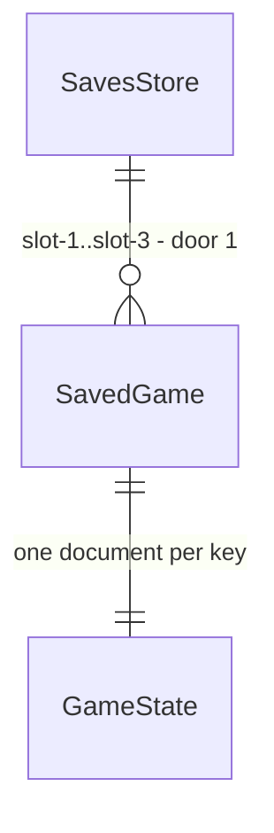

# Vários saves

## Problem

O jogo guarda um único jogo salvo, na chave `slot-1` do IndexedDB. Quem quer começar outra carreira (outro clube, outra divisão) precisa apagar a que tem: «Novo jogo» pergunta «Isso apaga o jogo salvo. Continuar?», e importar um arquivo pergunta «Isso substitui o jogo salvo». A única saída é exportar o jogo para um arquivo antes e importar de volta depois, trocando um pelo outro à mão. O autor escolheu «vários saves» como próxima feature em 01/10/2026; não há número de pedidos nem métrica, só a escolha do autor entre as candidatas (empréstimo de jogadores, vários saves).

Quando isto sair, o jogo guarda até 3 carreiras ao mesmo tempo. «Novo jogo» e «Importar jogo» usam um espaço vazio sem apagar nada, e a tela «Jogos salvos» mostra os 3 espaços, abre qualquer um e apaga um com confirmação.

## Flow

Reusa o documento salvo de hoje (um `GameState` por chave, migrado na leitura por `engine/migrate`), a gravação em fila da store (`persist`), o fechamento da data ao vivo pendente (`closePendingLive`, AD-019) e a trava de aba (AD-020); só a chave passa a variar.

1. abertura do jogo, toque em «Jogos salvos» -> `store` (exists) -> `persistence/save` (exists) lê `slot-1`, `slot-2` e `slot-3` numa transação de leitura e migra cada documento (`engine/migrate`, exists)
2. `store` (exists) - escolhe o espaço ativo: o salvo legível de maior `savedAt` (door 2); abre esse jogo como hoje, fechando antes a data ao vivo pendente
3. toda gravação -> `store.persist` (exists) -> `persistence/save` grava o jogo, com `savedAt` no documento (door 2), na chave do espaço ativo, `slot-<n>` (door 1); a leitura tira o `savedAt` e o devolve ao lado do jogo
4. «Jogos salvos» -> `ui/Saves` (new, no door - placement per conventions) - uma linha por espaço; «Abrir» torna o espaço ativo e abre o jogo; «Apagar» confirma e remove a chave em `persistence/save`
5. «Novo jogo» e «Importar jogo» -> `store` (exists) - o menor espaço vazio vira o ativo; sem espaço vazio, abre «Jogos salvos» com o aviso e não grava nada

## Impact

| Front | What changes |
| --- | --- |
| domain | new term: espaço (`slot`, 1 a 3), mostrado como «Jogo 1», «Jogo 2», «Jogo 3» - vive em `persistence/save` (chave) e na store (`activeSlot`) |
| domain | existing term: `hasSave` significava «o slot único tem um jogo legível»; passa a significar «o espaço ativo tem um jogo legível». Quem lê: `Home` («Continuar», cor do «Novo jogo»), `NewGameButton` (confirmação), `importFile` (confirmação), `persist`, e o `check:layout`, que espera «Continuar» |
| domain | existing term: `SLOT = "slot-1"` era a única chave; passa a ser a chave do Jogo 1. Quem lê: `loadGame`, `saveGame` e os testes de `persistence/save` |
| domain | existing behaviour: as confirmações «Isso apaga o jogo salvo» (nucleo-liga-partida AC 10) e «Isso substitui o jogo salvo» (lancamento) deixam de aparecer quando há espaço vazio; ficam só para a leitura que falhou (correcoes-validacao AC 2) |
| stored data | nada a migrar: o jogo salvo de hoje já está em `slot-1` e abre como Jogo 1; sem `savedAt`, conta como o mais antigo; a primeira gravação depois da atualização acrescenta `savedAt` ao documento. O `GameState` em memória e o arquivo exportado não mudam |

## Relations

One-way constraints: a chave de cada jogo é `slot-<n>` com n de 1 a 3, e `slot-1` é o jogo salvo de hoje (door 1). Cada documento continua sendo um `GameState` inteiro (AD-003), com `savedAt` opcional no topo do documento gravado, fora do `GameState` lido (door 2).

## Surface

None - nothing consumed outside. O arquivo exportado continua sendo o envelope da AD-018, igual: o `savedAt` fica só no documento do IndexedDB.

## Landing

| One-way door | Literal shape | Alternative rejected |
| --- | --- | --- |
| 1. chave de cada jogo | object store `saves` do banco `forzion-futmanager` v1, chaves `"slot-1"`, `"slot-2"`, `"slot-3"`; o jogo salvo antes desta feature é o `"slot-1"` | um documento só com os 3 jogos: cada gravação reescreveria as 3 carreiras, e um documento corrompido perderia todas; um banco por jogo: três conexões e uma migração do banco de hoje |
| 2. qual jogo é o mais recente | o documento de cada chave leva `savedAt: number` (ms desde 1970, `Date.now()`) no topo, ao lado dos campos do `GameState`, gravado por `persistence/save` em cada `put` e tirado na leitura (`loadGame` devolve o jogo sem ele); ausente = 0; save continua v8 | campo no `GameState`: o jogo em memória, o arquivo exportado e todo teste que compara o jogo lido com o gravado passariam a carregar a hora da gravação; um registro à parte (`"meta"`) com o último espaço: pode divergir do jogo que de fato foi gravado por último, e mistura um tipo que não é jogo no store `saves`; `localStorage`: outro armazenamento, que o navegador apaga por regras diferentes do IndexedDB |

- O limite de 3 espaços é reversível (subir o número não muda chave nem documento)
- Nothing else in this change is hard to reverse

## Criteria

### S1: três espaços salvos, o mais recente aberto (P1)

O jogo grava cada carreira no seu espaço e abre a mais recente.

**Acceptance Criteria**

1. The system SHALL guardar cada jogo no object store `saves`, na chave `slot-1`, `slot-2` ou `slot-3`, no máximo 3 jogos.
2. WHEN o jogo é gravado THEN the system SHALL escrever só na chave do espaço ativo um documento igual ao jogo mais `savedAt` = `Date.now()` do momento da gravação, sem tocar as outras duas chaves.
3. WHEN um espaço é lido THEN the system SHALL devolver o jogo sem o campo `savedAt`, igual ao jogo que foi gravado.
4. WHEN o jogo abre THEN the system SHALL tornar ativo o espaço com jogo legível de maior `savedAt` (sem `savedAt` = 0; empate = o de menor número) e mostrar «Continuar» para ele.
5. WHEN o jogo abre e nenhum espaço tem jogo legível THEN the system SHALL tornar ativo o menor espaço vazio e não mostrar «Continuar».
6. WHEN o jogo abre e o espaço ativo tem a marca de data ao vivo pendente THEN the system SHALL jogar essa data até o fim e gravá-la no mesmo espaço, como hoje (AD-019, AD-022).
7. WHEN o jogo abre com um jogo salvo antes desta feature (só `slot-1`, sem `savedAt`) THEN the system SHALL abri-lo como Jogo 1, com «Continuar» levando ao mesmo clube e à mesma data.
8. WHILE ao menos um espaço está ocupado (jogo legível ou incompatível) the system SHALL mostrar na tela de título o botão «Jogos salvos» logo depois de «Continuar» (ou primeiro, sem «Continuar»); sem nenhum espaço ocupado, o menu continua «Importar jogo», «Novo jogo», «Sobre».

**Independent test:** gravar jogos em `slot-1` e `slot-3` com `savedAt` diferentes no IndexedDB, abrir o app e ver «Continuar» levar ao jogo de `savedAt` maior.

### S2: tela «Jogos salvos» (P1)

A tela de título ganha «Jogos salvos», que mostra os 3 espaços, abre e apaga.

**Acceptance Criteria**

9. WHEN o usuário toca «Jogos salvos» na tela de título THEN the system SHALL mostrar a tela «Jogos salvos» com 3 linhas, «Jogo 1», «Jogo 2» e «Jogo 3», nessa ordem, e o botão «Voltar».
10. WHILE um espaço tem jogo legível the system SHALL mostrar na linha «<clube do usuário> · <liga do clube> · Temporada <n>» e, quando há `savedAt`, «Salvo em <dd/mm/aaaa> às <hh:mm>» na hora local, com os botões «Abrir» e «Apagar».
11. WHILE um espaço está vazio the system SHALL mostrar «Vazio» na linha, sem botões.
12. IF um espaço tem um jogo salvo de versão não suportada THEN the system SHALL mostrar na linha «Jogo salvo incompatível (versão <v>)» só com «Apagar».
13. WHEN o usuário toca «Abrir» numa linha THEN the system SHALL tornar esse espaço ativo e abrir o jogo na tela em que ele estava, como «Continuar» faz, jogando antes a data ao vivo pendente desse espaço, se houver.
14. WHEN o usuário toca «Apagar» numa linha THEN the system SHALL pedir confirmação com «Apagar o Jogo <n>? Isso não pode ser desfeito.», «Sim, apagar» e «Cancelar», sem apagar nada ainda.
15. WHEN o usuário confirma «Sim, apagar» THEN the system SHALL remover a chave desse espaço e mostrar a linha como «Vazio».
16. IF o espaço apagado era o ativo THEN the system SHALL tornar ativo o espaço que o critério 4 escolheria entre os que sobraram, ou o menor vazio quando não sobra nenhum, e a tela de título SHALL mostrar «Continuar» só se houver jogo legível.
17. WHEN o usuário toca «Voltar» em «Jogos salvos» THEN the system SHALL voltar à tela de título.

**Independent test:** com 2 jogos gravados, abrir «Jogos salvos», apagar um, abrir o outro e cair no elenco dele.

### S3: novo jogo e importação sem apagar nada (P1)

«Novo jogo» e «Importar jogo» usam um espaço vazio; com os 3 ocupados, mandam apagar um.

**Acceptance Criteria**

18. WHEN o usuário toca «Novo jogo» e há espaço vazio THEN the system SHALL começar o jogo novo no menor espaço vazio, sem confirmação, e o primeiro save desse jogo SHALL ir para esse espaço, sem mudar os outros.
19. IF o usuário toca «Novo jogo» com os 3 espaços ocupados (legíveis ou incompatíveis) THEN the system SHALL abrir «Jogos salvos» com o aviso «Os 3 espaços estão ocupados. Apague um jogo para começar outro.» e não começar jogo nenhum.
20. WHEN o usuário importa um arquivo válido e há espaço vazio THEN the system SHALL gravar o jogo no menor espaço vazio, sem confirmação, torná-lo ativo e abri-lo.
21. IF o usuário importa um arquivo válido com os 3 espaços ocupados THEN the system SHALL abrir «Jogos salvos» com o aviso «Os 3 espaços estão ocupados. Apague um jogo para importar outro.» e não gravar nada.
22. IF a leitura dos espaços falhou ao abrir o jogo THEN the system SHALL manter as confirmações de hoje antes de «Novo jogo» («Isso apaga o jogo salvo. Continuar?») e da importação («Isso substitui o jogo salvo. Continuar?»), gravando no Jogo 1 (correcoes-validacao AC 2).
23. WHEN o usuário volta ao menu principal no meio de um jogo e toca «Continuar» THEN the system SHALL voltar ao mesmo jogo do mesmo espaço (menu-no-elenco C1 continua valendo).

**Independent test:** com 3 jogos gravados, «Novo jogo» abre «Jogos salvos» com o aviso; apagar um e tocar «Novo jogo» vai à escolha de clube, e o clube escolhido aparece no espaço apagado.

### S4: as telas cabem (P2)

**Acceptance Criteria**

24. The system SHALL caber em 400 × 700 px sem rolagem na tela «Jogos salvos» com os 3 espaços ocupados, com e sem a confirmação de apagar aberta, e na tela de título com o botão «Jogos salvos» (AD-010).

**Independent test:** `npm run check:layout` mede `saves` e `savesConfirm` além das telas de hoje.

## Out of scope

| Excluded | Why |
| --- | --- |
| mais de 3 espaços, ou número escolhido pelo usuário | 3 cabe numa tela de 400 × 700 sem rolagem; o limite sobe sem mudar chave nem documento |
| dar nome a um espaço | o resumo (clube, liga, temporada, data) já distingue as carreiras |
| exportar um espaço que não é o ativo | «Exportar jogo» exporta o jogo ativo; abrir o outro e exportar faz o mesmo |
| copiar um espaço para outro | não pedido; exportar e importar fazem isso |
| salvar na nuvem | sem backend (AD-001) |

## Assumptions

| Assumption | Chosen default | Rationale | Confirmed? |
| --- | --- | --- | --- |
| quantos espaços | 3 | padrão dos managers da época; a lista cabe na tela sem rolagem | n |
| o que «Continuar» abre depois de recarregar | o jogo gravado por último | é o que o usuário estava jogando; não pede um ponteiro gravado à parte | n |
| sem espaço vazio, «Novo jogo» e «Importar» sobrescrevem? | não: mandam apagar um em «Jogos salvos» | uma única ação destrutiva (apagar), sempre com confirmação; nunca sobrescreve por engano | n |
| onde fica a lista | tela própria «Jogos salvos», aberta por um botão no título | o título já tem 5 botões; a lista com 3 linhas e botões não cabe nele em 400 × 700 | n |
| trava de aba | continua uma só para o banco inteiro (AD-020) | duas abas em espaços diferentes ainda brigariam pela fila de gravação e pelo `requestPersistence` | n |
| decisões do autor | defaults recomendados sem rodada de perguntas | o autor pediu para seguir com as recomendações (preferência registrada desde 26/09/2026) | y |

**Open questions:** none - all resolved or logged above.

## Observable

| Surface | Decision | Landing |
| --- | --- | --- |
| screen «Jogos salvos» | empty state | AC 11 (cada linha vazia), AC 5 (nenhum jogo) |
| screen «Jogos salvos» | loading state | existing - a tela de título já mostra «Carregando…» enquanto a store lê; a lista lida na abertura vem pronta |
| screen «Jogos salvos» | error state | AC 12 (incompatível); AC 22 (leitura que falhou continua no título com «Não foi possível ler o jogo salvo») |
| screen «Jogos salvos» | unauthorised state | n/a - jogo local, sem contas |
| screen «Jogos salvos» | density and ordering | AC 9 (Jogo 1 a 3 em ordem fixa), AC 24 |
| screen «Jogos salvos» | destructive action confirms | AC 14, AC 15 |
| screen título | o botão novo | AC 8, AC 24 |
| screen título | «Novo jogo» e «Importar» com os espaços cheios | AC 19, AC 21 |
| arquivo exportado | forma | existing - envelope da AD-018, sem mudança |

## Sources

- Pedido do autor em 01/10/2026: «pode fechar os pontos fracos e ir pra feature de varios saves» - escolhe a feature entre as candidatas do handoff.
- `.specs/STATE.md` AD-003, AD-015, AD-018, AD-019, AD-020 - o documento, o banco, o envelope, a data pendente e a trava que esta feature mantém.
